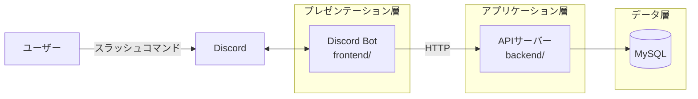

# DiscordWorkLogger
Discordのスラッシュコマンドで出退勤を記録できる勤怠管理Botと、作業用タイマーBotのアプリケーション。
Discord Bot(discord.py)とAPIサーバー(FastAPI)、データベース(MySQL)をDockerで動かしている。

## 作成の経緯
勤務先ではDiscordで連絡を取っており、アルバイトの人は出退勤の時刻をスプレッドシートに手入力して記録していた。
出退勤時にはDiscordで挨拶をしていたので、挨拶のついでにワンクリックで出退勤を記録できるようにしようと考えた。
まずdiscord.pyの使い方を学ぶために作業用タイマーを作り、その後に出退勤記録の機能を開発している。

詳細な要件は下記に記載している。
* [タイマーの要件定義・基本設計](./docs/timer_requirements_and_design/)
* [出退勤の要件定義・基本設計](./docs/attendance_requirements_and_design/)

## 主な機能
* **作業用タイマー**: 分単位のタイマー、一時停止・再開・停止、ポモドーロタイマー
* **ユーザー登録**: DiscordのユーザーIDと名前をDBに登録し、登録した名前を確認できる
* **出勤記録**: コマンドを実行した時刻を出勤時刻としてDBに記録する

## 使用技術
| 分類 | 技術 |
| --- | --- |
| 言語 | Python 3.13 |
| Bot | discord.py 2.7 |
| API | FastAPI / Uvicorn / Pydantic v2 |
| DB | MySQL 8.0 / SQLAlchemy 2.0 / phpMyAdmin |
| インフラ | Docker / Docker Compose |

## 構成
3層アーキテクチャで、Bot・API・DBの役割を分けている。

| 層 | 役割 | 実装 |
| --- | --- | --- |
| プレゼンテーション層 | Discordでユーザーからコマンドを受け取り、結果を返す | `frontend/`(discord.py) |
| アプリケーション層 | 登録や出退勤の記録など、アプリのルールに従って処理する | `backend/`(FastAPI) |
| データ層 | データを保存する | MySQL |

### 設計で意識したこと
* BotとAPIはHTTP通信だけでつながり、お互いのコードを直接読み込まない
* BotはDBに直接アクセスせず、必ずAPIを経由する
* タイマー機能はDBを使わないため、Botの中だけで完結させている

### ファイル構成
| ディレクトリ・ファイル | 内容 |
| --- | --- |
| `frontend/` | Discord Bot。機能ごとにCogとして分割 |
| `frontend/main.py` | Botの起動処理とCogの登録 |
| `frontend/timer.py` | タイマー機能 |
| `frontend/register_cog.py` | ユーザー登録機能 |
| `frontend/time_stamp_cog.py` | 出勤記録機能 |
| `backend/` | APIサーバー |
| `backend/from_discord.py` | APIのエンドポイント定義 |
| `backend/crud.py` | DBの読み書き処理 |
| `backend/models.py` | テーブル定義(SQLAlchemy) |
| `backend/schemas.py` | リクエストの型定義(Pydantic) |
| `docs/` | 要件定義、フローチャートやシーケンス図などの設計資料 |

---

# 環境構築
DockerとDocker Composeを使用する。

## Docker Desktopのインストール
[Docker Desktop](https://www.docker.com/products/docker-desktop/)をダウンロードしてインストールする。

1. `$docker -v` :インストール確認
2. `$docker compose version` :Docker Composeのインストール確認

## Discord Botの作成
1. [Discord Developer Portal](https://discord.com/developers/applications)でアプリケーションを作成する
2. 「Bot」のページでトークンを発行する
3. 同じページの「Privileged Gateway Intents」で`MESSAGE CONTENT INTENT`を有効にする
4. 「OAuth2」のページで`bot`と`applications.commands`のスコープを選び、発行したURLからBotをサーバーに招待する

## 環境変数の設定
プロジェクト直下に`.env`を作成し、下記の値を設定する。

| 変数名 | 内容 |
| --- | --- |
| `ENV` | `prod`で本番環境、それ以外で開発環境として起動する |
| `TARGET_TOKEN` | 本番環境で使用するBotのトークン |
| `TARGET_GUILD_ID` | 本番環境で使用するサーバーのID |
| `TEST_TOKEN` | 開発環境で使用するBotのトークン |
| `TEST_GUILD_ID` | 開発環境で使用するサーバーのID |
| `API_BASE_URL` | BotからアクセスするAPIサーバーのURL |
| `MYSQL_HOST` | MySQLのホスト名 |
| `MYSQL_ROOT_PASSWORD` | MySQLのrootパスワード |
| `MYSQL_DATABASE` | 使用するデータベース名 |
| `MYSQL_USER` | MySQLのユーザー名 |
| `MYSQL_PASSWORD` | MySQLのパスワード |

※ `.env`はGitの管理対象外にしているため、トークンやパスワードをコミットしないように注意する。

---

# アプリケーションの実行

## 起動
`$docker compose up -d`

起動すると下記のサービスが立ち上がる。

| サービス | URL |
| --- | --- |
| Discord Bot | - |
| APIサーバー | `http://localhost:8000` |
| APIドキュメント(Swagger UI) | `http://localhost:8000/docs` |
| phpMyAdmin | `http://localhost:8080` |
| MySQL | `localhost:3306` |

テーブルはAPIサーバーの起動時に`backend/models.py`の定義から自動で作成される。

BotからAPIへはDockerのネットワーク経由(`http://api:8000`)で接続するため、`.env`の`API_BASE_URL`は起動時に上書きされる。

## 停止・再起動
* `$docker compose down` :全てのサービスを停止
* `$docker compose restart bot` :Botのみ再起動(コードの変更を反映)
* `$docker compose up -d --build` :イメージを作り直して起動(`frontend/requirements.txt`を変更した場合)

## ログの確認
* `$docker compose logs -f bot` :Botのログをリアルタイムで表示
* `$docker compose logs -f api` :APIサーバーのログをリアルタイムで表示

# コマンド一覧
## timer
| コマンド | 内容 |
| --- | --- |
| `/timer {minutes}` | 指定した分数のタイマーをセットする |
| `/pausetimer` | タイマーを一時停止する |
| `/resume_timer` | タイマーを再開する |
| `/stoptimer` | タイマーを停止する |
| `/showtimer` | タイマーの残り時間を表示する |
| `/pomodorotimer {sets}` | ポモドーロタイマーをセットする(デフォルトは4セット) |

## work_stamp
| コマンド | 内容 |
| `/register {name}` | 名前を登録する |
| `/myname` | 登録した名前を確認する |
| `/start_work` | 出勤を記録する |
|　`/stop_work`　| 退勤を記録する　|

# API一覧
| メソッド | パス | 内容 |
| --- | --- | --- |
| POST | `/register_member` | メンバーを登録する。IDか名前が重複している場合は409を返す |
| POST | `/get_name` | ユーザーIDから登録名を取得する。未登録の場合は409を返す |
| POST | `/create_clock_in` | 出勤時刻を記録する |
| POST | `/update_clock_out` | 退勤時刻を記録する |

# DB設計
| テーブル | 内容 |
| --- | --- |
| `Member_table` | メンバーのユーザーID、名前、登録日、退職日 |
| `attendance_records` | 1回の出退勤。1行で1回分の出勤時刻と退勤時刻を管理する |
| `monthly_summary` | 1ヶ月分の総労働時間と出勤回数(集計処理は未実装) |

# 設計資料
* [start_workのフローチャート](./docs/flowchart.md)
* [start_workのシーケンス図](./docs/start_work_sequence_diagram.md)
* [ユーザー登録のシーケンス図](./docs/user_registration_sequence.md)

---

# 開発環境での起動
`.env`の`ENV`を`prod`以外にすると開発環境として起動する。

* `TEST_TOKEN`と`TEST_GUILD_ID`のBotとサーバーが使われる
* コマンド名の末尾に`_test`が付く(例: `/timer_test`)
* Botのステータスが「test」になる

これによって、本番環境のBotと同じサーバーに入れてもコマンドが重複しない。

# プロジェクトの運用

## コミットメッセージ
`{type}: {目的}のため、{変更内容}`の形式で書く。

(例)`feat: 出勤記録をAPIで処理するため、start_workコマンドに通信処理を追加`

| type | 内容 |
| --- | --- |
| `feat` | 機能の追加 |
| `fix` | 不具合の修正 |
| `refactor` | 動作を変えないコードの整理 |
| `docs` | ドキュメントの追加・修正 |
| `chore` | 設定ファイルなど、上記以外の変更 |

# 今後の予定
* 退勤を記録するコマンドの追加(APIは実装済み)
* 月ごとの労働時間の集計
* テストコードの導入
