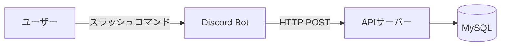
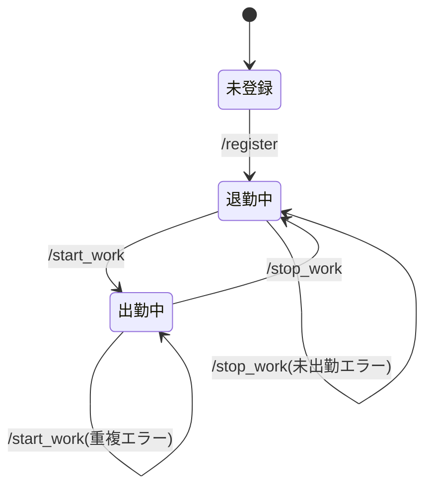
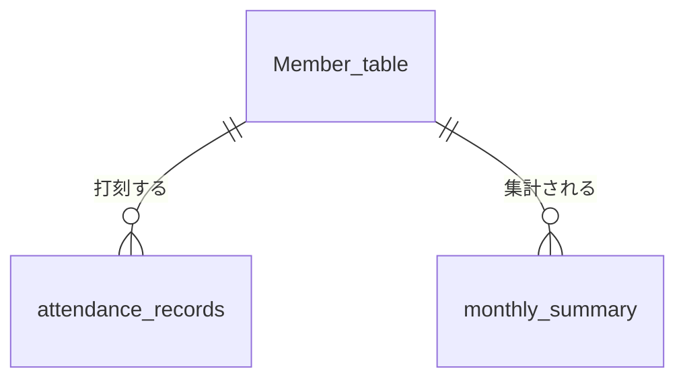

# 出退勤の基本設計

要件定義は[requirements_definition.md](./requirements_definition.md)、詳細設計は[detailed_design.md](./detailed_design.md)を参照。

## 全体構成
- タイマーと違い、出退勤はデータを保存する必要があるためDBを使う。
- Bot(discord.py)はコマンドを受け取ってAPIに送るだけにし、判定や保存はAPI(FastAPI)側で行う。
- BotはDBに直接アクセスしない。

## コマンド設計
- コマンド形式はスラッシュコマンド
- サーバーのチャットでコマンドする(挨拶と一緒に使うため)

| コマンド | 内容 | 状態 |
| --- | --- | --- |
| `/register {name}` | 名前を登録する | 実装済み |
| `/myname` | 登録した名前を確認する | 実装済み |
| `/start_work` | 出勤を記録する | 実装中 |
| `/stop_work` | 退勤を記録する | 未実装 |
| `/work_status` | 現在の出勤状態を確認する | 予定 |

## 状態遷移
- ユーザーの状態は「未登録」「退勤中」「出勤中」の3つ。

## 処理の概要
### 出勤(/start_work)
- コマンドを実行した時刻を出勤時刻として記録し、登録名を使った出勤完了メッセージを返す。
- 未登録の場合は登録を促すメッセージを返す。
- すでに出勤中の場合は記録せず、「すでに出勤している」とメッセージを返す。

### 退勤(/stop_work)
- コマンドを実行した時刻を退勤時刻として記録し、今回の勤務時間を含めた退勤完了メッセージを返す。
- 未登録の場合は登録を促すメッセージを返す。
- 出勤していない場合は記録せず、「出勤していない」とメッセージを返す。
- 日をまたいだ勤務(夜勤など)でも正しく退勤できるようにする。

### 共通
- APIサーバーと通信できなかった場合は、打刻できなかったことをメッセージで返す。

## API一覧
| メソッド | パス | 内容 |
| --- | --- | --- |
| POST | `/register_member` | メンバーを登録する |
| POST | `/get_name` | user_idから登録名を取得する |
| POST | `/start_work` | 出勤時刻を記録する |
| POST | `/stop_work` | 退勤時刻を記録する |
| POST | `/work_status` | 現在の出勤状態を返す |
| POST | `/monthly_report` | 指定月の集計を返す。discordでは使わない。webで使うかはwebの基本設計で決める |

## データモデル設計
- データベースはMySQLを使用する。

| テーブル | 内容 |
| --- | --- |
| Member_table | メンバーのdiscordのユーザーID、登録名、登録日、退職日 |
| attendance_records | 1回の出退勤セッション。1日に複数回出退勤しても、それぞれ別の行として記録する |
| monthly_summary | 1人の1ヶ月分の総労働時間と出勤回数 |

