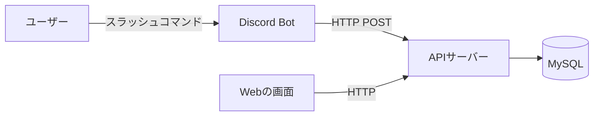
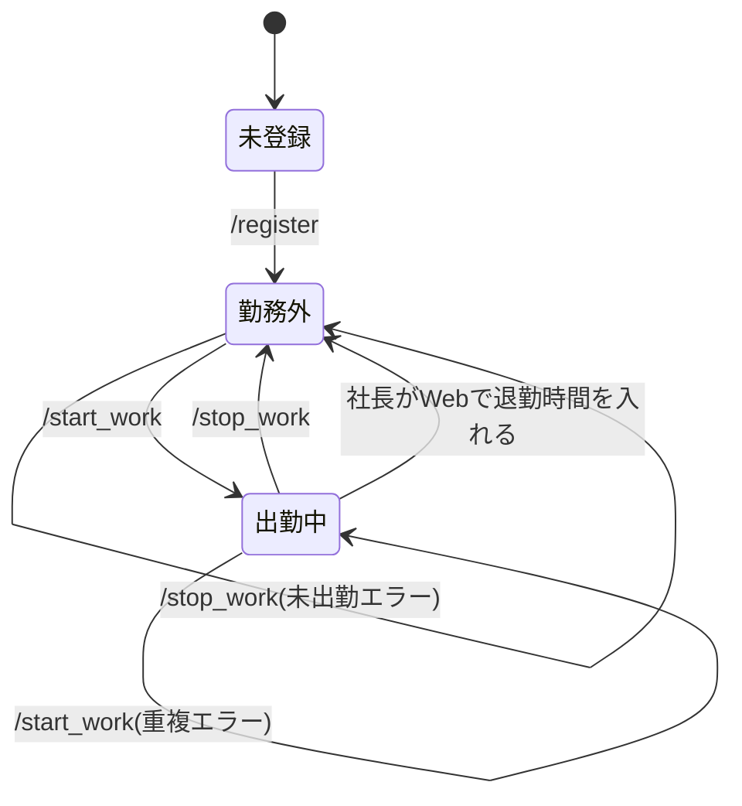
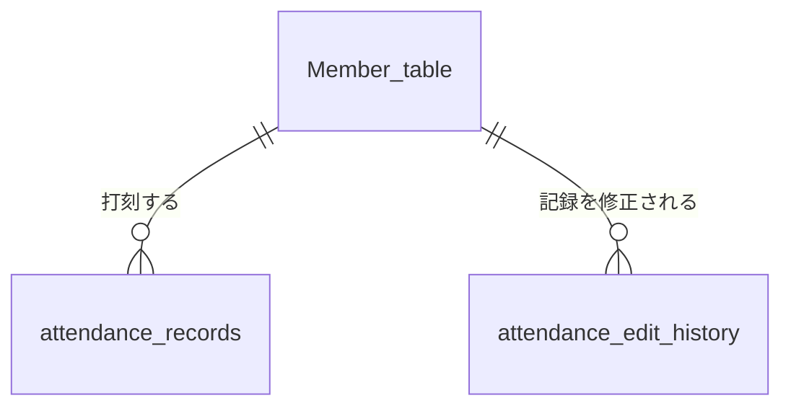

# 出退勤の基本設計

要件定義は[requirements_definition.md](./requirements_definition.md)、詳細設計は[detailed_design.md](./detailed_design.md)を参照。
Webでの勤怠確認と修正は[Webの基本設計](../web_attendance_requirements_and_design/basic_design.md)を参照。

## 全体構成
- タイマーと違い、出退勤はデータを保存する必要があるためDBを使う。
- Bot(discord.py)はコマンドを受け取ってAPIに送るだけにし、判定や保存はAPI(FastAPI)側で行う。
- BotはDBに直接アクセスしない。
- Webの画面も同じAPIとDBを使う。Discordで打刻した記録が、そのままWebに表示される。


---
## 社長かどうかの判定
- 社長のDiscordユーザーIDを`.env`に書いておき、APIで一致するかを判定する(Webのログインと同じ方法)。
- 社長は打刻しないので、`Member_table`に登録しない。社長の出退勤の記録は作らない。
---
## コマンド設計
- コマンド形式はスラッシュコマンド
- サーバーのチャットでコマンドする(挨拶と一緒に使うため)。チャンネルは決めず、サーバーのどのチャンネルでも使える。
- BotへのDMでは、出退勤のコマンドを使えないようにする(挨拶を社長に見せるため)。DMのコマンドの候補にも出さない。
- 開発環境ではコマンド名の末尾に`_test`を付ける(例: `/start_work_test`)
- 従業員専用のコマンドと社長専用のコマンドに分け、お互いのコマンドは使えないようにする。

### 従業員専用のコマンド
| コマンド | 内容 | 返信が見える人 |
| --- | --- | --- |
| `/register {name}` | 名前を登録する | 全員 |
| `/myname` | 登録した名前を確認する | 全員 |
| `/rename {name}` | 登録した名前を変更する | 全員 |
| `/start_work` | 出勤を記録し、社長に出勤の挨拶をする | 全員 |
| `/stop_work` | 退勤を記録し、社長に退勤の挨拶をする | 全員 |
| `/work_status` | 自分の出勤状況を確認する | 自分だけ |

### 社長専用のコマンド
| コマンド | 内容 | 返信が見える人 |
| --- | --- | --- |
| `/all_work_status` | 社長以外の全員の出勤状況を確認する | 自分だけ |

### 全員が使うコマンド
| コマンド | 内容 | 返信が見える人 |
| --- | --- | --- |
| `/help` | 各コマンドの説明を表示する | 自分だけ |

- `/start_work`と`/stop_work`は社長への挨拶を兼ねるので、サーバーの全員に見えるように返信する。
- `/work_status`、`/all_work_status`、`/help`は確認のためだけに使うので、コマンドした人だけに見えるように返信する(チャットを流さないため)。
- 専用のコマンドも、全員のコマンドの候補に表示される。使えない人が使った場合は、何もせずエラーのメッセージを返すだけにする。
  - 従業員が社長専用のコマンドを使った場合:「このコマンドは社長しか使えないのだ!」
  - 社長が従業員専用のコマンドを使った場合:「このコマンドは従業員しか使えないのだ!」
---
## 返信のメッセージ
- Botの返信は、`/register`と`/myname`に合わせて、すべてずんだもんの口調(語尾が「〜のだ」)にする。
- `/register`と`/myname`と同じく、同じ内容のメッセージを数パターン用意し、ランダムに選んで返す。この設計書のメッセージは、そのうちの1つの例。
- 時刻は「9:30」、勤務時間や働いている時間は「8:30」(8時間30分)のように、時:分の形で表示する。
---
## 状態遷移
- ユーザーの状態は「未登録」「出勤中」「勤務外」の3つ。
- 「勤務外」は、まだ出勤していない時と、退勤した後の両方を指す。
- 打刻の間違いや退勤し忘れは、社長がWebで記録を修正して直す。


---
## 処理の概要
### 名前の登録(`/register {name}`)
- コマンドした人のDiscordのユーザーIDと、入力した名前を登録し、登録完了のメッセージを返す。
- 名前は英字(A〜Z、a〜z)のみ、10文字までとする。
- 名前が空の場合は登録せず、「名前を書くのだ!」とメッセージを返す。
- 英字以外(ひらがな、漢字、数字、記号、空白など)が入っている場合は登録せず、「英字以外は書けないのだ!」とメッセージを返す。
- 10文字を超えている場合は登録せず、「名前は10文字までなのだ!」とメッセージを返す。
- すでに登録している人の場合は登録せず、「もう登録されているのだ!名前を変えたい時は`/rename`を使うのだ!」とメッセージを返す。
- 他の人が同じ名前を使っている場合は登録せず、「『○○』は他の人が使っているのだ…別の名前にしてほしいのだ!」とメッセージを返す。
  - 大文字と小文字は区別せず、同じ名前として扱う(例: 「Jun」が登録されていたら「jun」は登録できない)。
  - 登録名は、入力した大文字・小文字のまま表示する。

### 名前の確認(`/myname`)
- コマンドした人の登録名を返す。
- 未登録の場合は、「まだ名前が登録されていないのだ!先に`/register`で登録するのだ!」とメッセージを返す。

### 名前の変更(`/rename {name}`)
- コマンドした人の登録名を、入力した名前に変更し、変更前と変更後の名前を含めた変更完了のメッセージを返す。
  - 例:「名前を○○から△△に変えたのだ!」
- 名前のルールは`/register`と同じにする(英字のみ、10文字まで、空は不可、他の人と同じ名前は不可)。ルールに合わない場合は変更せず、`/register`と同じメッセージを返す。
- 今と同じ名前を入力した場合は変更せず、「今と同じ名前なのだ!」とメッセージを返す。
- 未登録の場合は変更せず、「まだ名前が登録されていないのだ!先に`/register`で登録するのだ!」とメッセージを返す。
- 名前を変更しても、それまでの出退勤の記録はそのまま引き継ぐ(記録はユーザーIDで管理しているため)。

### コマンドの説明(`/help`)
- 各コマンドの名前と説明を一覧で返す。
- 表示するのは出退勤のコマンドだけにし、タイマーのコマンドは載せない。
- 従業員専用と社長専用のコマンドを分けて表示する。
- 例:
  ```
  【従業員専用】
  /register {name} … 名前を登録する
  /myname … 登録した名前を確認する
  /rename {name} … 登録した名前を変更する
  /start_work … 出勤を記録する
  /stop_work … 退勤を記録する
  /work_status … 自分の出勤状況を確認する
  【社長専用】
  /all_work_status … 社長以外の全員の出勤状況を確認する
  【全員】
  /help … コマンドの説明を表示する
  ```
- 登録していない人も使えるようにする(最初に何をすれば良いか分かるようにするため)。

### 出勤(`/start_work`)
- コマンドを実行した時刻を出勤時刻として記録し、実行した人と社長にメンションし、登録名を使った出勤の挨拶を返す。
- 挨拶に入れる出勤時刻は、30分単位に切り上げた後の時刻にする(打刻した本当の時刻は入れない)。
  - 例: 9:05に打刻した場合「@アルバイトさん、@社長。○○なのだ!出勤したのだ!今日もよろしくなのだ!(出勤 9:30)」
- 名前が未登録の場合は記録せず、「まだ名前が登録されていないのだ!先に`/register`で登録するのだ!」とメッセージを返す。
- すでに出勤中の場合は記録せず、「もう出勤しているのだ!」とメッセージを返す。
  - 丸めた後の出勤時刻から5時間以上経っている場合は、前回の退勤し忘れの可能性があるので、「退勤し忘れていたら、社長に伝えるのだ!」も一緒に返す。
  - 5時間未満の場合は、「もう出勤しているのだ!」だけを返す。

### 退勤(`/stop_work`)
- コマンドを実行した時刻を退勤時刻として記録し、実行した人と社長にメンションし、今回の勤務時間を含めた退勤の挨拶を返す。
- 挨拶に入れる退勤時刻と勤務時間は、30分単位に丸めた後の時刻で表示・計算する(打刻した本当の時刻は入れない)。
  - 例: 9:05に出勤、18:10に退勤した場合「@アルバイトさん、@社長。○○なのだ!退勤したのだ!お疲れさまなのだ!(退勤 18:00 / 勤務時間 8:30)」
- 未登録の場合は記録せず、「まだ名前が登録されていないのだ!先に`/register`で登録するのだ!」とメッセージを返す。
- 出勤していない場合は記録せず、「まだ出勤していないのだ!出勤し忘れていたら、社長に伝えるのだ!」とメッセージを返す。
- 日をまたいだ勤務(夜勤など)でも正しく退勤できるようにする。

### 自分の出勤状況の確認(`/work_status`)
- 出勤中なら、丸めた後の出勤時刻と、今回の出勤で働いている時間を返す。
  - 例: 9:05に打刻して、今12:40の場合「出勤中なのだ!9:30に出勤して、今3:00働いているのだ!」
- 勤務外なら「今は勤務外なのだ!」と返す。
- 未登録の場合は、「まだ名前が登録されていないのだ!先に`/register`で登録するのだ!」とメッセージを返す。
- 日をまたいで出勤中の場合は、出勤時刻に日付を付けて表示する。前日なら「前日21:30」、それより前なら「10/1 21:30」のようにする。

### 全員の出勤状況の確認(`/all_work_status`、社長のみ)
- 登録している全員について、出勤中か勤務外かを一覧で返す。
- 出勤中の人は、丸めた後の出勤時刻と、今回の出勤で働いている時間も表示する。
  - 例:
    ```
    みんなの出勤状況なのだ!
    【出勤中】
    ・○○さん 9:30〜(3:00)
    ・△△さん 前日21:30〜(15:00)
    【勤務外】
    ・□□さん
    ```
- 日をまたいで出勤中の人は、`/work_status`と同じく出勤時刻に日付を付けて表示する(「前日21:30」「10/1 21:30」)。働いている時間が長い人に気づけるので、退勤し忘れの確認にも使える。
- 社長以外がコマンドした場合は、出勤状況を返さず「このコマンドは社長しか使えないのだ!」と返す。

### 打刻時刻の30分単位への丸め
- 給料は30分単位で計算しており、会社のルールとして従業員にも事前に説明しているため、出退勤の時刻を30分単位にそろえる。
- 出勤時刻は30分単位で切り上げ、退勤時刻は30分単位で切り捨てる。
- 秒は切り捨ててから丸める。ちょうど0分か30分の時はそのままにする。

| 打刻した時刻 | 出勤の場合(切り上げ) | 退勤の場合(切り捨て) |
| --- | --- | --- |
| 9:00 | 9:00 | 9:00 |
| 9:01 | 9:30 | 9:00 |
| 9:29 | 9:30 | 9:00 |
| 9:30 | 9:30 | 9:30 |
| 23:45 | 翌0:00 | 23:30 |

- Discordの返信、Webの表示、勤務時間の計算は、すべて丸めた後の時刻を使う。
- 打刻した本当の時刻も記録として残す。Discordの返信やWebには表示しない(トラブルが起きた時に確認するため)。
- 出勤日は、丸めた後の出勤時刻の日付にする(例: 10/31 23:45に出勤したら、11/1 0:00の出勤として11月の勤務になる)。
- 丸めた後の退勤時刻が出勤時刻より前になる場合は、退勤時刻を出勤時刻と同じにし、勤務時間0分の記録として残す(例: 9:05に出勤して9:20に退勤すると、出勤9:30、退勤9:00になるので、退勤も9:30にする)。
- `/work_status`と`/all_work_status`で表示する働いている時間は、今の時刻を退勤と同じく切り捨てて、丸めた後の出勤時刻から計算する。マイナスになる場合は0分と表示する。

### 共通
- 時刻はBotがコマンドを受け取った時刻を使い、日本時間(JST)で扱う。
- APIサーバーと通信できなかった場合は、どのコマンドでも「サーバーとつながらなかったのだ…少し待ってからもう一度試してほしいのだ!」と返す。
  - `/start_work`と`/stop_work`の場合は、打刻されていないことが分かるように「打刻はできていないのだ!」も一緒に返す。
  - `/help`はAPIを使わないので、APIサーバーと通信できなくても使える。
- 結果は数秒以内に返信する。APIの応答が遅い場合は待ち続けず、通信できなかった場合と同じメッセージを返す。

## API一覧
Discordで使うAPI。Webで使うAPIは[Webの基本設計](../web_attendance_requirements_and_design/basic_design.md#api一覧)を参照。

| メソッド | パス | 内容 |
| --- | --- | --- |
| POST | `/register_member` | メンバーを登録する |
| POST | `/get_name` | user_idから登録名を取得する |
| POST | `/rename_member` | 登録名を変更する |
| POST | `/start_work` | 出勤時刻を記録する |
| POST | `/stop_work` | 退勤時刻を記録する |
| POST | `/work_status` | 本人の出勤状況を返す |
| POST | `/all_work_status` | 社長以外の全員の出勤状況を返す。社長以外が使った場合はエラーを返す |

- 月ごとの集計はDiscordでは表示しないので、Discord用の集計APIは作らない。Webでは勤怠の一覧と一緒に集計を返す。

## データモデル設計
- データベースはMySQLを使用する。

| テーブル | 内容 |
| --- | --- |
| Member_table | メンバーのdiscordのユーザーID、登録名、登録日、退職日 |
| attendance_records | 1回の出退勤セッション。1日に複数回出退勤しても、それぞれ別の行として記録する。丸めた後の時刻と、打刻した本当の時刻の両方を持つ |
| attendance_edit_history | 社長がWebで記録を修正した履歴。詳しくは[Webの基本設計](../web_attendance_requirements_and_design/basic_design.md#データモデル設計)を参照 |

- 月ごとの総労働時間と出勤回数はテーブルに保存せず、表示のたびに`attendance_records`から計算する。



---
## 後回しにしたこと
- 退職した人の扱い。退職したらDBから消す方向で考えている。開発時間の関係で、今回は作らない。
