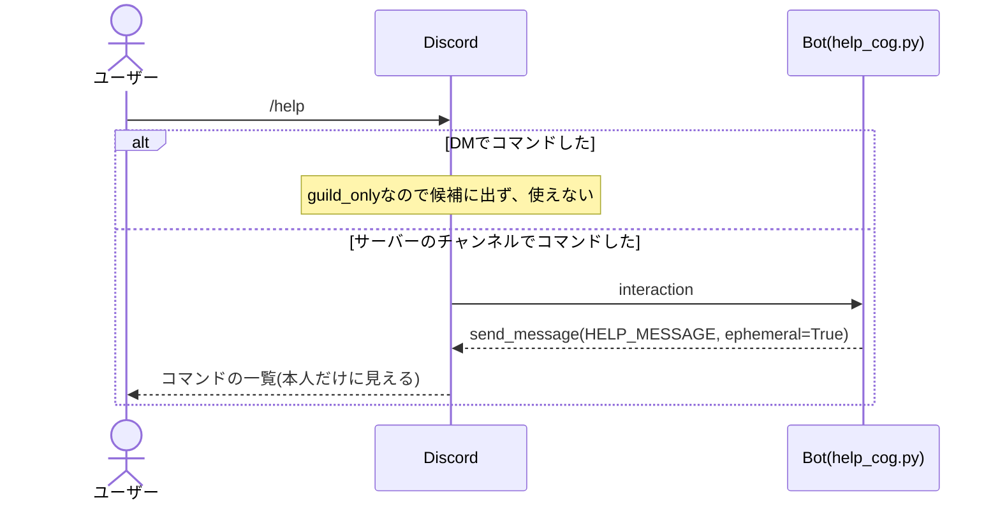
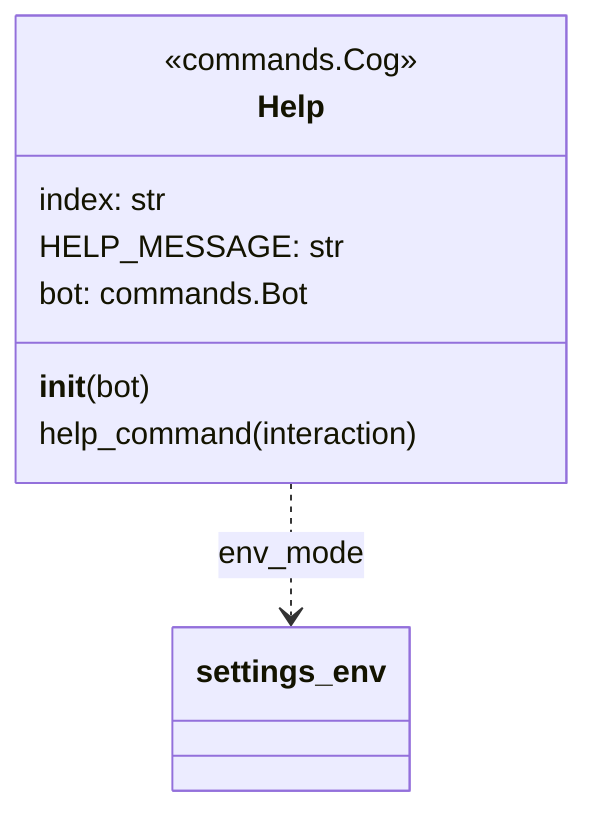

# `/help`コマンドの単体詳細設計

- 基本設計: [コマンドの説明(`/help`)](../basic_design.md#コマンドの説明help)
- 詳細設計(全体): [`/help`の表示](../detailed_design.md#helpの表示)、[返信の見え方](../detailed_design.md#返信の見え方)

## 目次
- [概要](#概要)
- [対象ファイル](#対象ファイル)
- [処理の流れ](#処理の流れ)
- [コマンドの定義](#コマンドの定義)
- [返信の文](#返信の文)
- [クラス](#クラス)
- [エラーの扱い](#エラーの扱い)
- [単体テスト](#単体テスト)
- [決めたこと](#決めたこと)

---
## 概要
- 出退勤のコマンドの名前と説明を、従業員専用・社長専用・全員の3つに分けて返す。
- タイマーのコマンドは載せない。
- APIを使わない。Botの中だけで返信する。
  - そのため、APIサーバーと通信できない時も使える。
  - 登録していない人も、社長も使える(社長かどうか、登録しているかどうかは確かめない)。
- 返信はコマンドした人だけに見せる(`ephemeral=True`)。

---
## 対象ファイル
| ファイル | 変更 | 内容 |
| --- | --- | --- |
| `frontend/help_cog.py` | 追加 | `/help`のCog |
| `frontend/main.py` | 変更 | `on_ready`で`Help`のCogを読み込む |
| `frontend/tests/__init__.py`、`frontend/tests/unit/__init__.py` | 追加 | テストのパッケージ化 |
| `frontend/tests/unit/test_help_cog.py` | 追加 | `/help`の単体テスト |
| `frontend/requirements.txt` | 変更 | `pytest`を足す |

---
## 処理の流れ


- APIを呼ばず、すぐに返信できるので`defer`しない。最初の応答の`interaction.response.send_message`で返す。

---
## コマンドの定義
| 項目 | 値 |
| --- | --- |
| コマンド名 | `help{index}`(本番は`help`、開発は`help_test`) |
| 説明(候補に出る文) | `コマンドの説明を表示します` |
| 引数 | なし |
| DMで使えるか | 使えない(`@app_commands.guild_only()`) |
| 返信が見える人 | 自分だけ(`ephemeral=True`) |

- `index`は、`register_cog.py`と同じく`env_mode`が`"prod"`なら`""`、それ以外は`"_test"`にする。

---
## 返信の文
- 返信の文は、`Help`の定数`HELP_MESSAGE`にベタ打ちで書く。
- 開発環境でも、コマンド名の末尾に`_test`は付けない(本番と同じ文を返す)。

```
【従業員専用】
/register {name} … 名前を登録する
/myname … 登録した名前を確認する
/rename {name} … 登録した名前を変更する
/start_work … 出勤を記録する
/stop_work … 退勤を記録する
/work_status … 自分の出勤状況を確認する
【社長専用】
/all_work_status … 社長以外の全員の出勤状況を確認する
【全員】
/help … コマンドの説明を表示する
```

---
## クラス


```python
@app_commands.command(name=f"help{index}", description="コマンドの説明を表示します")
@app_commands.guild_only()
async def help_command(self, interaction: discord.Interaction):
    await interaction.response.send_message(self.HELP_MESSAGE, ephemeral=True)
```
- メソッド名を`help`にしないのは、Pythonの組み込みの`help`と紛らわしいため。
- `main.py`の`on_ready`で、ほかのCogと同じく`await bot.add_cog(Help(bot))`する。

---
## エラーの扱い
- APIを使わないので、通信エラーやタイムアウトの処理はない。
- 社長・従業員・未登録のどれでもエラーにしない。
- Discordへの返信が失敗した時は、discord.pyのエラーのログに任せる(特別な処理はしない)。

---
## 単体テスト
- ファイル: `frontend/tests/unit/test_help_cog.py`
- 実行: `frontend/`で`python -m pytest tests`

| No | 対象 | 確かめること | 期待する結果 |
| --- | --- | --- | --- |
| U-01 | `HELP_MESSAGE` | 返信の文 | [返信の文](#返信の文)と完全に一致する |

---
## 決めたこと
- **DMでは使えないようにする(`guild_only`)。** 基本設計の「DMでは出退勤のコマンドを使えないようにする」に`/help`も含める。DMでは一覧のコマンドをどれも使えないので、`/help`だけ使えても役に立たないため。
- **返信の文はランダムにしない。** 基本設計の例のとおり、一覧だけを返す。毎回同じ形の方が読みやすいため。
- **返信の文はベタ打ちにする。** コマンドは8個だけで、増えることも少ないので、データから組み立てずにそのまま書く。コマンドを増やした時は、`HELP_MESSAGE`も直す。
- **開発環境でも`_test`を付けない。** ベタ打ちにするため。開発で使うのは自分だけなので、困らない。
