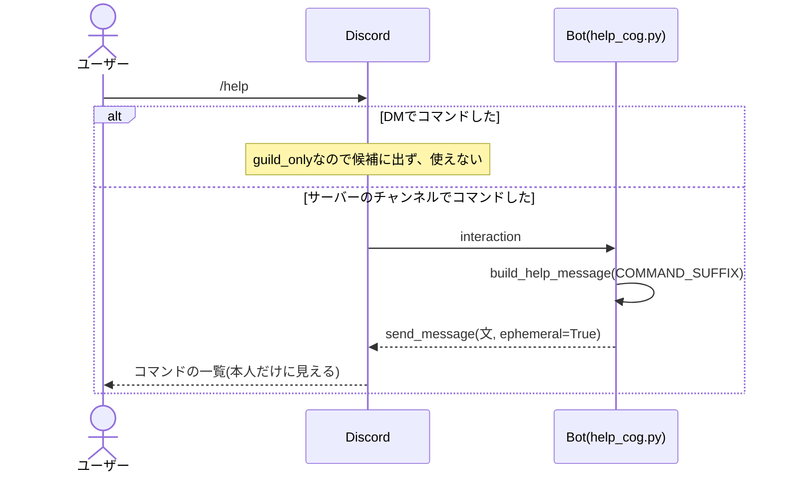
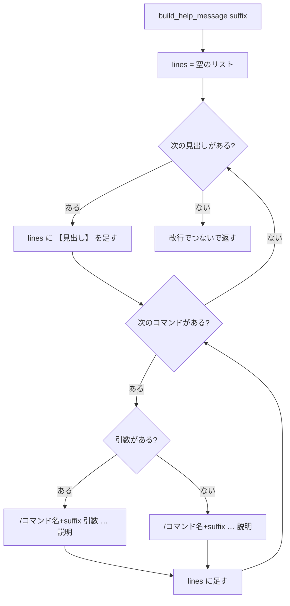
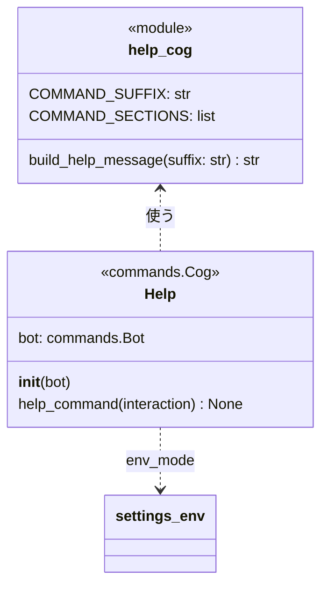

# `/help`コマンドの単体詳細設計

- 基本設計: [コマンドの説明(`/help`)](../basic_design.md#コマンドの説明help)
- 詳細設計(全体): [`/help`の表示](../detailed_design.md#helpの表示)、[返信の見え方](../detailed_design.md#返信の見え方)

## 目次
- [概要](#概要)
- [対象ファイル](#対象ファイル)
- [処理の流れ](#処理の流れ)
- [コマンドの定義](#コマンドの定義)
- [表示する内容](#表示する内容)
- [クラスと関数](#クラスと関数)
- [エラーの扱い](#エラーの扱い)
- [単体テスト](#単体テスト)
- [決めたこと](#決めたこと)

---
## 概要
- 出退勤のコマンドの名前と説明を、従業員専用・社長専用・全員の3つに分けて返す。
- タイマーのコマンドは載せない。
- APIを使わない。Botの中だけで返信を作る。
  - そのため、APIサーバーと通信できない時も使える。
  - 登録していない人も、社長も使える(社長かどうか、登録しているかどうかは確かめない)。
- 返信はコマンドした人だけに見せる(`ephemeral=True`)。

---
## 対象ファイル
| ファイル | 変更 | 内容 |
| --- | --- | --- |
| `frontend/help_cog.py` | 追加 | `/help`のCogと、返信の文を作る関数 |
| `frontend/main.py` | 変更 | `on_ready`で`Help`のCogを読み込む |
| `frontend/tests/__init__.py`、`frontend/tests/unit/__init__.py` | 追加 | テストのパッケージ化 |
| `frontend/tests/unit/test_help_cog.py` | 追加 | `/help`の単体テスト |
| `frontend/requirements.txt` | 変更 | `pytest`を足す |

---
## 処理の流れ


- APIを呼ばず、すぐに返信できるので`defer`しない。最初の応答の`interaction.response.send_message`で返す。

---
## コマンドの定義
| 項目 | 値 |
| --- | --- |
| コマンド名 | `help{COMMAND_SUFFIX}`(本番は`help`、開発は`help_test`) |
| 説明(候補に出る文) | `コマンドの説明を表示します` |
| 引数 | なし |
| DMで使えるか | 使えない(`@app_commands.guild_only()`) |
| 返信が見える人 | 自分だけ(`ephemeral=True`) |

- `COMMAND_SUFFIX`は、`settings_env.env_mode`が`"prod"`なら`""`、それ以外は`"_test"`にする(今の`register_cog.py`の`index`と同じ決め方)。

---
## 表示する内容
### コマンドの一覧のデータ
表示するコマンドは、`help_cog.py`の定数`COMMAND_SECTIONS`にまとめる。この順番どおりに表示する。

| 見出し | コマンド名 | 引数 | 説明 |
| --- | --- | --- | --- |
| 従業員専用 | `register` | `{name}` | 名前を登録する |
| 従業員専用 | `myname` | | 登録した名前を確認する |
| 従業員専用 | `rename` | `{name}` | 登録した名前を変更する |
| 従業員専用 | `start_work` | | 出勤を記録する |
| 従業員専用 | `stop_work` | | 退勤を記録する |
| 従業員専用 | `work_status` | | 自分の出勤状況を確認する |
| 社長専用 | `all_work_status` | | 社長以外の全員の出勤状況を確認する |
| 全員 | `help` | | コマンドの説明を表示する |

```python
# (見出し, [(コマンド名, 引数, 説明), ...])
COMMAND_SECTIONS: list[tuple[str, list[tuple[str, str, str]]]] = [
    ("従業員専用", [
        ("register", "{name}", "名前を登録する"),
        ("myname", "", "登録した名前を確認する"),
        ("rename", "{name}", "登録した名前を変更する"),
        ("start_work", "", "出勤を記録する"),
        ("stop_work", "", "退勤を記録する"),
        ("work_status", "", "自分の出勤状況を確認する"),
    ]),
    ("社長専用", [
        ("all_work_status", "", "社長以外の全員の出勤状況を確認する"),
    ]),
    ("全員", [
        ("help", "", "コマンドの説明を表示する"),
    ]),
]
```

### 文の組み立て


- 1行の形: `/{コマンド名}{suffix} {引数} … {説明}`。引数がない時は`/{コマンド名}{suffix} … {説明}`。
- `suffix`はコマンド名のすぐ後ろに付け、引数はその後ろにする(例: `/register_test {name}`)。開発環境で、そのままコピーして使えるようにするため。
- 区切りは「 … 」(前後に半角スペース、`…`は1文字の三点リーダー)。
- 最後の行の後ろに改行は付けない。

### 返信の例
本番(`suffix=""`):
```
【従業員専用】
/register {name} … 名前を登録する
/myname … 登録した名前を確認する
/rename {name} … 登録した名前を変更する
/start_work … 出勤を記録する
/stop_work … 退勤を記録する
/work_status … 自分の出勤状況を確認する
【社長専用】
/all_work_status … 社長以外の全員の出勤状況を確認する
【全員】
/help … コマンドの説明を表示する
```

開発(`suffix="_test"`):
```
【従業員専用】
/register_test {name} … 名前を登録する
/myname_test … 登録した名前を確認する
/rename_test {name} … 登録した名前を変更する
/start_work_test … 出勤を記録する
/stop_work_test … 退勤を記録する
/work_status_test … 自分の出勤状況を確認する
【社長専用】
/all_work_status_test … 社長以外の全員の出勤状況を確認する
【全員】
/help_test … コマンドの説明を表示する
```

---
## クラスと関数


### `build_help_message(suffix: str) -> str`
- `COMMAND_SECTIONS`から、[返信の例](#返信の例)の文を作って返す。
- Discordにつながずに確かめられるよう、Cogの外の関数にする。

| 引数 | 型 | 内容 |
| --- | --- | --- |
| `suffix` | `str` | コマンド名の末尾。本番は`""`、開発は`"_test"` |

| 戻り値 | 内容 |
| --- | --- |
| `str` | 改行でつないだコマンドの一覧 |

### `Help.help_command(interaction)`
```python
@app_commands.command(name=f"help{COMMAND_SUFFIX}", description="コマンドの説明を表示します")
@app_commands.guild_only()
async def help_command(self, interaction: discord.Interaction) -> None:
    await interaction.response.send_message(build_help_message(COMMAND_SUFFIX), ephemeral=True)
```
- メソッド名を`help`にしないのは、Pythonの組み込みの`help`と紛らわしいため。
- `main.py`の`on_ready`で、ほかのCogと同じく`await bot.add_cog(Help(bot))`する。

---
## エラーの扱い
- APIを使わないので、通信エラーやタイムアウトの処理はない。
- 社長・従業員・未登録のどれでもエラーにしない。
- Discordへの返信が失敗した時は、discord.pyのエラーのログに任せる(特別な処理はしない)。

---
## 単体テスト
- ファイル: `frontend/tests/unit/test_help_cog.py`
- 実行: `frontend/`で`python -m pytest tests`
- Discordにはつながない。`interaction`は`unittest.mock`の`MagicMock`と`AsyncMock`で作る。
- async関数は`asyncio.run`で呼ぶ(`pytest-asyncio`は入れない)。

| No | 対象 | 確かめること | 期待する結果 |
| --- | --- | --- | --- |
| U-01 | `build_help_message("")` | 本番の文 | [返信の例](#返信の例)の本番の文と完全に一致する |
| U-02 | `build_help_message("_test")` | 開発の文 | [返信の例](#返信の例)の開発の文と完全に一致する |
| U-03 | `build_help_message("_test")` | 引数の位置 | `/register_test {name}`、`/rename_test {name}`を含む(`/register {name}_test`ではない) |
| U-04 | `build_help_message("")` | 見出しの順番 | 【従業員専用】→【社長専用】→【全員】の順に出る |
| U-05 | `build_help_message("")` | タイマーのコマンドを載せない | `timer`、`stoptimer`、`pausetimer`、`showtimer`、`resume_timer`、`pomodorotimer`を含まない |
| U-06 | `build_help_message("")` | 最後の改行 | 末尾が`\n`で終わらない |
| U-07 | `Help.help_command` | 返信の仕方 | `interaction.response.send_message`が1回、`build_help_message(COMMAND_SUFFIX)`の文と`ephemeral=True`で呼ばれる |
| U-08 | `Help.help_command` | `defer`しない | `interaction.response.defer`と`interaction.followup.send`が呼ばれない |
| U-09 | `Help.help_command` | コマンドの定義 | `name`が`f"help{COMMAND_SUFFIX}"`、`guild_only`が`True` |

---
## 決めたこと
- **DMでは使えないようにする(`guild_only`)。** 基本設計の「DMでは出退勤のコマンドを使えないようにする」に`/help`も含める。DMでは一覧のコマンドをどれも使えないので、`/help`だけ使えても役に立たないため。
- **返信の文はランダムにしない。** 基本設計の例のとおり、一覧だけを返す。毎回同じ形の方が読みやすいため。
- **一覧は`help_cog.py`に直接書く。** 各Cogのコマンドから自動で作ると、タイマーを除く処理や見出しの分け方が必要になり、かえって複雑になるため。コマンドを増やした時は、`COMMAND_SECTIONS`も直す。
