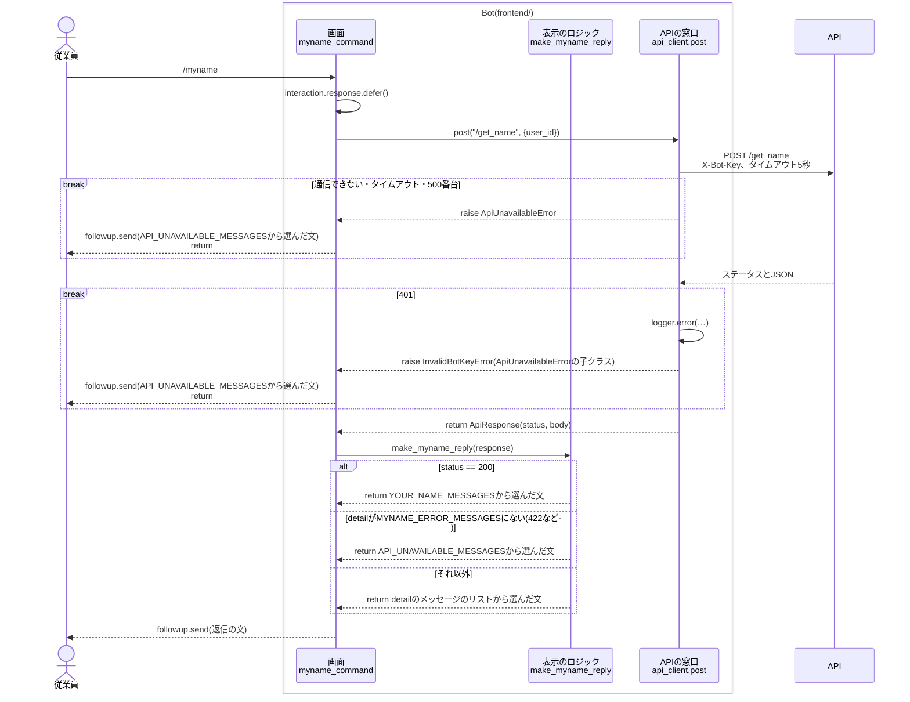
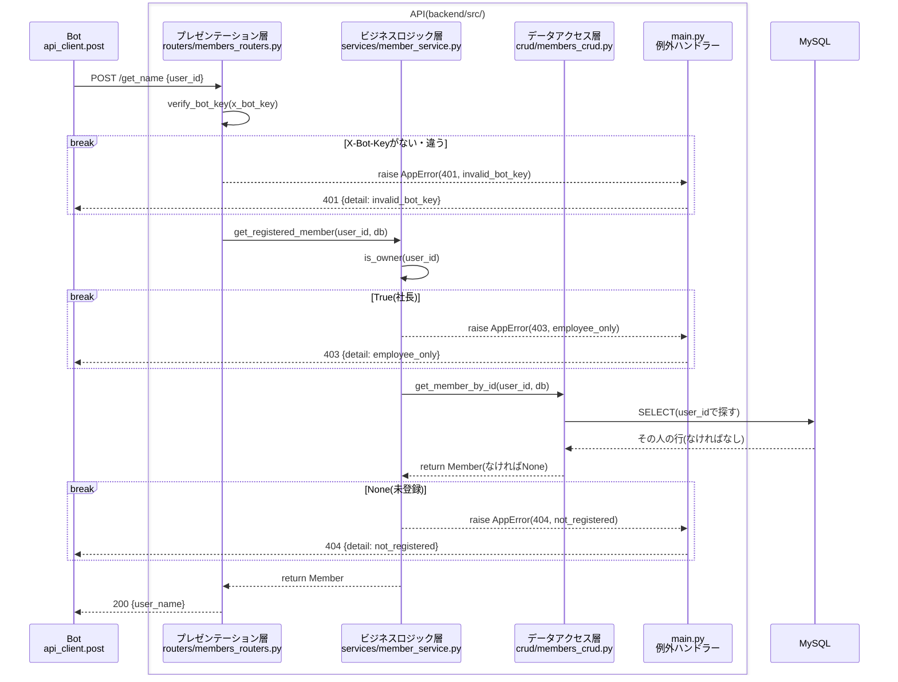
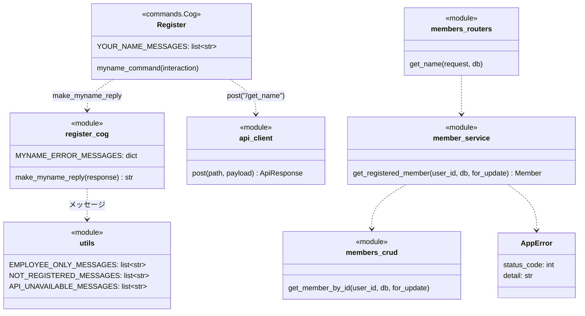

# `/myname`コマンドの単体詳細設計

- 基本設計: [名前の確認(`/myname`)](../basic_design.md#名前の確認myname)
- 詳細設計(全体): [共通の決まり](../detailed_design.md#共通の決まり)、[`/get_name`](../detailed_design.md#get_name)、[エラーコードとメッセージ](../detailed_design.md#エラーコードとメッセージ)、[成功した時のメッセージの例](../detailed_design.md#成功した時のメッセージの例)、[Member_table](../detailed_design.md#member_tableメンバー)
- 土台(`api_client`、`AppError`、`verify_bot_key`、`get_registered_member`、`NOT_REGISTERED_MESSAGES`、テストの準備)は[`/register`](./register_detailed_design.md)と[`/rename`](./rename_detailed_design.md)の単体詳細設計で作ったものを使う。

## 目次
- [概要](#概要)
- [対象ファイル](#対象ファイル)
- [処理の流れ](#処理の流れ)
  - [Botの中](#botの中)
  - [APIの中](#apiの中)
- [コマンドの定義](#コマンドの定義)
- [Bot](#bot)
  - [Cog(`cogs/register_cog.py`)](#cogcogsregister_cogpy)
  - [返信の文](#返信の文)
  - [消すもの](#消すもの)
- [API](#api)
  - [リクエストとレスポンス](#リクエストとレスポンス)
  - [確認する順番](#確認する順番)
  - [各層の処理](#各層の処理)
- [クラス](#クラス)
- [エラーの扱い](#エラーの扱い)
- [単体テスト](#単体テスト)
- [Discordでの確認](#discordでの確認)
- [決めたこと](#決めたこと)

---
## 概要
- コマンドした人の登録名を、「お前の名前は「{name}」なのだ！」のようなメッセージで返す。
- 社長かどうか、登録しているかどうかの確認は、すべてAPIで行う。Botは`user_id`をAPIに送り、返ってきた結果に合わせてメッセージを返すだけにする。
- 返信はサーバーの全員に見せる(`defer()`)。エラーのメッセージも全員に見える。
- `/myname`は、今も`requests`で古い`/get_name`を呼んでいる。[`/register`のステップ](./register_detailed_design.md#決めたこと)で古いAPIのファイルを消したため、今は動いていない。このステップで、Bot・APIとも新しい構成で作り直す。
- DBは読むだけで、書き換えない。
- `/myname`は`requests`を使う最後のコマンドなので、作り直した後に`requests`を`frontend/requirements.txt`から消す。

---
## 対象ファイル
### Bot(`frontend/`)
| ファイル | 変更 | 内容 |
| --- | --- | --- |
| `cogs/register_cog.py` | 作り直し・追加 | 今の`myname`を`myname_command`として作り直す。返信の文を作る`make_myname_reply`、`MYNAME_ERROR_MESSAGES`を足す。`NO_DATA_AND_REGISTER_NAME_MESSAGES`と、使わなくなる`import json`、`import requests`、`API_URL`の読み込みを消す。ファイルのdocstringはそのまま |
| `requirements.txt` | 変更 | `requests`を消す |
| `tests/unit/test_register_cog.py` | 追加 | `make_myname_reply`のテスト |

### API(`backend/`)
| ファイル | 変更 | 内容 |
| --- | --- | --- |
| `src/schemas/members.py` | 追加 | `GetNameRequest`、`GetNameResponse`を足す |
| `src/routers/members_routers.py` | 追加 | `POST /get_name`を足す |
| `tests/integration/test_members_api.py` | 追加 | `/get_name`の単体テストを足す。ファイルのdocstringを`"""/register_member、/rename_member、/get_nameの結合テスト"""`に直す |

- `services/`と`crud/`は変えない。今ある`member_service.get_registered_member`をそのまま使う([決めたこと](#決めたこと)を参照)。
- `models.py`、テーブルは変えない。

### その他
| ファイル | 変更 | 内容 |
| --- | --- | --- |
| `README.md` | 変更 | APIの表の`/get_name`の説明を「ユーザーIDから登録名を取得する。社長の場合は403、未登録の場合は404を返す」に直す |

---
## 処理の流れ
全体は「Bot → API → MySQL」の3つに分かれ、BotとAPIの中も、それぞれ3つの層に分かれている。

| | 層 | ファイル・関数 |
| --- | --- | --- |
| Bot | 画面 | `cogs/register_cog.py`の`myname_command` |
| | 表示のロジック | `cogs/register_cog.py`の`make_myname_reply` |
| | APIの窓口 | `services/api_client.py`の`post` |
| API | プレゼンテーション層 | `routers/members_routers.py`の`get_name`(`X-Bot-Key`の確認は`dependencies.py`の`verify_bot_key`) |
| | ビジネスロジック層 | `services/member_service.py`の`get_registered_member` |
| | データアクセス層 | `crud/members_crud.py`の`get_member_by_id` |

`/rename`と同じく、Botの中とAPIの中を別々の図にする。
図には、層をまたぐ関数の呼び出し、MySQLへのアクセス、例外と早期リターンを描く。関数の中の1行の処理(変数に入れるなど)は描かない。

### Botの中
APIは1つの箱として描く。APIの中は[APIの中](#apiの中)の図を参照。

- `break`の中に入ったら、そこで終わる。下には進まない。
- `myname_command`は、`ApiUnavailableError`だけを`except`する。`InvalidBotKeyError`は子クラスなので、同じ`except`で捕まる。

### APIの中

- `break`の中に入ったら、そこで終わる。下には進まない。
- `verify_bot_key`は、FastAPIが`get_name`より先に呼ぶ(`dependencies.py`の関数を、routerの`dependencies`に付けているため)。
- `AppError`は`routers`を通り抜けて`main.py`の例外ハンドラーに届く。図では、通り抜けるところを省いている。
- 読むだけなので、コミットもロールバックもしない。

---
## コマンドの定義
| 項目 | 値 |
| --- | --- |
| コマンド名 | `myname{index}`(本番は`myname`、開発は`myname_test`) |
| 説明(候補に出る文) | `名前を確認します`(今のまま) |
| 引数 | なし |
| DMで使えるか | 使えない(`@app_commands.guild_only()`) |
| 返信が見える人 | 全員(`defer()`) |

- 今の`myname`には`guild_only`が付いていない。`/register`、`/rename`と同じく付ける([コマンドの登録](../detailed_design.md#コマンドの登録))。

---
## Bot
### Cog(`cogs/register_cog.py`)
`/register`、`/rename`と同じCog(`Register`)の、今の`myname`を作り直す。`requests`を`api_client`に変え、`defer()`してから`followup.send()`で返す。

| 関数 | 内容 |
| --- | --- |
| `myname_command(self, interaction) -> None` | 作り直し。`defer()`し、`{"user_id": interaction.user.id}`を`api_client.post("/get_name", …)`で送る。`ApiUnavailableError`なら`API_UNAVAILABLE_MESSAGES`の文を、それ以外は`make_myname_reply`の文を`followup.send()`で返す |
| `make_myname_reply(response) -> str` | 追加。Cogの外(モジュール)に置く。Discordを使わないので単体テストできる |

- 関数の名前は、`register_command`、`rename_command`にそろえて`myname_command`にする。
- 今の`print(dir(response))`(確認用の出力)は消す。

`make_myname_reply`は、`make_rename_reply`と同じ形で、次の順に返信の文を決める。

1. `status`が200なら、`YOUR_NAME_MESSAGES`から選んだ文に、`body["user_name"]`を`{name}`として入れる。
2. `detail`が文字列で、`MYNAME_ERROR_MESSAGES`にあれば、そのリストから選んだ文。
3. それ以外(422の時の、リストの`detail`など)は、`API_UNAVAILABLE_MESSAGES`から選んだ文。

- `/register`、`/rename`と違い、入力した名前がないので、引数は`response`だけにする。
- `MYNAME_ERROR_MESSAGES`は`detail`とメッセージのリストの辞書(`dict[str, list[str]]`)。`RENAME_ERROR_MESSAGES`の下に置く。

  | detail | メッセージのリスト | 置いておく所 |
  | --- | --- | --- |
  | `employee_only` | `EMPLOYEE_ONLY_MESSAGES` | `utils.py` |
  | `not_registered` | `NOT_REGISTERED_MESSAGES` | `utils.py` |

### 返信の文
- 各メッセージは数パターン用意し、`random_choice_format_list_message`でランダムに選ぶ。下は各リストの1つ目。
- 足すリストはない。確認できた時の`YOUR_NAME_MESSAGES`は、今あるものをそのまま使う。

| 場面 | メッセージの例 | リスト |
| --- | --- | --- |
| 確認できた | お前の名前は「{name}」なのだ！ | `YOUR_NAME_MESSAGES` |
| `employee_only` | このコマンドは従業員しか使えないのだ！ | `EMPLOYEE_ONLY_MESSAGES` |
| `not_registered` | まだ名前が登録されていないのだ！先に/registerで登録するのだ！ | `NOT_REGISTERED_MESSAGES` |
| 通信できない | サーバーとつながらなかったのだ…少し待ってからもう一度試してほしいのだ！ | `API_UNAVAILABLE_MESSAGES` |

- `{name}`はAPIが返した登録名を使う。APIの確認を通って登録された名前(英字だけ)なので、メンションなどが混ざることはない。

### 消すもの
| 消すもの | 理由 |
| --- | --- |
| `Register.NO_DATA_AND_REGISTER_NAME_MESSAGES` | `NOT_REGISTERED_MESSAGES`に切り替えるため([`/rename`の決めたこと](./rename_detailed_design.md#決めたこと)のとおり) |
| `register_cog.py`の`import json`、`import requests`、`from settings_env import ... API_URL`の`API_URL` | `myname`を`api_client`に変えると使わなくなるため。`env_mode`の読み込みは残す |
| `frontend/requirements.txt`の`requests` | `requests`を使っているのは`myname`だけなので、どこからも使わなくなるため([`/register`の決めたこと](./register_detailed_design.md#決めたこと)のとおり、すべてのコマンドを直した後で消す) |

- `requests`を消した後は、Botのコンテナを作り直す(`docker compose up -d --build bot`)。消し忘れの`import requests`があれば、Botの起動時にエラーで分かる。

---
## API
### リクエストとレスポンス
| 項目 | 値 |
| --- | --- |
| メソッド・パス | `POST /get_name` |
| ヘッダー | `X-Bot-Key: {BOT_API_KEY}` |
| リクエスト | `{"user_id": int}` |
| レスポンス(200) | `{"user_name": str}` |
| エラー | `{"detail": "<エラーコード>"}` |

### 確認する順番
上から順に確認し、最初に当てはまったものを返す。

| 順 | 確認すること | ステータス | detail |
| --- | --- | --- | --- |
| 0 | `X-Bot-Key`がない、または`BOT_API_KEY`と違う | 401 | `invalid_bot_key` |
| 1 | `user_id`が`OWNER_DISCORD_ID`と同じ | 403 | `employee_only` |
| 2 | その`user_id`が登録されていない | 404 | `not_registered` |

- 1と2は`get_registered_member`で確かめる。
- 古い`/get_name`は未登録の時に409を返していた。[全体の詳細設計](../detailed_design.md#現在のコードとの差分設計に合わせて直すところ)のとおり、404 `not_registered`にする。

### 各層の処理
#### `schemas/members.py`
| クラス | 属性 | 内容 |
| --- | --- | --- |
| `GetNameRequest` | `user_id: int` | 名前を確認する人のDiscordのユーザーID |
| `GetNameResponse` | `user_name: str` | 登録名 |

- `RenameMemberResponse`の下に置く。
- レスポンスの形は`RegisterMemberResponse`と同じだが、分けて作る([`/rename`](./rename_detailed_design.md#schemasmemberspy)と同じ考え方)。

#### `routers/members_routers.py`
| 関数 | 内容 |
| --- | --- |
| `get_name(request, db) -> GetNameResponse` | 追加。`POST /get_name`。`member_service.get_registered_member(request.user_id, db)`でメンバーを取り、`GetNameResponse(user_name=member.user_name)`を返す。`AppError`は自分では捕まえず、`main.py`の例外ハンドラーに任せる |

- `rename_member`の下に置き、`import`に`GetNameRequest`、`GetNameResponse`を足す。
- `routers`は`main.py`で読み込み済み(`members_routers.router`)なので、`main.py`は変えない。

#### `services/member_service.py`、`crud/members_crud.py`
変えない。使う関数は次のとおり。

| 関数 | 内容 |
| --- | --- |
| `member_service.get_registered_member(user_id, db, for_update=False)` | 社長なら403 `employee_only`、未登録なら404 `not_registered`を投げ、見つかったメンバーを返す。`for_update`は渡さない(読むだけでロックは要らないため) |
| `members_crud.get_member_by_id(user_id, db, for_update=False)` | `user_id`でメンバーを1件探す |

---
## クラス
今回足すものだけを書く。`/register`、`/rename`で作ったものは[`/register`のクラス](./register_detailed_design.md#クラス)、[`/rename`のクラス](./rename_detailed_design.md#クラス)を参照。

- `YOUR_NAME_MESSAGES`は今あるもの。`myname_command`は今の`myname`を作り直したもの。

---
## エラーの扱い
| 起きること | API | Bot |
| --- | --- | --- |
| 社長、未登録 | `AppError`を投げ、例外ハンドラーが403/404にする | `detail`に合わせたメッセージ |
| `X-Bot-Key`が違う | 401 `invalid_bot_key` | `api_client`がエラーのログを残して`InvalidBotKeyError`を投げる。従業員には通信できなかった時のメッセージ |
| リクエストの形が違う | FastAPIが422を返す | 通信できなかった時のメッセージ |
| DBにつながらない | 500 | 通信できなかった時のメッセージ |
| APIにつながらない・5秒以内に返ってこない | | 通信できなかった時のメッセージ |

---
## 単体テスト
- 番号は、`/stop_work`のテストの続き(T-34〜、U-14〜)にする。`/stop_work`はまだmasterに入っていないが、先に入る予定なので、番号がぶつからないようにする。

### API(`backend/tests/integration/test_members_api.py`)
- 実行: `docker compose exec api python -m pytest tests`
- `/rename_member`のテストの下に足す。
- `/get_name`を`TestClient`で呼び、返ってきた結果を確かめる。DBは書き換えないので、DBの中身は確かめない。
- テストの準備(`conftest.py`)は`/register`で作ったものをそのまま使う。名前を確認したい人は、先に今ある`register`の関数で登録しておく。
- `/get_name`を呼ぶ`get_name(client, headers, user_id)`を、`register`と同じ形で足す(`{"user_id": user_id}`を送り、レスポンスを返す)。

| No | 確かめること | 起こしたエラー(やったこと) | 期待する結果 |
| --- | --- | --- | --- |
| T-34 | 自分の登録名を確認できる | なし(`Jun`と`Ken`が登録されている所で、`Jun`の人が確認する) | 200 `{"user_name": "Jun"}` |
| T-35 | 名前を変えた後は、新しい名前が返る | なし(`Jun`で登録した人が`Ken`に変えてから確認する) | 200 `{"user_name": "Ken"}` |
| T-36 | 社長は確認できない | 社長のIDで確認する | 403 `employee_only` |
| T-37 | 登録していない人は確認できない | 未登録の人が確認する | 404 `not_registered` |
| T-38 | BotとAPIの合言葉(`X-Bot-Key`)が違うと使えない | `Jun`で登録した人が、`X-Bot-Key`を違う値にして確認する | 401 `invalid_bot_key` |

- T-34は、他の人がいても、`user_id`で絞って自分の名前が返ることを確かめる。
- T-35は、`/rename_member`の後に古い名前が返らないことを確かめる。

### Bot(`frontend/tests/unit/test_register_cog.py`)
- 実行: `docker compose exec bot python -m pytest tests`
- ファイルのdocstringは`"""/mynameの返信の文(make_myname_reply)の単体テスト"""`にする。
- 返信の文はランダムに選ばれるので、「リストのどれかの文と同じか」で確かめる。

| No | 確かめること | 入力 | 期待する結果 |
| --- | --- | --- | --- |
| U-14 | 確認できた時は、登録名を入れた文になる | `ApiResponse(200, {"user_name": "Jun"})` | `YOUR_NAME_MESSAGES`のどれかに`name="Jun"`を入れた文 |
| U-15 | エラーの時は`detail`に合わせた文になる | 404 `not_registered`、403 `employee_only` | それぞれ`MYNAME_ERROR_MESSAGES`のリストのどれか |
| U-16 | 表にない`detail`の時は、通信できなかった時の文になる | `ApiResponse(422, {"detail": [{…}]})` | `API_UNAVAILABLE_MESSAGES`のどれか |

- U-15は、`pytest.mark.parametrize`でまとめる。

---
## Discordでの確認
単体テストでは確かめられない、Botとつないだ時の動きを開発環境(`/myname_test`)で確かめる。

| No | 操作 | 期待する結果 |
| --- | --- | --- |
| D-01 | `Jun`で登録した人が`/myname_test` | 全員に見える「お前の名前は「Jun」なのだ！」などのメッセージ |
| D-02 | 同じ人が`/rename_test Ken`の後に`/myname_test` | 「Ken」が入ったメッセージ |
| D-03 | 未登録の人が`/myname_test` | まだ名前が登録されていないメッセージ |
| D-04 | 社長が`/myname_test` | 従業員しか使えないメッセージ |
| D-05 | APIのコンテナを止めて`/myname_test` | 5秒ほどで、サーバーとつながらなかったメッセージ |
| D-06 | BotへのDMで`/myname_test`を打つ | 候補に出ない |
| D-07 | `requests`を消してBotのコンテナを作り直す | Botがエラーなく起動し、`/register_test`、`/rename_test`、`/start_work_test`も今までどおり動く |

---
## 決めたこと
- **`services`に`/get_name`用の関数を新しく作らず、routerから`get_registered_member`を呼ぶ。** `/get_name`でやることは「社長と未登録の確認をして、メンバーを返す」だけで、`get_registered_member`と同じため。同じ中身の関数を作ると、どちらを使えばよいか迷うことになる。
- **APIのパスは`/get_name`のままにする。** 全体の詳細設計とREADMEが`/get_name`になっているため。ほかの名前のAPI(`/register_member`、`/rename_member`)と形はそろわないが、名前を変える理由が「そろえたい」だけなので、設計書を直す手間に見合わない。
- **`/myname`にも`guild_only`を付ける。** 名前のコマンドは`/register`、`/rename`に付けているので、そろえる。DMで使えないと困る人はいない。
- **確認できた時の文は、今ある`YOUR_NAME_MESSAGES`をそのまま使う。** 全体の詳細設計の例(お前の名前は「{name}」なのだ！)と合っているため。
- **`make_myname_reply`は、`make_register_reply`、`make_rename_reply`と共通の関数にまとめない。** [`/rename`の決めたこと](./rename_detailed_design.md#決めたこと)では「同じ形が3つ以上になったらまとめるかを考える」とした。今回で3つになったが、`/myname`は入力した名前がなく引数が違ううえ、`/start_work`の`make_start_work_reply`はメンションを付けるので形が違う。まとめるなら、全部のコマンドを作り直した後に、どこまで同じかを見て決める。
- **Botのテストのファイルは`test_register_cog.py`にする。** `/start_work`の`test_time_stamp_cog.py`と同じく、Cogのファイルごとにテストのファイルを作る。`make_register_reply`、`make_rename_reply`のテストは、このステップの目的ではないので足さない。
- **`requests`は、このステップで`requirements.txt`から消す。** `/myname`を直すと、どこからも使わなくなるため。消さずに残すと、使っていないライブラリがBotのコンテナに入り続ける。
