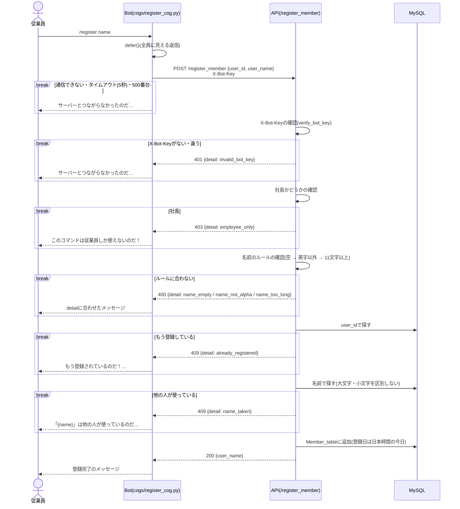
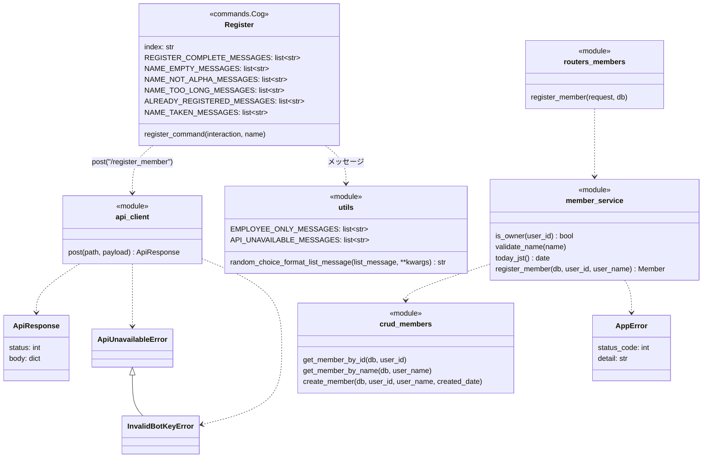

# `/register {name}`コマンドの単体詳細設計

- 基本設計: [名前の登録(`/register {name}`)](../basic_design.md#名前の登録register-name)
- 詳細設計(全体): [共通の決まり](../detailed_design.md#共通の決まり)、[`/register_member`](../detailed_design.md#register_member)、[エラーコードとメッセージ](../detailed_design.md#エラーコードとメッセージ)、[Member_table](../detailed_design.md#member_tableメンバー)

## 目次
- [概要](#概要)
- [対象ファイル](#対象ファイル)
- [準備](#準備)
- [処理の流れ](#処理の流れ)
- [コマンドの定義](#コマンドの定義)
- [Bot](#bot)
  - [ディレクトリの分け方](#ディレクトリの分け方)
  - [APIの呼び出し(`services/api_client.py`)](#apiの呼び出しservicesapi_clientpy)
  - [Cog(`cogs/register_cog.py`)](#cogcogsregister_cogpy)
  - [返信の文](#返信の文)
- [API](#api)
  - [リクエストとレスポンス](#リクエストとレスポンス)
  - [確認する順番](#確認する順番)
  - [各層の処理](#各層の処理)
- [クラス](#クラス)
- [エラーの扱い](#エラーの扱い)
- [単体テスト](#単体テスト)
- [Discordでの確認](#discordでの確認)
- [決めたこと](#決めたこと)

---
## 概要
- コマンドした人のDiscordのユーザーIDと、入力した名前を`Member_table`に登録し、登録完了のメッセージを返す。
- 名前のルール(英字のみ、10文字まで、空は不可、他の人と同じ名前は不可)と、社長かどうか、登録済みかどうかの確認は、すべてAPIで行う。Botは入力をそのままAPIに送り、返ってきた結果に合わせてメッセージを返すだけにする。
- 返信はサーバーの全員に見せる(`defer()`)。エラーのメッセージも全員に見える。
- `/register`はAPIを使う最初のコマンドなので、ほかのコマンドでも使う次の土台もここで作る。
  - Bot: `cogs/`と`services/`のディレクトリ分け、`services/api_client.py`(`aiohttp`、タイムアウト5秒、`X-Bot-Key`、`ApiUnavailableError`、`InvalidBotKeyError`)
  - API: `backend/src/`の構成、`AppError`と例外ハンドラー、`verify_bot_key`、テスト用DBにつなぐテストの準備

---
## 対象ファイル
### Bot(`frontend/`)
| ファイル | 変更 | 内容 |
| --- | --- | --- |
| `cogs/__init__.py`、`services/__init__.py` | 追加 | パッケージ化 |
| `services/api_client.py` | 追加 | APIを呼ぶ処理。`post`、`ApiUnavailableError`、`InvalidBotKeyError` |
| `register_cog.py` → `cogs/register_cog.py` | 移動・変更 | `register_command`を作り直す。返信の文を作る`make_register_reply`を足す。`myname`はこのステップでは直さない |
| `help_cog.py` → `cogs/help_cog.py` | 移動 | 中身は変えない |
| `time_stamp_cog.py` → `cogs/time_stamp_cog.py` | 移動 | 中身は変えない |
| `timer.py` → `cogs/timer_cog.py` | 移動 | 名前をほかのCogにそろえる。中身は変えない |
| `main.py` | 変更 | Cogの`import`を`from cogs.help_cog import Help`のように直す |
| `settings_env.py` | 変更 | `BOT_API_KEY`を読む |
| `utils.py` | 変更 | どのコマンドでも使うメッセージ(`EMPLOYEE_ONLY_MESSAGES`、`API_UNAVAILABLE_MESSAGES`)を足す |
| `tests/unit/test_help_cog.py` | 変更 | `import`を`from cogs.help_cog import Help`に直す |

### API(`backend/`)
| ファイル | 変更 | 内容 |
| --- | --- | --- |
| `src/__init__.py`、`src/*/__init__.py` | 追加 | パッケージ化 |
| `src/main.py` | 追加 | FastAPIの起動。routerの読み込み、`AppError`の例外ハンドラー、起動時の`create_all` |
| `src/config.py` | 追加 | `.env`の読み込み(DBの接続情報、`OWNER_DISCORD_ID`、`BOT_API_KEY`、`MYSQL_TEST_DATABASE`)と`JST` |
| `src/database.py` | 追加 | DBの接続(`engine`、`SessionLocal`、`Base`) |
| `src/dependencies.py` | 追加 | `get_db`、`verify_bot_key` |
| `src/exceptions.py` | 追加 | `AppError` |
| `src/models.py` | 追加 | `Member`(`Member_table`)。`attendance_records`は`/start_work`のステップで足す |
| `src/schemas/members.py` | 追加 | `RegisterMemberRequest`、`RegisterMemberResponse` |
| `src/routers/members.py` | 追加 | `POST /register_member` |
| `src/services/member_service.py` | 追加 | `is_owner`、`validate_name`、`today_jst`、`register_member` |
| `src/crud/members.py` | 追加 | `get_member_by_id`、`get_member_by_name`、`create_member` |
| `crud.py`、`database.py`、`database_config.py`、`from_discord.py`、`models.py`、`schemas.py` | 削除 | `src/`に移すため |
| `tests/__init__.py`、`tests/integration/__init__.py` | 追加 | テストのパッケージ化 |
| `tests/conftest.py` | 追加 | `TestClient`、テストごとにテーブルを空にする処理 |
| `tests/dependencies.py` | 追加 | テスト用DBにつなぐ`get_test_db` |
| `tests/integration/test_members_api.py` | 追加 | `/register_member`の単体テスト |
| `requirements.txt` | 変更 | `pytest`と`httpx`(`TestClient`で使う)を足す |

### その他
| ファイル | 変更 | 内容 |
| --- | --- | --- |
| `docker-compose.yml` | 変更 | APIの起動コマンドを`uvicorn src.main:app`にする |
| `README.md` | 変更 | ファイルの表を、Botの新しい場所に直す |
| `.env` | 変更 | `OWNER_DISCORD_ID`、`BOT_API_KEY`、`MYSQL_TEST_DATABASE`を足す(Git管理外) |

---
## 準備
- `.env`に次を足す。

  | 名前 | 例 | 内容 |
  | --- | --- | --- |
  | `OWNER_DISCORD_ID` | `123456789012345678` | 社長のDiscordユーザーID |
  | `BOT_API_KEY` | `python -c "import secrets; print(secrets.token_urlsafe(32))"`で作った文字列 | BotからのリクエストだとAPIが確かめるための文字列 |
  | `MYSQL_TEST_DATABASE` | `discord_work_logger_test` | 単体テストで使うデータベースの名前 |

- テスト用のデータベースは、phpMyAdminでrootとして1回だけ作る(Dockerの`MYSQL_USER`には新しいデータベースを作る権限がないため)。
  ```sql
  CREATE DATABASE discord_work_logger_test CHARACTER SET utf8mb4 COLLATE utf8mb4_0900_ai_ci;
  GRANT ALL PRIVILEGES ON discord_work_logger_test.* TO '<MYSQL_USER>'@'%';
  ```
- 今のDBの`Member_table`は、カラムが新しい設計と同じなので、そのまま使う。

---
## 処理の流れ


- `break`の中に入ったら、そこで終わる。下の確認には進まない。

---
## コマンドの定義
| 項目 | 値 |
| --- | --- |
| コマンド名 | `register{index}`(本番は`register`、開発は`register_test`) |
| 説明(候補に出る文) | `名前を登録します` |
| 引数 | `name: str`(必須)。引数の説明は`英字のみ、10文字まで` |
| DMで使えるか | 使えない(`@app_commands.guild_only()`) |
| 返信が見える人 | 全員(`defer()`) |

- 引数に`app_commands.Range[str, 1, 10]`などの制限は付けない。付けるとDiscordが先に止めてしまい、ずんだもんのメッセージを返せないため。

---
## Bot
### ディレクトリの分け方
[全体の詳細設計のBot](../detailed_design.md#botfrontend)のとおり、`cogs/`(画面)と`services/`(APIの窓口)に分ける。APIを使う最初のコマンドなので、このステップで今のCogもまとめて`cogs/`に移す。

```
frontend/
├ cogs/
│ ├ __init__.py
│ ├ help_cog.py         ## 移動
│ ├ register_cog.py     ## 移動・変更
│ ├ time_stamp_cog.py   ## 移動
│ └ timer_cog.py        ## timer.pyから名前を変えて移動
├ services/
│ ├ __init__.py
│ └ api_client.py       ## 追加
├ tests/unit/
│ └ test_help_cog.py    ## importを直す
├ main.py               ## importを直す
├ settings_env.py       ## BOT_API_KEYを足す
└ utils.py              ## 共通のメッセージを足す
```

- `cogs/register_cog.py`では、`from services import api_client`、`from services.api_client import ApiResponse`、`from settings_env import env_mode`、`from utils import ...`のように、`frontend/`から見た名前で読み込む。
- `control_log.py`はどこからも読み込まれていないので、このステップでは動かさない。

### APIの呼び出し(`services/api_client.py`)
ほかのコマンドも、この`post`を使ってAPIを呼ぶ。

```python
import logging
import aiohttp
from dataclasses import dataclass
from settings_env import API_URL, BOT_API_KEY

TIMEOUT = aiohttp.ClientTimeout(total=5)
logger = logging.getLogger(__name__)


class ApiUnavailableError(Exception):
    """APIと通信できない・タイムアウト・500番台の時に投げる"""


class InvalidBotKeyError(ApiUnavailableError):
    """APIが401を返した時に投げる。.envのBOT_API_KEYの設定が間違っている"""


@dataclass
class ApiResponse:
    """APIから返ってきた結果(500番台と401以外)

    Attributes:
        status (int): HTTPのステータスコード。200、400、403、404、409など
        body (dict): レスポンスのJSON。成功なら{"user_name": "Jun"}など、
            エラーなら{"detail": "name_taken"}など。JSONでなければ{}
    """
    status: int
    body: dict


async def post(path: str, payload: dict) -> ApiResponse:
    """APIにPOSTし、結果を返す

    ヘッダーにX-Bot-Keyを付け、5秒でタイムアウトする。
    401以外の400番台は例外にせず、ApiResponseで返す(detailごとのメッセージは各Cogで出し分けるため)。

    Args:
        path (str): APIのパス。"/register_member"のように"/"から書く
        payload (dict): APIに送るデータ。JSONにして送る

    Returns:
        ApiResponse: ステータスコードとレスポンスのJSON

    Raises:
        InvalidBotKeyError: APIが401を返した時(.envのBOT_API_KEYの設定の間違い)
        ApiUnavailableError: 通信できない・タイムアウト・500番台の時

    Examples:

        >>> response = await post("/register_member", {"user_id": 123, "user_name": "Jun"})
        >>> response.status
        200
        >>> response.body
        {'user_name': 'Jun'}
    """
    headers = {"X-Bot-Key": BOT_API_KEY}
    try:
        async with aiohttp.ClientSession(timeout=TIMEOUT) as session:
            async with session.post(f"{API_URL}{path}", json=payload, headers=headers) as response:
                if response.status == 401:
                    logger.error("APIが401を返した。BotとAPIの.envのBOT_API_KEYが同じか確かめる")
                    raise InvalidBotKeyError(f"status=401 path={path}")
                if response.status >= 500:
                    raise ApiUnavailableError(f"status={response.status}")
                try:
                    body = await response.json(content_type=None)
                except ValueError:
                    body = {}
                return ApiResponse(response.status, body or {})
    except (aiohttp.ClientError, TimeoutError) as e:
        raise ApiUnavailableError(str(e)) from e
```
- `aiohttp`はdiscord.pyと一緒に入っているので、`requirements.txt`には足さない。
- `ClientSession`は呼ぶたびに作る。使う人が少なく、1回のコマンドで1回しか呼ばないため。
- 401は`InvalidBotKeyError`を投げる。401はどのコマンドでも「`.env`の設定の間違い」という同じ意味なので、各Cogではなく`api_client`で止める。
  - `ApiUnavailableError`の子クラスにするので、Cogは`except ApiUnavailableError`だけで捕まえられ、従業員には通信できなかった時と同じメッセージが出る。
  - 従業員には直せない問題なので、エラーのログに残して開発者が気づけるようにする。
- 401以外の400番台は例外にせず、`ApiResponse`で返す。`detail`ごとのメッセージの出し分けは各Cogで行う。
- `requests`は、`/myname`などをまだ使っているので、`requirements.txt`から消さない(すべてのコマンドを直した後で消す)。

### Cog(`cogs/register_cog.py`)
```python
@app_commands.command(name=f"register{index}", description="名前を登録します")
@app_commands.describe(name="英字のみ、10文字まで")
@app_commands.guild_only()
async def register_command(self, interaction: discord.Interaction, name: str) -> None:
    """名前を登録し、結果をサーバーの全員に見える形で返信する

    Args:
        interaction (discord.Interaction): コマンドのinteraction。interaction.user.idを登録に使う
        name (str): 登録する名前。ルールの確認はAPIで行うので、そのまま送る
    """
    await interaction.response.defer()
    payload = {"user_id": interaction.user.id, "user_name": name}
    try:
        response = await api_client.post("/register_member", payload)
    except api_client.ApiUnavailableError:
        await interaction.followup.send(random_choice_format_list_message(API_UNAVAILABLE_MESSAGES))
        return
    await interaction.followup.send(make_register_reply(response, name))
```

返信の文は、Discordを使わない関数`make_register_reply`で作る(モジュールの関数にする)。後でテストを足す時に、Discordなしで確かめられるようにするため。

```python
def make_register_reply(response: ApiResponse, name: str) -> str:
    """/register_memberの結果から、返信の文を作る

    Discordを使わないので、単体テストできる。

    Args:
        response (ApiResponse): /register_memberの結果
        name (str): 従業員が入力した名前。name_takenのメッセージに入れる

    Returns:
        str: ランダムに選んだ返信の文。表にないdetailの時は、通信できなかった時の文
    """
    if response.status == 200:
        return random_choice_format_list_message(
            Register.REGISTER_COMPLETE_MESSAGES, name=response.body["user_name"])
    messages = REGISTER_ERROR_MESSAGES.get(response.body.get("detail"))
    if messages is None:
        return random_choice_format_list_message(API_UNAVAILABLE_MESSAGES)
    return random_choice_format_list_message(messages, name=name)
```
- `REGISTER_ERROR_MESSAGES`は`detail`とメッセージのリストの辞書。

  | detail | メッセージのリスト | 置いておく所 |
  | --- | --- | --- |
  | `employee_only` | `EMPLOYEE_ONLY_MESSAGES` | `utils.py` |
  | `name_empty` | `NAME_EMPTY_MESSAGES` | `Register` |
  | `name_not_alpha` | `NAME_NOT_ALPHA_MESSAGES` | `Register` |
  | `name_too_long` | `NAME_TOO_LONG_MESSAGES` | `Register` |
  | `already_registered` | `ALREADY_REGISTERED_MESSAGES`(今の`REGISTER_ID_CONFLICT_MESSAGES`を直す) | `Register` |
  | `name_taken` | `NAME_TAKEN_MESSAGES`(今の`REGISTER_NAME_CONFLICT_MESSAGES`を直す) | `Register` |

- 名前のルールのメッセージは`/rename`でも使うので、`Register`のクラス変数にする(`/rename`も同じCogに作るため)。
- 表にない`detail`(422の時など)は、通信できなかった時と同じメッセージを返す。401は`api_client`が`InvalidBotKeyError`にするので、ここには来ない。
- 今の`register_command`にある`if not name`の確認、`created_date`を送る処理、`requests`での呼び出しは消す。

### 返信の文
- 今と同じく、各メッセージを数パターン用意し、`random_choice_format_list_message`でランダムに選ぶ。下は各リストの1つ目。
- 今のコードに合わせて、「!」は全角(`！`)で書く。
- 開発環境でも、メッセージの中のコマンド名に`_test`は付けない(`/help`と同じ)。

| 場面 | メッセージの例 |
| --- | --- |
| 登録完了 | {name}の登録が完了したのだ！これからよろしくなのだ！ |
| `employee_only` | このコマンドは従業員しか使えないのだ！ |
| `name_empty` | 名前を書くのだ！ |
| `name_not_alpha` | 英字以外は書けないのだ！ |
| `name_too_long` | 名前は10文字までなのだ！ |
| `already_registered` | もう登録されているのだ！名前を変えたい時は/renameを使うのだ！ |
| `name_taken` | 「{name}」は他の人が使っているのだ…別の名前にしてほしいのだ！ |
| 通信できない | サーバーとつながらなかったのだ…少し待ってからもう一度試してほしいのだ！ |

- 登録完了のメッセージは、今の`REGISTER_COMPLETE_MESSAGES`をそのまま使う。
- `already_registered`の今のメッセージ(「更新機能を使うのだ」など)は、`/rename`を案内する文に直す。
- `{name}`に入るのは、APIの確認を通った名前(英字だけ)なので、メンションなどが混ざることはない。

---
## API
### リクエストとレスポンス
| 項目 | 値 |
| --- | --- |
| メソッド・パス | `POST /register_member` |
| ヘッダー | `X-Bot-Key: {BOT_API_KEY}` |
| リクエスト | `{"user_id": int, "user_name": str}` |
| レスポンス(200) | `{"user_name": str}` |
| エラー | `{"detail": "<エラーコード>"}` |

- 今のリクエストにある`created_date`は受け取らない。登録日はAPIが日本時間の今日を入れる。
- `user_name`には、Pydanticで長さなどの制限を付けない。付けると422になり、エラーコードを返せないため。

### 確認する順番
上から順に確認し、最初に当てはまったものを返す。

| 順 | 確認すること | ステータス | detail |
| --- | --- | --- | --- |
| 0 | `X-Bot-Key`がない、または`BOT_API_KEY`と違う | 401 | `invalid_bot_key` |
| 1 | `user_id`が`OWNER_DISCORD_ID`と同じ | 403 | `employee_only` |
| 2 | 名前が空(前後の空白を除いて0文字) | 400 | `name_empty` |
| 3 | 英字以外が入っている(`re.fullmatch(r"[A-Za-z]+", name)`に合わない) | 400 | `name_not_alpha` |
| 4 | 11文字以上 | 400 | `name_too_long` |
| 5 | その`user_id`がもう登録されている | 409 | `already_registered` |
| 6 | 他の人が同じ名前(大文字・小文字を区別しない) | 409 | `name_taken` |

- 3は空白も英字以外として扱う。前後の空白も取り除かずにエラーにする(例: ` Jun`は`name_not_alpha`)。
- 3で`str.isalpha()`を使わないのは、ひらがなや漢字も`True`になるため。`re.match`と`$`を使わないのは、末尾の改行を通してしまうため。

### 各層の処理
#### `routers/members.py`
```python
router = APIRouter(dependencies=[Depends(verify_bot_key)])

@router.post("/register_member", response_model=RegisterMemberResponse)
def register_member(request: RegisterMemberRequest, db: Session = Depends(get_db)) -> RegisterMemberResponse:
    """POST /register_member: メンバーを登録する

    Args:
        request (RegisterMemberRequest): 登録する人のuser_idと名前
        db (Session): DBのセッション

    Returns:
        RegisterMemberResponse: 登録した名前

    Raises:
        AppError: 登録できない時(member_service.register_memberと同じ)

    Note:
        AppErrorは、main.pyの例外ハンドラーがエラーのレスポンスにする
    """
    member = member_service.register_member(db, request.user_id, request.user_name)
    return RegisterMemberResponse(user_name=member.user_name)
```
- DBの処理が同期なので、`async def`ではなく`def`にする(FastAPIが別のスレッドで動かし、ほかのリクエストを止めないため)。

#### `services/member_service.py`
```python
NAME_PATTERN = re.compile(r"[A-Za-z]+")
NAME_MAX_LENGTH = 10

def is_owner(user_id: int) -> bool:
    """社長かどうかを判定する

    Args:
        user_id (int): DiscordのユーザーID

    Returns:
        bool: OWNER_DISCORD_IDと同じならTrue。.envにOWNER_DISCORD_IDがなければ、いつもFalse
    """
    return config.OWNER_DISCORD_ID is not None and user_id == config.OWNER_DISCORD_ID

def validate_name(name: str) -> None:
    """名前のルール(空は不可、英字のみ、10文字まで)を確かめる

    上から順に確かめ、最初に当てはまったエラーを投げる。/renameでも使う。

    Args:
        name (str): 確かめる名前

    Raises:
        AppError: ルールに合わない時(400)。detailは次のどれか
            - name_empty: 前後の空白を除いて0文字
            - name_not_alpha: 英字以外が入っている
            - name_too_long: 11文字以上
    """
    if not name.strip():
        raise AppError(400, "name_empty")
    if not NAME_PATTERN.fullmatch(name):
        raise AppError(400, "name_not_alpha")
    if len(name) > NAME_MAX_LENGTH:
        raise AppError(400, "name_too_long")

def today_jst() -> date:
    """日本時間の今日の日付を返す

    Returns:
        date: 日本時間の今日。登録日(created_date)に使う
    """
    return datetime.now(config.JST).date()

def register_member(db: Session, user_id: int, user_name: str) -> Member:
    """メンバーを登録する

    「確認する順番」の表のとおりに確かめてから登録し、コミットする。
    同時に登録されてUNIQUE制約に引っかかった時は、ロールバックしてから、どちらのエラーかを決める。

    Args:
        db (Session): DBのセッション
        user_id (int): 登録する人のDiscordのユーザーID
        user_name (str): 登録する名前

    Returns:
        Member: 登録したメンバー

    Raises:
        AppError: 登録できない時。detailは次のどれか
            - employee_only(403): 社長
            - name_empty、name_not_alpha、name_too_long(400): 名前のルールに合わない
            - already_registered(409): もう登録している
            - name_taken(409): 他の人が同じ名前を使っている(大文字・小文字を区別しない)
    """
    if is_owner(user_id):
        raise AppError(403, "employee_only")
    validate_name(user_name)
    if members.get_member_by_id(db, user_id) is not None:
        raise AppError(409, "already_registered")
    if members.get_member_by_name(db, user_name) is not None:
        raise AppError(409, "name_taken")

    member = members.create_member(db, user_id, user_name, today_jst())
    try:
        db.commit()
    except IntegrityError:
        # 同時に登録された時。もう一度確かめて、どちらのエラーかを決める
        db.rollback()
        if members.get_member_by_id(db, user_id) is not None:
            raise AppError(409, "already_registered")
        raise AppError(409, "name_taken")
    db.refresh(member)
    return member
```
- `config.OWNER_DISCORD_ID`は、関数の中で毎回`config`から読む(テストで差し替えられるようにするため)。

#### `crud/members.py`
| 関数 | 内容 |
| --- | --- |
| `get_member_by_id(db, user_id) -> Member \| None` | `user_id`で1件探す |
| `get_member_by_name(db, user_name) -> Member \| None` | `func.lower(Member.user_name) == user_name.lower()`で1件探す |
| `create_member(db, user_id, user_name, created_date) -> Member` | `db.add`だけ行う。コミットしない |

- 大文字・小文字を区別しない比べ方は、照合順序(`utf8mb4_0900_ai_ci`)に任せず`func.lower`で書く。コードを読むだけで分かるようにするため。照合順序とUNIQUE制約は、同時に登録された時の最後の守りにする。

#### `models.py`
```python
class Member(Base):
    """Member_table。メンバーを1人1行で管理する

    Attributes:
        user_id (int): 主キー。DiscordのユーザーID
        user_name (str): 登録名。UNIQUE。入力した大文字・小文字のまま保存する
        created_date (date): 登録日(日本時間)
        retirement_date (date | None): 退職日。今回は使わない
    """
    __tablename__ = "Member_table"
    __table_args__ = {"mysql_charset": "utf8mb4", "mysql_collate": "utf8mb4_0900_ai_ci"}

    user_id = Column(BigInteger, primary_key=True, autoincrement=False)
    user_name = Column(String(10), nullable=False, unique=True)
    created_date = Column(Date, nullable=False)
    retirement_date = Column(Date, nullable=True)
```
- `autoincrement=False`は、DiscordのユーザーIDをそのまま入れるため。

#### `dependencies.py`
```python
def get_db() -> Iterator[Session]:
    """リクエストごとにDBのセッションを作り、終わったら閉じる

    Yields:
        Session: DBのセッション
    """
    db = SessionLocal()
    try:
        yield db
    finally:
        db.close()

def verify_bot_key(x_bot_key: str | None = Header(default=None)) -> None:
    """X-Bot-Keyヘッダーが、.envのBOT_API_KEYと同じかを確かめる

    Bot用のrouterすべてに、dependenciesとして付ける。

    Args:
        x_bot_key (str | None): X-Bot-Keyヘッダーの値。ヘッダーがない時はNone

    Raises:
        AppError: 401 invalid_bot_key。ヘッダーがない、値が違う、.envにBOT_API_KEYがない時
    """
    if not config.BOT_API_KEY or x_bot_key is None \
            or not secrets.compare_digest(x_bot_key, config.BOT_API_KEY):
        raise AppError(401, "invalid_bot_key")
```
- `.env`に`BOT_API_KEY`を書き忘れた時に、ヘッダーなしのリクエストが通ってしまわないよう、`BOT_API_KEY`が空なら必ず401にする。

#### `main.py`
```python
@asynccontextmanager
async def lifespan(app: FastAPI) -> AsyncIterator[None]:
    """APIの起動時に、テーブルがなければ作る

    Args:
        app (FastAPI): FastAPIのアプリ

    Yields:
        None: ここでAPIが動き、止まる時に戻ってくる
    """
    Base.metadata.create_all(bind=engine)
    yield

app = FastAPI(lifespan=lifespan)
app.include_router(members.router)

@app.exception_handler(AppError)
async def app_error_handler(request: Request, exc: AppError) -> JSONResponse:
    """AppErrorを、HTTPのエラーのレスポンスにする

    Args:
        request (Request): 受け取ったリクエスト
        exc (AppError): servicesなどが投げた例外

    Returns:
        JSONResponse: exc.status_codeのステータスと、{"detail": exc.detail}
    """
    return JSONResponse(status_code=exc.status_code, content={"detail": exc.detail})
```
- `create_all`は`lifespan`の中で行う。テストで`app`を読み込んだ時に、本番のDBにつながないようにするため。
- 今の`from_discord.py`のCORSの設定は、Webのステップで必要になった時に足す(今はBotしか使わないため)。

#### `config.py`
| 名前 | 内容 |
| --- | --- |
| `MYSQL_USER`、`MYSQL_PASSWORD`、`MYSQL_HOST`、`MYSQL_DATABASE`、`MYSQL_TEST_DATABASE` | `.env`の値 |
| `OWNER_DISCORD_ID` | `.env`の値を`int`にしたもの。書いていなければ`None` |
| `BOT_API_KEY` | `.env`の値 |
| `JST` | `timezone(timedelta(hours=9))`。日本は夏時間がないので、`zoneinfo`を使わない |

- `database.py`の接続先は`mysql+mysqlconnector://{user}:{password}@{host}/{db}?charset=utf8mb4`にする。今の`database.py`にある`session = SessionLocal()`(使われていない)は作らない。

---
## クラス


---
## エラーの扱い
| 起きること | API | Bot |
| --- | --- | --- |
| 名前のルール違反、社長、登録済み、名前が使われている | `AppError`を投げ、例外ハンドラーが400/403/409にする | `detail`に合わせたメッセージ |
| `X-Bot-Key`が違う | 401 `invalid_bot_key` | `api_client`がエラーのログを残して`InvalidBotKeyError`を投げる。従業員には通信できなかった時のメッセージ(設定の間違いなので、利用者にはサーバーの問題として見せる) |
| リクエストの形が違う | FastAPIが422を返す | 通信できなかった時のメッセージ |
| 同時に同じ`user_id`・同じ名前で登録された | UNIQUE制約の`IntegrityError`をロールバックし、409にする | `detail`に合わせたメッセージ |
| DBにつながらない | 500 | 通信できなかった時のメッセージ |
| APIにつながらない・5秒以内に返ってこない | | 通信できなかった時のメッセージ |

- Discordへの返信が失敗した時は、`/help`と同じくdiscord.pyのエラーのログに任せる。

---
## 単体テスト
- ファイル: `backend/tests/integration/test_members_api.py`
- 実行: `docker compose exec api python -m pytest tests`
- `/register_member`を`TestClient`で呼び、返ってきた結果と、テスト用DBの`Member_table`の中身を確かめる。
- `conftest.py`で`get_db`を`tests/dependencies.py`の`get_test_db`に差し替え、テストの前に`create_all`、各テストの前に`Member_table`を空にする。
- リクエストのヘッダーには`config.BOT_API_KEY`、社長のIDには`config.OWNER_DISCORD_ID`を使う。

| No | 確かめること | 起こしたエラー(やったこと) | 期待する結果 |
| --- | --- | --- | --- |
| T-01 | 名前を登録できる | なし(未登録の従業員が`Jun`で登録する) | 200 `{"user_name": "Jun"}`。DBに`Jun`の行ができ、登録日が今日になっている |
| T-02 | 社長は登録できない | 社長のIDで`Boss`を登録する | 403 `employee_only`。DBに行ができない |
| T-03 | 他の人と同じ名前は登録できない | `Jun`が登録されている所に、別の人が`jun`(大文字・小文字だけ違う)で登録する | 409 `name_taken`。DBの行は`Jun`の1つだけ |
| T-04 | ルールに合わない名前は登録できない | 次の3つの名前で登録する<br>・空(`""`)<br>・英字以外(`じゅん`)<br>・11文字(`abcdefghijk`) | 順に、400 `name_empty`、400 `name_not_alpha`、400 `name_too_long`。どれもDBに行ができない |
| T-05 | BotとAPIの合言葉(`X-Bot-Key`)が違うと使えない | `X-Bot-Key`を違う値にして登録する | 401 `invalid_bot_key`。DBに行ができない |

- T-04は、`pytest.mark.parametrize`で3つの名前を1つのテストにまとめる。
- Botが401を受けた時に「サーバーとつながらなかったのだ…」と返すことは、[Discordでの確認](#discordでの確認)のD-08で確かめる。

---
## Discordでの確認
単体テストでは確かめられない、Botとつないだ時の動きを開発環境(`/register_test`)で確かめる。

| No | 操作 | 期待する結果 |
| --- | --- | --- |
| D-01 | 未登録の人が`/register_test Jun` | 全員に見える登録完了のメッセージ。phpMyAdminで`Member_table`に行がある |
| D-02 | 同じ人がもう一度`/register_test Ken` | もう登録されているメッセージ |
| D-03 | 別の人が`/register_test jun` | 「jun」は他の人が使っているメッセージ |
| D-04 | `/register_test じゅん` | 英字以外は書けないメッセージ |
| D-05 | 社長が`/register_test Boss` | 従業員しか使えないメッセージ |
| D-06 | APIのコンテナを止めて`/register_test Jun` | 5秒ほどで、サーバーとつながらなかったメッセージ |
| D-07 | BotへのDMで`/register_test`を打つ | 候補に出ない |
| D-08 | Botの`.env`の`BOT_API_KEY`だけを違う値にして`/register_test Jun` | 従業員には、サーバーとつながらなかったメッセージ。Botのログに401のエラーが出る |

---
## 決めたこと
- **このステップで`backend/src/`に移し、古いAPIのファイルは消す。** `/register_member`だけを新しい構成で作る。そのため、`/myname`(`/get_name`)は次のステップで作り直すまで動かなくなる。今の`/start_work`は、もともと存在しないAPIを呼んでいて動いていないので、影響はない。古いファイルを残すと、新旧2つの`models.py`ができて紛らわしいため。
- **DBの古いテーブル(`monthly_summary`など)は、このステップでは消さない。** `create_all`は今あるテーブルを変えないので、そのまま残る。`attendance_records`のカラムを足す`/start_work`のステップで、まとめて作り直す。
- **名前のルールの確認はAPIだけで行い、Botでは確かめない。** 基本設計どおり、判定はAPIに集める。Botでも確かめると、ルールを変えた時に2か所直す必要があるため。
- **`name_taken`のメッセージの`{name}`は、入力した名前を使う。** 登録済みの人の名前(例: `Jun`)を出すと、大文字・小文字の違いで混乱するため、自分が打った名前を出す。
- **Botを`cogs/`と`services/`に分け、今のCogもこのステップで移す。** 層の分け方をディレクトリで見えるようにするため。APIの窓口を作るこのステップで移すと、後のコマンドはすべて新しい場所で作れる。
- **`api_client.post`は、401だけ`InvalidBotKeyError`にし、ほかの400番台は例外にしない。** 401はどのコマンドでも設定の間違いという同じ意味だが、ほかの400番台はコマンドごとに意味が違い、各Cogが`detail`で出し分けるため。
- **`InvalidBotKeyError`は`ApiUnavailableError`の子クラスにする。** 従業員に見せるメッセージは通信できない時と同じでよいので、Cogに`except`を増やさずに済むため。
- **テスト用DBは手で1回作る。** `MYSQL_USER`にはデータベースを作る権限がなく、rootのパスワードをテストに持たせたくないため。
