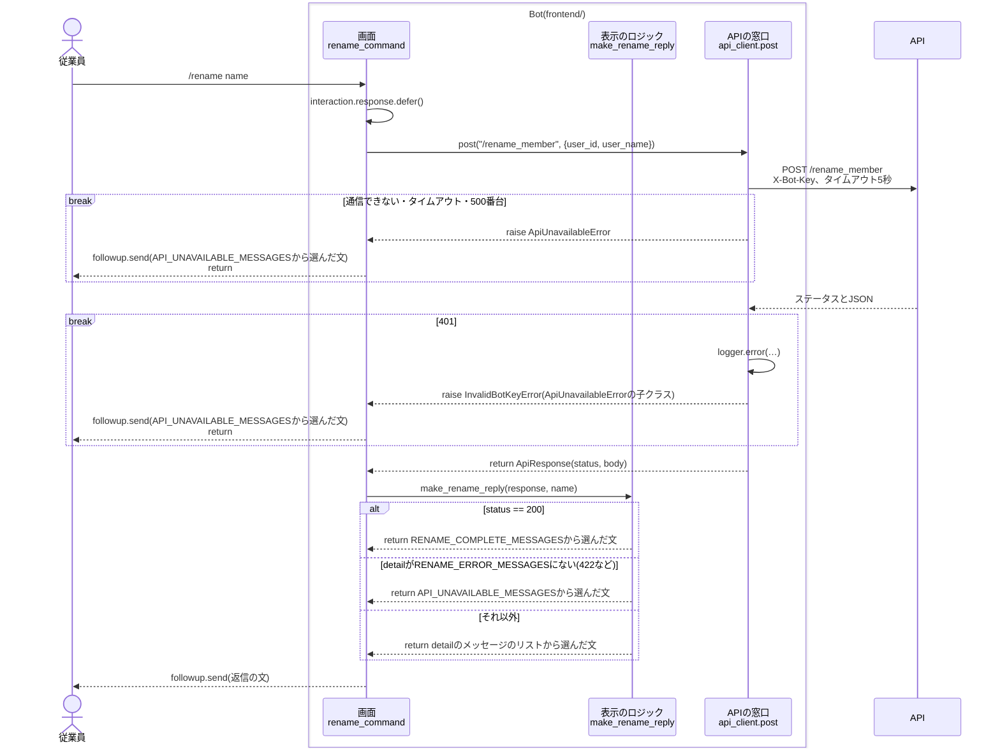
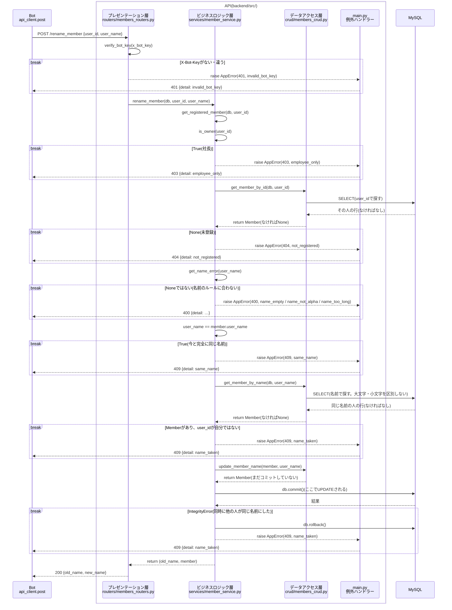
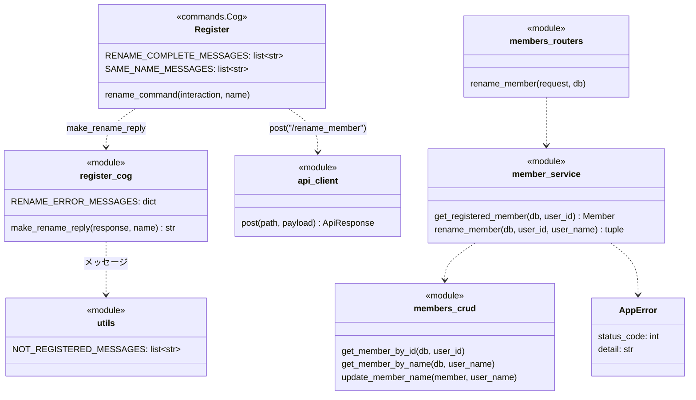

# `/rename {name}`コマンドの単体詳細設計

- 基本設計: [名前の変更(`/rename {name}`)](../basic_design.md#名前の変更rename-name)
- 詳細設計(全体): [共通の決まり](../detailed_design.md#共通の決まり)、[`/rename_member`](../detailed_design.md#rename_member)、[エラーコードとメッセージ](../detailed_design.md#エラーコードとメッセージ)、[Member_table](../detailed_design.md#member_tableメンバー)
- 土台(`api_client`、`AppError`、`verify_bot_key`、テストの準備)は[`/register`の単体詳細設計](./register_detailed_design.md)で作ったものを使う。

## 目次
- [概要](#概要)
- [対象ファイル](#対象ファイル)
- [処理の流れ](#処理の流れ)
  - [Botの中](#botの中)
  - [APIの中](#apiの中)
- [コマンドの定義](#コマンドの定義)
- [Bot](#bot)
  - [Cog(`cogs/register_cog.py`)](#cogcogsregister_cogpy)
  - [返信の文](#返信の文)
- [API](#api)
  - [リクエストとレスポンス](#リクエストとレスポンス)
  - [確認する順番](#確認する順番)
  - [各層の処理](#各層の処理)
- [クラス](#クラス)
- [エラーの扱い](#エラーの扱い)
- [単体テスト](#単体テスト)
- [Discordでの確認](#discordでの確認)
- [決めたこと](#決めたこと)

---
## 概要
- コマンドした人の登録名を、入力した名前に変え、変更前と変更後の名前を入れたメッセージを返す。
- 名前のルール(英字のみ、10文字まで、空は不可、他の人と同じ名前は不可)は`/register`と同じ。確認はすべてAPIで行い、Botは入力をそのままAPIに送る。
- 今と完全に同じ名前(大文字・小文字も同じ)なら変えない。大文字・小文字だけを変えること(`jun` → `Jun`)はできる。
- 出退勤の記録は`user_id`で持っているので、名前を変えても記録はそのまま引き継がれる。`Member_table`の`user_name`を書き換えるだけでよい。
- 返信はサーバーの全員に見せる(`defer()`)。エラーのメッセージも全員に見える。
- `/rename`は「登録している従業員だけが使える」最初のコマンドなので、ほかのコマンドでも使う次の土台もここで作る。
  - API: `member_service.get_registered_member`(社長と未登録の確認)
  - Bot: `utils.py`の`NOT_REGISTERED_MESSAGES`(未登録の時のメッセージ)

---
## 対象ファイル
### Bot(`frontend/`)
| ファイル | 変更 | 内容 |
| --- | --- | --- |
| `cogs/register_cog.py` | 追加・変更 | `rename_command`、返信の文を作る`make_rename_reply`、`RENAME_ERROR_MESSAGES`、メッセージのリスト(`RENAME_COMPLETE_MESSAGES`、`SAME_NAME_MESSAGES`)を足す。ファイルのdocstringを、`/rename`も入れた説明に書き換える |
| `utils.py` | 追加 | どのコマンドでも使うメッセージに`NOT_REGISTERED_MESSAGES`を足す |

### API(`backend/`)
| ファイル | 変更 | 内容 |
| --- | --- | --- |
| `src/schemas/members.py` | 追加 | `RenameMemberRequest`、`RenameMemberResponse`を足す |
| `src/routers/members_routers.py` | 追加 | `POST /rename_member`を足す |
| `src/services/member_service.py` | 追加 | `get_registered_member`、`rename_member`を足す |
| `src/crud/members_crud.py` | 追加 | `update_member_name`を足す |
| `tests/integration/test_members_api.py` | 追加 | `/rename_member`の単体テストを足す |

### その他
| ファイル | 変更 | 内容 |
| --- | --- | --- |
| `README.md` | 追加 | コマンドの表に`/rename {name}`、APIの表に`/rename_member`を足す |

- `models.py`、テーブルは変えない。

---
## 処理の流れ
全体は「Bot → API → MySQL」の3つに分かれ、BotとAPIの中も、それぞれ3つの層に分かれている。

| | 層 | ファイル・関数 |
| --- | --- | --- |
| Bot | 画面 | `cogs/register_cog.py`の`rename_command` |
| | 表示のロジック | `cogs/register_cog.py`の`make_rename_reply` |
| | APIの窓口 | `services/api_client.py`の`post` |
| API | プレゼンテーション層 | `routers/members_routers.py`の`rename_member`(`X-Bot-Key`の確認は`dependencies.py`の`verify_bot_key`) |
| | ビジネスロジック層 | `services/member_service.py`の`rename_member`、`get_registered_member` |
| | データアクセス層 | `crud/members_crud.py`の`get_member_by_id`、`get_member_by_name`、`update_member_name` |

1つの図にすると、APIのエラーのたびにBotの返信の流れをくり返すことになり、読みにくくなる。そこで、Botの中とAPIの中を別々の図にする。
図には、層をまたぐ関数の呼び出し、MySQLへのアクセス、例外と早期リターンを描く。関数の中の1行の処理(変数に入れる、属性を書き換えるなど)は描かない。

### Botの中
APIは1つの箱として描く。APIの中は[APIの中](#apiの中)の図を参照。



- `break`の中に入ったら、そこで終わる。下には進まない。
- `rename_command`は、`ApiUnavailableError`だけを`except`する。`InvalidBotKeyError`は子クラスなので、同じ`except`で捕まる。

### APIの中


- `break`の中に入ったら、そこで終わる。下には進まない。
- `verify_bot_key`は、FastAPIが`rename_member`より先に呼ぶ(`dependencies.py`の関数を、routerの`dependencies`に付けているため)。
- `AppError`は`routers`を通り抜けて`main.py`の例外ハンドラーに届く。図では、通り抜けるところを省いている。
- コミットとロールバックは、[層の分け方](../detailed_design.md#層の分け方と例外)のとおり`services`で行う。そのため、`services`からMySQLへの矢印がある。

---
## コマンドの定義
| 項目 | 値 |
| --- | --- |
| コマンド名 | `rename{index}`(本番は`rename`、開発は`rename_test`) |
| 説明(候補に出る文) | `名前を変更します` |
| 引数 | `name: str`(必須)。引数の説明は`英字のみ、10文字まで` |
| DMで使えるか | 使えない(`@app_commands.guild_only()`) |
| 返信が見える人 | 全員(`defer()`) |

- `/register`と同じく、引数に`app_commands.Range`などの制限は付けない(ずんだもんのメッセージを返すため)。

---
## Bot
### Cog(`cogs/register_cog.py`)
`/register`と同じCog(`Register`)に足す。名前のルールのメッセージ(`NAME_EMPTY_MESSAGES`など)を、そのまま使えるため。

```python
@app_commands.command(name=f"rename{index}", description="名前を変更します")
@app_commands.describe(name="英字のみ、10文字まで")
@app_commands.guild_only()
async def rename_command(self, interaction: discord.Interaction, name: str) -> None:
    """登録名を変更し、結果をサーバーの全員に見える形で返信する

    Args:
        interaction (discord.Interaction): コマンドのinteraction。interaction.user.idで変更する人を決める
        name (str): 変更後の名前。ルールの確認はAPIで行うので、そのまま送る
    """
    await interaction.response.defer()
    payload = {"user_id": interaction.user.id, "user_name": name}
    try:
        response = await api_client.post("/rename_member", payload)
    except api_client.ApiUnavailableError:
        await interaction.followup.send(random_choice_format_list_message(API_UNAVAILABLE_MESSAGES))
        return
    await interaction.followup.send(make_rename_reply(response, name))
```

返信の文は、`make_register_reply`と同じく、Discordを使わないモジュールの関数`make_rename_reply`で作る。

```python
def make_rename_reply(response: ApiResponse, name: str) -> str:
    """/rename_memberの結果から、返信の文を作る

    Discordを使わないので、単体テストできる。

    Args:
        response (ApiResponse): /rename_memberの結果
        name (str): 従業員が入力した名前。name_takenのメッセージに入れる

    Returns:
        str: ランダムに選んだ返信の文。表にないdetailの時は、通信できなかった時の文
    """
    if response.status == 200:
        return random_choice_format_list_message(
            Register.RENAME_COMPLETE_MESSAGES,
            old_name=response.body["old_name"], new_name=response.body["new_name"])

    detail = response.body.get("detail")
    # 422の時はdetailがリストで返ってくるので、文字列の時だけ探す
    messages = RENAME_ERROR_MESSAGES.get(detail) if isinstance(detail, str) else None
    if messages is None:
        return random_choice_format_list_message(API_UNAVAILABLE_MESSAGES)
    return random_choice_format_list_message(messages, name=name)
```

- `RENAME_ERROR_MESSAGES`は`detail`とメッセージのリストの辞書。`REGISTER_ERROR_MESSAGES`の下に置く。

  | detail | メッセージのリスト | 置いておく所 |
  | --- | --- | --- |
  | `employee_only` | `EMPLOYEE_ONLY_MESSAGES` | `utils.py` |
  | `not_registered` | `NOT_REGISTERED_MESSAGES`(追加) | `utils.py` |
  | `name_empty` | `NAME_EMPTY_MESSAGES` | `Register` |
  | `name_not_alpha` | `NAME_NOT_ALPHA_MESSAGES` | `Register` |
  | `name_too_long` | `NAME_TOO_LONG_MESSAGES` | `Register` |
  | `same_name` | `SAME_NAME_MESSAGES`(追加) | `Register` |
  | `name_taken` | `NAME_TAKEN_MESSAGES` | `Register` |

- `NOT_REGISTERED_MESSAGES`は、`/myname`、`/start_work`、`/stop_work`、`/work_status`でも使うので`utils.py`に置く。
  - 今の`Register.NO_DATA_AND_REGISTER_NAME_MESSAGES`は`/myname`がまだ使っているので、このステップでは残す。`/myname`を作り直すステップで`NOT_REGISTERED_MESSAGES`に切り替えて消す。
- `make_register_reply`と`make_rename_reply`は、200の時の文と辞書が違うだけで形が同じ。ただし、共通の関数にはまとめない([決めたこと](#決めたこと)を参照)。

### 返信の文
- `/register`と同じく、各メッセージを数パターン用意し、`random_choice_format_list_message`でランダムに選ぶ。下は各リストの1つ目。
- 「!」は全角(`！`)で書く。メッセージの中のコマンド名に`_test`は付けない。

| 場面 | メッセージの例 | リスト |
| --- | --- | --- |
| 変更完了 | 名前を{old_name}から{new_name}に変えたのだ！ | `RENAME_COMPLETE_MESSAGES`(追加) |
| `employee_only` | このコマンドは従業員しか使えないのだ！ | `EMPLOYEE_ONLY_MESSAGES` |
| `not_registered` | まだ名前が登録されていないのだ！先に/registerで登録するのだ！ | `NOT_REGISTERED_MESSAGES`(追加) |
| `name_empty` | 名前を書くのだ！ | `NAME_EMPTY_MESSAGES` |
| `name_not_alpha` | 英字以外は書けないのだ！ | `NAME_NOT_ALPHA_MESSAGES` |
| `name_too_long` | 名前は10文字までなのだ！ | `NAME_TOO_LONG_MESSAGES` |
| `same_name` | 今と同じ名前なのだ！ | `SAME_NAME_MESSAGES`(追加) |
| `name_taken` | 「{name}」は他の人が使っているのだ…別の名前にしてほしいのだ！ | `NAME_TAKEN_MESSAGES` |
| 通信できない | サーバーとつながらなかったのだ…少し待ってからもう一度試してほしいのだ！ | `API_UNAVAILABLE_MESSAGES` |

- 足すリストの例(実装の時に、ほかの文も足してよい)。

  ```python
  RENAME_COMPLETE_MESSAGES: list[str] = [
      "名前を{old_name}から{new_name}に変えたのだ！",
      "{old_name}改め、{new_name}なのだ！これからもよろしくなのだ！",
      "名前の変更が完了したのだ！今日から{new_name}なのだ！",
  ]

  SAME_NAME_MESSAGES: list[str] = [
      "今と同じ名前なのだ！",
      "それは今の名前と同じなのだ！変える必要はないのだ！",
      "もうその名前で登録されているのだ！",
  ]
  ```

  ```python
  # utils.py
  ## 登録していない人が、登録している人専用のコマンドを使った時(detail: not_registered)
  NOT_REGISTERED_MESSAGES: list[str] = [
      "まだ名前が登録されていないのだ！先に/registerで登録するのだ！",
      "ボクの記録にお前の名前がないのだ！先に/registerで登録するのだ！",
      "名前が登録されていないのだ…まずは/registerからよろしくなのだ！",
  ]
  ```

- `{old_name}`と`{new_name}`はAPIが返した名前を使う。どちらもAPIの確認を通った名前(英字だけ)なので、メンションなどが混ざることはない。

---
## API
### リクエストとレスポンス
| 項目 | 値 |
| --- | --- |
| メソッド・パス | `POST /rename_member` |
| ヘッダー | `X-Bot-Key: {BOT_API_KEY}` |
| リクエスト | `{"user_id": int, "user_name": str}`(`user_name`は変更後の名前) |
| レスポンス(200) | `{"old_name": str, "new_name": str}` |
| エラー | `{"detail": "<エラーコード>"}` |

- `user_name`には、`/register_member`と同じく、Pydanticで長さなどの制限を付けない(422にせず、エラーコードを返すため)。

### 確認する順番
上から順に確認し、最初に当てはまったものを返す。

| 順 | 確認すること | ステータス | detail |
| --- | --- | --- | --- |
| 0 | `X-Bot-Key`がない、または`BOT_API_KEY`と違う | 401 | `invalid_bot_key` |
| 1 | `user_id`が`OWNER_DISCORD_ID`と同じ | 403 | `employee_only` |
| 2 | その`user_id`が登録されていない | 404 | `not_registered` |
| 3 | 名前が空(前後の空白を除いて0文字) | 400 | `name_empty` |
| 4 | 英字以外が入っている | 400 | `name_not_alpha` |
| 5 | 11文字以上 | 400 | `name_too_long` |
| 6 | 今の名前と完全に同じ(大文字・小文字も区別する) | 409 | `same_name` |
| 7 | 自分以外の人が同じ名前(大文字・小文字を区別しない) | 409 | `name_taken` |

- 1と2は`get_registered_member`で確かめる。
- 3〜5は`/register_member`と同じ`get_name_error`を使う。
- 未登録(2)を名前のルール(3〜5)より先に確かめる。未登録の人に名前のルールを直させても、結局変えられないため。
- 6は`==`で比べる。`jun` → `Jun`は6に当てはまらず、7の確認に進む。
- 7は`get_member_by_name`で探し、見つかった人が自分なら当てはまらないものとする。`jun` → `Jun`の時は自分の行が見つかるので、変更できる。

### 各層の処理
#### `schemas/members.py`
```python
class RenameMemberRequest(BaseModel):
    """/rename_memberのリクエスト

    user_nameには長さなどの制限を付けない(付けると422になり、エラーコードを返せないため)。

    Attributes:
        user_id (int): 名前を変える人のDiscordのユーザーID
        user_name (str): 変更後の名前。入力したまま送られてくる
    """
    user_id: int
    user_name: str


class RenameMemberResponse(BaseModel):
    """/rename_memberのレスポンス

    Attributes:
        old_name (str): 変更前の名前
        new_name (str): 変更後の名前
    """
    old_name: str
    new_name: str
```
- リクエストの形は`RegisterMemberRequest`と同じだが、分けて作る。APIごとに型を持つと、片方だけ項目を変えたい時に困らないため。

#### `routers/members_routers.py`
```python
@router.post("/rename_member", response_model=RenameMemberResponse)
def rename_member(request: RenameMemberRequest, db: Session = Depends(get_db)) -> RenameMemberResponse:
    """POST /rename_member: 登録名を変更する

    Args:
        request (RenameMemberRequest): 名前を変える人のuser_idと、変更後の名前
        db (Session): DBのセッション

    Returns:
        RenameMemberResponse: 変更前と変更後の名前

    Raises:
        AppError: 変更できない時(member_service.rename_memberと同じ)

    Note:
        AppErrorは、main.pyの例外ハンドラーがエラーのレスポンスにする
    """
    old_name, member = member_service.rename_member(db, request.user_id, request.user_name)
    return RenameMemberResponse(old_name=old_name, new_name=member.user_name)
```

#### `services/member_service.py`
```python
def get_registered_member(db: Session, user_id: int) -> Member:
    """登録している従業員を返す。社長か未登録ならAppErrorを投げる

    従業員専用のAPIは、どれも最初にこの関数を呼ぶ(/register_memberは除く)。

    Args:
        db (Session): DBのセッション
        user_id (int): DiscordのユーザーID

    Returns:
        Member: 見つかったメンバー

    Raises:
        AppError: 使えない時。detailは次のどれか
            - employee_only(403): 社長
            - not_registered(404): 登録していない
    """
    if is_owner(user_id):
        raise AppError(403, "employee_only")

    member = members_crud.get_member_by_id(db, user_id)
    if member is None:
        raise AppError(404, "not_registered")
    return member


def rename_member(db: Session, user_id: int, user_name: str) -> tuple[str, Member]:
    """登録名を変更する

    「確認する順番」の表のとおりに確かめてから名前を書き換え、コミットする。
    同時に同じ名前に変えられてUNIQUE制約に引っかかった時は、ロールバックしてname_takenにする。

    Args:
        db (Session): DBのセッション
        user_id (int): 名前を変える人のDiscordのユーザーID
        user_name (str): 変更後の名前

    Returns:
        tuple[str, Member]: 変更前の名前と、変更した後のメンバー

    Raises:
        AppError: 変更できない時。detailは次のどれか
            - employee_only(403): 社長
            - not_registered(404): 登録していない
            - name_empty、name_not_alpha、name_too_long(400): 名前のルールに合わない
            - same_name(409): 今と完全に同じ名前
            - name_taken(409): 自分以外の人が同じ名前を使っている(大文字・小文字を区別しない)
    """
    member = get_registered_member(db, user_id)

    name_error = get_name_error(user_name)
    if name_error is not None:
        raise AppError(400, name_error)

    if user_name == member.user_name:
        raise AppError(409, "same_name")

    same_name_member = members_crud.get_member_by_name(db, user_name)
    # 大文字・小文字だけを変える時は自分が見つかるので、自分以外の時だけエラーにする
    if same_name_member is not None and same_name_member.user_id != user_id:
        raise AppError(409, "name_taken")

    old_name = member.user_name
    members_crud.update_member_name(member, user_name)
    try:
        db.commit()
    except IntegrityError:
        # 同時に他の人が同じ名前に変えた・登録した時
        db.rollback()
        raise AppError(409, "name_taken")
    db.refresh(member)
    return old_name, member
```
- `old_name`は、書き換える前に取っておく(書き換えた後は`member.user_name`が新しい名前になるため)。
- 名前を変える時、`Member_table`の行はロックしない。同じ人が同時に2回`/rename`しても、後の方の名前になるだけで、記録が壊れることはないため。
- `register_member`の中の社長の確認は、`get_registered_member`に置き換えない(`/register_member`は「未登録なら続ける」ので、確かめる内容が逆になるため)。

#### `crud/members_crud.py`
| 関数 | 内容 |
| --- | --- |
| `update_member_name(member, user_name) -> Member` | 追加。`member.user_name`を書き換えるだけ行う。コミットしない |

```python
def update_member_name(member: Member, user_name: str) -> Member:
    """メンバーの名前を書き換える。コミットしない

    Args:
        member (Member): 名前を変えるメンバー。DBのセッションから取ったもの
        user_name (str): 変更後の名前

    Returns:
        Member: 名前を書き換えたメンバー
    """
    member.user_name = user_name
    return member
```
- `member`はセッションから取ったものなので、`db.add`しなくても、コミットの時に`UPDATE`される。そのため`db`は受け取らない。
- 書き換えを`services`で直接行わず`crud`に置くのは、[層の分け方](../detailed_design.md#層の分け方と例外)のとおり、DBに書く処理を`crud`にそろえるため。

---
## クラス
今回足すものだけを書く。`/register`で作ったものは[`/register`のクラス](./register_detailed_design.md#クラス)を参照。



---
## エラーの扱い
| 起きること | API | Bot |
| --- | --- | --- |
| 社長、未登録、名前のルール違反、同じ名前、名前が使われている | `AppError`を投げ、例外ハンドラーが400/403/404/409にする | `detail`に合わせたメッセージ |
| `X-Bot-Key`が違う | 401 `invalid_bot_key` | `api_client`がエラーのログを残して`InvalidBotKeyError`を投げる。従業員には通信できなかった時のメッセージ |
| リクエストの形が違う | FastAPIが422を返す | 通信できなかった時のメッセージ |
| 同時に2人が同じ名前に変えた(または変更と登録が重なった) | UNIQUE制約の`IntegrityError`をロールバックし、409 `name_taken`にする | `name_taken`のメッセージ |
| DBにつながらない | 500 | 通信できなかった時のメッセージ |
| APIにつながらない・5秒以内に返ってこない | | 通信できなかった時のメッセージ |

---
## 単体テスト
- ファイル: `backend/tests/integration/test_members_api.py`(`/register_member`のテストの下に足す)
- 実行: `docker compose exec api python -m pytest tests`
- `/rename_member`を`TestClient`で呼び、返ってきた結果と、テスト用DBの`Member_table`の中身を確かめる。
- テストの準備(`conftest.py`)は`/register`で作ったものをそのまま使う。変更したい人は、先に今ある`register`の関数で登録しておく。
- `/rename_member`を呼ぶ`rename(client, headers, user_id, user_name)`を、`register`と同じ形で足す。
- 番号は、同じファイルの`/register_member`のテスト(T-01〜T-05)の続きにする。

| No | 確かめること | 起こしたエラー(やったこと) | 期待する結果 |
| --- | --- | --- | --- |
| T-06 | 名前を変更できる | なし(`Jun`で登録した人が`Ken`に変える) | 200 `{"old_name": "Jun", "new_name": "Ken"}`。DBの名前が`Ken`になり、登録日は変わらない |
| T-07 | 大文字・小文字だけを変えられる | なし(`jun`で登録した人が`Jun`に変える) | 200 `{"old_name": "jun", "new_name": "Jun"}`。DBの名前が`Jun`になる |
| T-08 | 社長は変更できない | 社長のIDで`Boss`に変える | 403 `employee_only` |
| T-09 | 登録していない人は変更できない | 未登録の人が`Ken`に変える | 404 `not_registered`。DBに行ができない |
| T-10 | ルールに合わない名前には変えられない | `Jun`で登録した人が、次の3つの名前に変える<br>・空(`""`)<br>・英字以外(`じゅん`)<br>・11文字(`abcdefghijk`) | 順に、400 `name_empty`、400 `name_not_alpha`、400 `name_too_long`。どれもDBの名前は`Jun`のまま |
| T-11 | 今と同じ名前には変えられない | `Jun`で登録した人が`Jun`に変える | 409 `same_name`。DBの名前は`Jun`のまま |
| T-12 | 他の人と同じ名前には変えられない | `Jun`と`Ken`が登録されている所で、`Ken`の人が`jun`(大文字・小文字だけ違う)に変える | 409 `name_taken`。DBの名前は`Jun`と`Ken`のまま |
| T-13 | BotとAPIの合言葉(`X-Bot-Key`)が違うと使えない | `Jun`で登録した人が、`X-Bot-Key`を違う値にして`Ken`に変える | 401 `invalid_bot_key`。DBの名前は`Jun`のまま |

- T-10は、`pytest.mark.parametrize`で3つの名前を1つのテストにまとめる。
- T-07は、T-11(`same_name`)とT-12(`name_taken`)の確認で、自分を間違ってエラーにしていないことを確かめる。
- DBの中身は、`/rename_member`を呼んだ後に`db`のfixtureで読む。`db`のセッションが前の値を覚えていないよう、テストの中で1回だけ読む。

---
## Discordでの確認
単体テストでは確かめられない、Botとつないだ時の動きを開発環境(`/rename_test`)で確かめる。

| No | 操作 | 期待する結果 |
| --- | --- | --- |
| D-01 | `Jun`で登録した人が`/rename_test Ken` | 全員に見える「名前をJunからKenに変えたのだ！」などのメッセージ。phpMyAdminで`Member_table`の名前が`Ken`になっている |
| D-02 | 同じ人がもう一度`/rename_test Ken` | 今と同じ名前のメッセージ |
| D-03 | 同じ人が`/rename_test ken` | 変更完了のメッセージ(`Ken`から`ken`) |
| D-04 | 別の人(登録済み)が`/rename_test KEN` | 「KEN」は他の人が使っているメッセージ |
| D-05 | 未登録の人が`/rename_test Ken` | まだ名前が登録されていないメッセージ |
| D-06 | `/rename_test じゅん` | 英字以外は書けないメッセージ |
| D-07 | 社長が`/rename_test Boss` | 従業員しか使えないメッセージ |
| D-08 | APIのコンテナを止めて`/rename_test Ken` | 5秒ほどで、サーバーとつながらなかったメッセージ |
| D-09 | BotへのDMで`/rename_test`を打つ | 候補に出ない |

---
## 決めたこと
- **`/rename`は`/register`と同じCog(`Register`)に作る。** 全体の詳細設計のとおり、名前のコマンドは`register_cog.py`にまとめる。名前のルールのメッセージを同じクラス変数から使えるため。
- **社長と未登録の確認は、このステップで`get_registered_member`にまとめる。** `/rename`が「登録している従業員だけが使える」最初のAPIなので、ここで作ると、`/myname`、`/start_work`などはこの関数を呼ぶだけで済む。
- **未登録のメッセージは`utils.py`の`NOT_REGISTERED_MESSAGES`に新しく作り、`/myname`の今のメッセージはまだ消さない。** `/myname`はまだ作り直していないので、このステップでは触らない。
- **`make_register_reply`と`make_rename_reply`は、共通の関数にまとめない。** 違うのは200の時の文と辞書だけだが、まとめると引数が増えて読みにくくなる。ほかのコマンドの返信の文を作った後で、同じ形が3つ以上になったらまとめるかを考える。
- **`name_taken`の確認は、新しいcrudの関数を作らず`get_member_by_name`の結果で自分を除く。** 自分以外を探す関数(`user_id != ...`の条件付き)を足すより、関数が少なくて済み、「自分なら当てはまらない」ことがコードで分かるため。
- **`same_name`は大文字・小文字も区別して比べる。** 全体の詳細設計のとおり。大文字・小文字の打ち間違いを直したい時(`jun` → `Jun`)に変えられるようにするため。
- **レスポンスの`new_name`は、DBに保存した後の`member.user_name`を使う。** 入力した名前と同じだが、実際に保存された値を返す方が確かなため。
