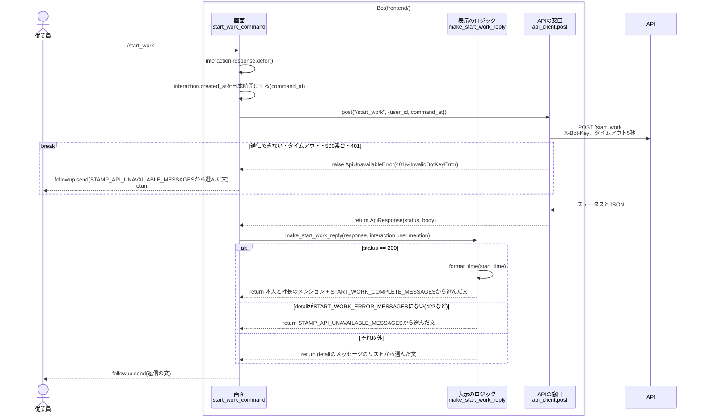
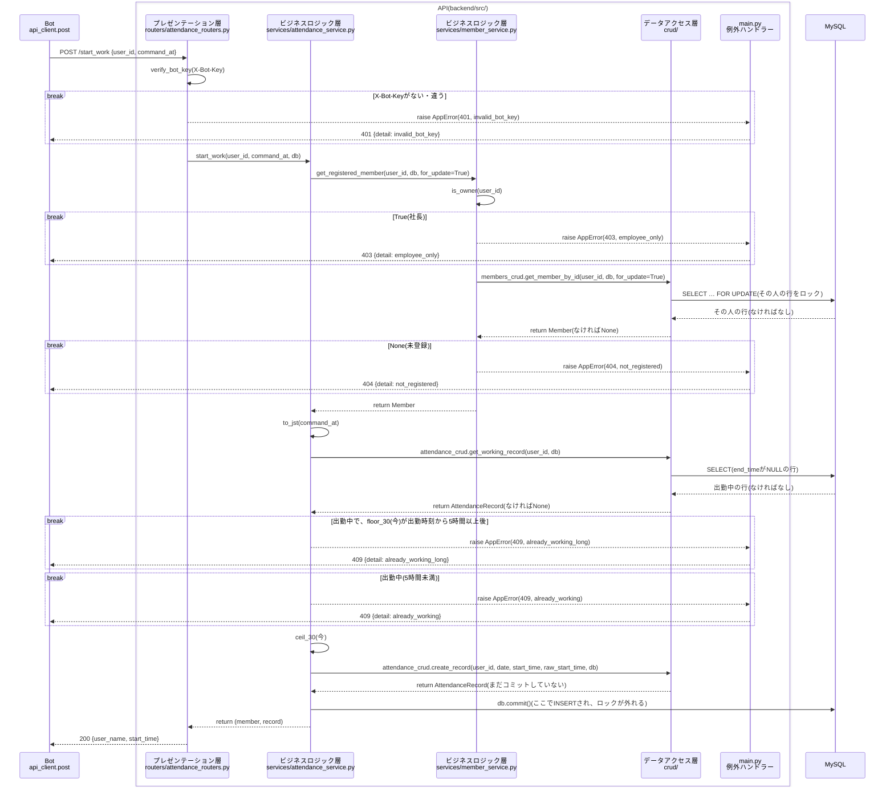
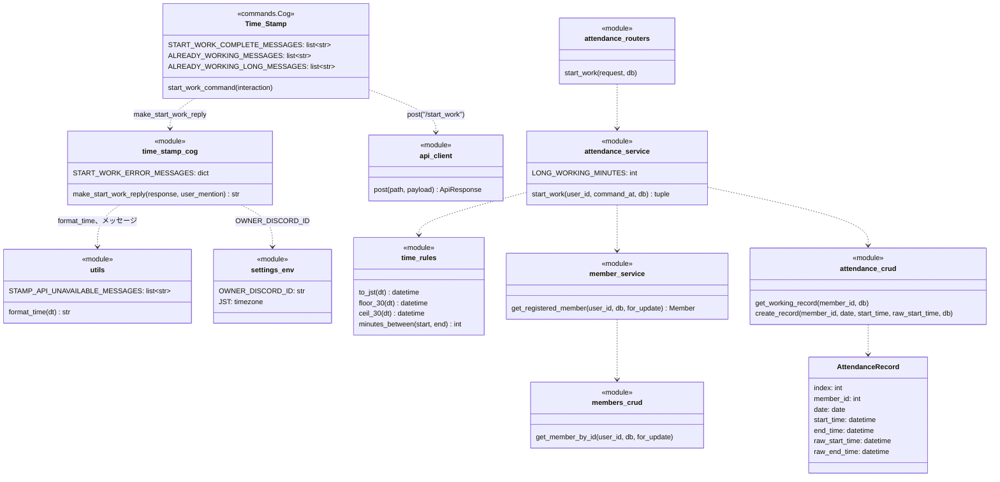

# `/start_work`コマンドの単体詳細設計

- 基本設計: [出勤(`/start_work`)](../basic_design.md#出勤start_work)、[打刻時刻の30分単位への丸め](../basic_design.md#打刻時刻の30分単位への丸め)
- 詳細設計(全体): [共通の決まり](../detailed_design.md#共通の決まり)、[出勤状態の判定](../detailed_design.md#出勤状態の判定)、[`/start_work`](../detailed_design.md#start_work)、[Botの処理](../detailed_design.md#botの処理)、[attendance_records](../detailed_design.md#attendance_records出退勤記録)
- 土台(`api_client`、`AppError`、`verify_bot_key`、`get_registered_member`、テストの準備)は[`/register`](./register_detailed_design.md)と[`/rename`](./rename_detailed_design.md)の単体詳細設計で作ったものを使う。

## 目次
- [概要](#概要)
- [対象ファイル](#対象ファイル)
- [準備](#準備)
- [処理の流れ](#処理の流れ)
  - [Botの中](#botの中)
  - [APIの中](#apiの中)
- [コマンドの定義](#コマンドの定義)
- [Bot](#bot)
  - [設定値(`settings_env.py`)](#設定値settings_envpy)
  - [時刻の表示(`utils.py`)](#時刻の表示utilspy)
  - [Cog(`cogs/time_stamp_cog.py`)](#cogcogstime_stamp_cogpy)
  - [返信の文](#返信の文)
- [API](#api)
  - [リクエストとレスポンス](#リクエストとレスポンス)
  - [確認する順番](#確認する順番)
  - [各層の処理](#各層の処理)
- [クラス](#クラス)
- [エラーの扱い](#エラーの扱い)
- [単体テスト](#単体テスト)
- [Discordでの確認](#discordでの確認)
- [決めたこと](#決めたこと)

---
## 概要
- コマンドした時刻を出勤時刻として`attendance_records`に1行追加し、本人と社長にメンションして、登録名と丸めた出勤時刻を入れた出勤の挨拶を返す。
- 出勤時刻は30分単位で切り上げる(9:05 → 9:30)。打刻した本当の時刻も`raw_start_time`に残す。
- すでに出勤中(`end_time`がNULLの行がある)なら記録しない。丸めた出勤時刻から5時間以上経っていたら、退勤し忘れの可能性も伝える。
- 返信はサーバーの全員に見せる(`defer()`)。エラーのメッセージも全員に見える。
- `/start_work`は出退勤の最初のコマンドなので、`/stop_work`などでも使う次の土台もここで作る。
  - API: `attendance_records`のテーブル(`AttendanceRecord`)、30分単位の丸め(`services/time_rules.py`)、`Member_table`の行のロック
  - Bot: 時刻の表示(`utils.format_time`)、打刻のコマンドで通信できなかった時のメッセージ(`STAMP_API_UNAVAILABLE_MESSAGES`)、社長のID(`settings_env.OWNER_DISCORD_ID`)
- `/stop_work`はまだないので、「退勤した後」の状態は、テストではDBに直接行を入れて作る。Discordで確かめる時はphpMyAdminで直す。

---
## 対象ファイル
### Bot(`frontend/`)
| ファイル | 変更 | 内容 |
| --- | --- | --- |
| `cogs/time_stamp_cog.py` | 作り直し | `start_work_command`、返信の文を作る`make_start_work_reply`、`START_WORK_ERROR_MESSAGES`、メッセージのリスト(`START_WORK_COMPLETE_MESSAGES`、`ALREADY_WORKING_MESSAGES`、`ALREADY_WORKING_LONG_MESSAGES`)。`requests`を使う今の`work_in`は消す。ファイルのdocstringはそのまま |
| `settings_env.py` | 追加 | `OWNER_DISCORD_ID`と`JST`を足す |
| `utils.py` | 追加 | `format_time`と、`STAMP_API_UNAVAILABLE_MESSAGES`を足す |
| `tests/unit/test_utils.py` | 追加 | `format_time`のテスト |
| `tests/unit/test_time_stamp_cog.py` | 追加 | `make_start_work_reply`のテスト |

### API(`backend/`)
| ファイル | 変更 | 内容 |
| --- | --- | --- |
| `src/models.py` | 追加 | `AttendanceRecord`(`attendance_records`)を足す |
| `src/schemas/attendance.py` | 追加 | `StartWorkRequest`、`StartWorkResponse` |
| `src/routers/attendance_routers.py` | 追加 | `POST /start_work` |
| `src/main.py` | 変更 | `attendance_routers.router`を読み込む |
| `src/services/time_rules.py` | 追加 | `to_jst`、`floor_30`、`ceil_30`、`minutes_between` |
| `src/services/attendance_service.py` | 追加 | `start_work` |
| `src/services/member_service.py` | 変更 | `get_registered_member`に`for_update`を足し、引数を`(user_id, db, for_update)`の順にする。`register_member`、`rename_member`の中の呼び出しも新しい順に直す |
| `src/crud/members_crud.py` | 変更 | `get_member_by_id`に`for_update`を足し、引数を`(user_id, db, for_update)`の順にする |
| `src/crud/attendance_crud.py` | 追加 | `get_working_record`、`create_record` |
| `tests/conftest.py` | 変更 | 各テストの前に`attendance_records`も空にする |
| `tests/unit/__init__.py` | 追加 | パッケージ化 |
| `tests/unit/test_time_rules.py` | 追加 | 丸めと時間の計算のテスト |
| `tests/integration/test_attendance_api.py` | 追加 | `/start_work`の単体テスト |

### その他
| ファイル | 変更 | 内容 |
| --- | --- | --- |
| `README.md` | 変更 | APIの表の`/create_clock_in`を`/start_work`に直す。DB設計の表から`monthly_summary`を消す |

---
## 準備
- 今のDBにある古い`attendance_records`と`monthly_summary`を、phpMyAdminで消す。`create_all`は今あるテーブルを変えないので、消さないと新しいカラム(`raw_start_time`など)ができないため。
  ```sql
  DROP TABLE monthly_summary;
  DROP TABLE attendance_records;
  ```
  - 消す前に、中身に残したい記録がないかを確かめる。今の`/start_work`は動いていなかったので、本当の打刻の記録はない。
  - 消した後にAPIを起動し直すと、`create_all`で新しい`attendance_records`ができる。
- テスト用のデータベースには古いテーブルがないので、何もしなくてよい。テストの前の`create_all`で`attendance_records`ができる。
- `.env`の`OWNER_DISCORD_ID`は`/register`のステップで足してある。Botも同じ`.env`を読むので、足すものはない。

---
## 処理の流れ
全体は「Bot → API → MySQL」の3つに分かれ、BotとAPIの中も、それぞれ3つの層に分かれている。

| | 層 | ファイル・関数 |
| --- | --- | --- |
| Bot | 画面 | `cogs/time_stamp_cog.py`の`start_work_command` |
| | 表示のロジック | `cogs/time_stamp_cog.py`の`make_start_work_reply`、`utils.py`の`format_time` |
| | APIの窓口 | `services/api_client.py`の`post` |
| API | プレゼンテーション層 | `routers/attendance_routers.py`の`start_work`(`X-Bot-Key`の確認は`dependencies.py`の`verify_bot_key`) |
| | ビジネスロジック層 | `services/attendance_service.py`の`start_work`、`services/member_service.py`の`get_registered_member`、`services/time_rules.py` |
| | データアクセス層 | `crud/members_crud.py`の`get_member_by_id`、`crud/attendance_crud.py`の`get_working_record`、`create_record` |

`/rename`と同じく、Botの中とAPIの中を別々の図にする。
図には、層をまたぐ関数の呼び出し、MySQLへのアクセス、例外と早期リターンを描く。関数の中の1行の処理は描かない。

### Botの中
APIは1つの箱として描く。APIの中は[APIの中](#apiの中)の図を参照。



- `break`の中に入ったら、そこで終わる。下には進まない。
- 401の時の`api_client`の動き(ログを残す)は[`/rename`の図](./rename_detailed_design.md#botの中)と同じなので、ここでは1つの`break`にまとめている。

### APIの中


- `break`の中に入ったら、そこで終わる。下には進まない。
- `AppError`は`routers`を通り抜けて`main.py`の例外ハンドラーに届く。図では、通り抜けるところを省いている。
- エラーで終わった時は、コミットせずに`get_db`がセッションを閉じる。閉じる時にロールバックされ、ロックも外れる。
- `members_crud`と`attendance_crud`は、図では1つの箱(`crud/`)にまとめている。

---
## コマンドの定義
| 項目 | 値 |
| --- | --- |
| コマンド名 | `start_work{index}`(本番は`start_work`、開発は`start_work_test`) |
| 説明(候補に出る文) | `出勤します` |
| 引数 | なし |
| DMで使えるか | 使えない(`@app_commands.guild_only()`) |
| 返信が見える人 | 全員(`defer()`) |

---
## Bot
### 設定値(`settings_env.py`)
```python
# 社長のDiscordユーザーID。出退勤の挨拶で社長にメンションする
OWNER_DISCORD_ID: str = os.getenv("OWNER_DISCORD_ID", "")

# 日本時間。日本は夏時間がないので、zoneinfoを使わない
JST = timezone(timedelta(hours=9))
```
- `OWNER_DISCORD_ID`は、メンション(`<@{OWNER_DISCORD_ID}>`)の文に入れるだけなので、`int`にせず文字列のまま持つ。
- `JST`は、APIの`config.JST`と同じ書き方にする。

### 時刻の表示(`utils.py`)
```python
def format_time(dt: datetime) -> str:
    """時刻を「時:分」の文字列にする。時は0埋めしない

    Args:
        dt (datetime): 表示する時刻

    Returns:
        str: 「9:30」「18:00」のような文字列

    Examples:

        >>> format_time(datetime(2026, 10, 8, 9, 30))
        '9:30'
    """
    return f"{dt.hour}:{dt.minute:02d}"
```
- [全体の詳細設計](../detailed_design.md#時刻と時間の表示utilspy)の`format_minutes`と`format_start_time`は、`/start_work`では使わないので、使うコマンドのステップで作る。

### Cog(`cogs/time_stamp_cog.py`)
今の`Time_Stamp`のCogを作り直す。クラスの名前は変えない(`main.py`の`import`を変えずに済むため)。

```python
index = "" if env_mode == "prod" else "_test"


class Time_Stamp(commands.Cog):
    ...

    # 出勤する
    @app_commands.command(name=f"start_work{index}", description="出勤します")
    @app_commands.guild_only()
    async def start_work_command(self, interaction: discord.Interaction) -> None:
        """出勤を記録し、本人と社長にメンションした挨拶を、サーバーの全員に見える形で返信する

        Args:
            interaction (discord.Interaction): コマンドのinteraction。
                interaction.user.idで出勤する人を、interaction.created_atで出勤時刻を決める
        """
        await interaction.response.defer()
        command_at = interaction.created_at.astimezone(JST)
        payload = {"user_id": interaction.user.id, "command_at": command_at.isoformat()}
        try:
            response = await api_client.post("/start_work", payload)
        except api_client.ApiUnavailableError:
            await interaction.followup.send(random_choice_format_list_message(STAMP_API_UNAVAILABLE_MESSAGES))
            return
        await interaction.followup.send(make_start_work_reply(response, interaction.user.mention))
```
- 出勤時刻には`interaction.created_at`(Discordがコマンドを受け取った時刻、UTC)を使う。`datetime.now()`はBotが処理を始めた時刻なので使わない。
- `command_at`は`2026-10-08T09:05:12.345000+09:00`のような、タイムゾーン付きの文字列にして送る。

返信の文は、`make_rename_reply`と同じく、Discordを使わないモジュールの関数`make_start_work_reply`で作る。

```python
def make_start_work_reply(response: ApiResponse, user_mention: str) -> str:
    """/start_workの結果から、返信の文を作る

    Discordを使わないので、単体テストできる。

    Args:
        response (ApiResponse): /start_workの結果
        user_mention (str): コマンドした人のメンション。interaction.user.mention

    Returns:
        str: ランダムに選んだ返信の文。200の時は、先頭に本人と社長のメンションを付ける。
            表にないdetailの時は、打刻のコマンドで通信できなかった時の文
    """
    if response.status == 200:
        start_time = datetime.fromisoformat(response.body["start_time"])
        message = random_choice_format_list_message(
            Time_Stamp.START_WORK_COMPLETE_MESSAGES,
            name=response.body["user_name"], start=format_time(start_time))
        return f"{user_mention} <@{OWNER_DISCORD_ID}> {message}"

    detail = response.body.get("detail")
    # 422の時はdetailがリストで返ってくるので、文字列の時だけ探す
    messages = START_WORK_ERROR_MESSAGES.get(detail) if isinstance(detail, str) else None
    if messages is None:
        return random_choice_format_list_message(STAMP_API_UNAVAILABLE_MESSAGES)
    return random_choice_format_list_message(messages)
```

- `START_WORK_ERROR_MESSAGES`は`detail`とメッセージのリストの辞書。`Time_Stamp`のクラスの下に置く。

  | detail | メッセージのリスト | 置いておく所 |
  | --- | --- | --- |
  | `employee_only` | `EMPLOYEE_ONLY_MESSAGES` | `utils.py` |
  | `not_registered` | `NOT_REGISTERED_MESSAGES` | `utils.py` |
  | `already_working` | `ALREADY_WORKING_MESSAGES`(追加) | `Time_Stamp` |
  | `already_working_long` | `ALREADY_WORKING_LONG_MESSAGES`(追加) | `Time_Stamp` |

- メンションは成功した時だけ付ける。エラーの時に社長へ通知が飛ばないようにするため。
- 挨拶の時刻は`format_time`だけを使い、日付は付けない([全体の詳細設計](../detailed_design.md#時刻と時間の表示utilspy)のとおり)。23:45に出勤した時も「出勤 0:00」になる。

### 返信の文
- 各メッセージを数パターン用意し、`random_choice_format_list_message`でランダムに選ぶ。下は各リストの1つ目。
- 「!」は全角(`！`)で書く。メッセージの中のコマンド名に`_test`は付けない。

| 場面 | メッセージの例 | リスト |
| --- | --- | --- |
| 出勤完了 | {本人} {社長} {name}なのだ！出勤したのだ！今日もよろしくなのだ！(出勤 {start}) | `START_WORK_COMPLETE_MESSAGES`(追加) |
| `employee_only` | このコマンドは従業員しか使えないのだ！ | `EMPLOYEE_ONLY_MESSAGES` |
| `not_registered` | まだ名前が登録されていないのだ！先に/registerで登録するのだ！ | `NOT_REGISTERED_MESSAGES` |
| `already_working` | もう出勤しているのだ！ | `ALREADY_WORKING_MESSAGES`(追加) |
| `already_working_long` | もう出勤しているのだ！退勤し忘れていたら、社長に伝えるのだ！ | `ALREADY_WORKING_LONG_MESSAGES`(追加) |
| 通信できない | サーバーとつながらなかったのだ…打刻はできていないのだ！少し待ってからもう一度試してほしいのだ！ | `STAMP_API_UNAVAILABLE_MESSAGES`(追加) |

- 足すリストの例(実装の時に、ほかの文も足してよい)。

  ```python
  START_WORK_COMPLETE_MESSAGES: list[str] = [
      "{name}なのだ！出勤したのだ！今日もよろしくなのだ！(出勤 {start})",
      "{name}が出勤したのだ！今日も一緒に頑張るのだ！(出勤 {start})",
      "おはようなのだ！{name}の出勤をしっかり記録したのだ！(出勤 {start})",
  ]

  ALREADY_WORKING_MESSAGES: list[str] = [
      "もう出勤しているのだ！",
      "出勤はもう記録してあるのだ！そのまま頑張るのだ！",
      "ん？もう出勤中なのだ！",
  ]

  ALREADY_WORKING_LONG_MESSAGES: list[str] = [
      "もう出勤しているのだ！退勤し忘れていたら、社長に伝えるのだ！",
      "まだ前の出勤が続いているのだ！退勤し忘れていたら、社長に伝えるのだ！",
      "出勤中のままなのだ…前に退勤し忘れていたら、社長に伝えてほしいのだ！",
  ]
  ```

  ```python
  # utils.py
  ## /start_work、/stop_workでAPIと通信できなかった時。打刻できていないことも伝える
  STAMP_API_UNAVAILABLE_MESSAGES: list[str] = [
      "サーバーとつながらなかったのだ…打刻はできていないのだ！少し待ってからもう一度試してほしいのだ！",
      "うまくサーバーに届かなかったのだ…打刻はできていないのだ！少し待ってからもう一度お願いするのだ！",
      "サーバーが返事をしてくれないのだ…打刻はできていないのだ！時間をおいてもう一度試すのだ！",
  ]
  ```

- メンションは`make_start_work_reply`で付けるので、`START_WORK_COMPLETE_MESSAGES`の文には書かない。
- `{name}`はAPIが返した登録名を使う(Discordの表示名ではない)。

---
## API
### リクエストとレスポンス
| 項目 | 値 |
| --- | --- |
| メソッド・パス | `POST /start_work` |
| ヘッダー | `X-Bot-Key: {BOT_API_KEY}` |
| リクエスト | `{"user_id": int, "command_at": "2026-10-08T09:05:12.345000+09:00"}` |
| レスポンス(200) | `{"user_name": "Jun", "start_time": "2026-10-08T09:30:00"}`(`start_time`は丸めた後、日本時間) |
| エラー | `{"detail": "<エラーコード>"}` |

- `command_at`はタイムゾーン付きにする。タイムゾーンがない時は、FastAPIが422を返す(Pydanticの`AwareDatetime`)。
- `start_time`は、DBと同じくタイムゾーンなしの日本時間で返す。

### 確認する順番
上から順に確認し、最初に当てはまったものを返す。

| 順 | 確認すること | ステータス | detail |
| --- | --- | --- | --- |
| 0 | `X-Bot-Key`がない、または`BOT_API_KEY`と違う | 401 | `invalid_bot_key` |
| 1 | `user_id`が`OWNER_DISCORD_ID`と同じ | 403 | `employee_only` |
| 2 | その`user_id`が登録されていない | 404 | `not_registered` |
| 3 | 出勤中で、`floor_30(command_at)`が丸めた出勤時刻から5時間(300分)以上後 | 409 | `already_working_long` |
| 4 | 出勤中(3以外) | 409 | `already_working` |

- 1と2は`get_registered_member`で確かめる。2の時に、`Member_table`のその人の行をロックする。
- 3の例: 9:05に出勤(9:30)した人が、14:29にもう一度`/start_work`すると`floor_30`で14:00、4時間30分なので4。14:30なら5時間なので3。

保存する値:

| カラム | 値 | 例(9:05:12に打刻) |
| --- | --- | --- |
| `member_id` | `user_id` | |
| `date` | `ceil_30(command_at).date()` | `2026-10-08` |
| `start_time` | `ceil_30(command_at)` | `2026-10-08 09:30:00` |
| `end_time` | NULL | |
| `raw_start_time` | `command_at`(日本時間、秒まで) | `2026-10-08 09:05:12` |
| `raw_end_time` | NULL | |

### 各層の処理
#### `models.py`
```python
class AttendanceRecord(Base):
    """attendance_records。1回の出退勤を1行で管理する

    Attributes:
        index (int): 主キー。自動採番
        member_id (int): Member_table.user_idの外部キー
        date (date): 出勤日。丸めた後の出勤時刻の日付
        start_time (datetime): 出勤時刻(丸めた後、日本時間)
        end_time (datetime | None): 退勤時刻(丸めた後、日本時間)。出勤中はNone
        raw_start_time (datetime | None): 打刻した本当の出勤時刻。社長がWebで追加した記録はNone
        raw_end_time (datetime | None): 打刻した本当の退勤時刻。出勤中と、社長がWebで退勤時間を入れた記録はNone
    """
    __tablename__ = "attendance_records"
    __table_args__ = (
        # 出勤中の行の検索、月の一覧、重なりの確認に使う
        Index("ix_attendance_records_member_id_start_time", "member_id", "start_time"),
        {
            "mysql_charset": "utf8mb4",
            "mysql_collate": "utf8mb4_0900_ai_ci",
        },
    )

    index = Column(Integer, primary_key=True, autoincrement=True)
    member_id = Column(BigInteger, ForeignKey("Member_table.user_id"), nullable=False)
    date = Column(Date, nullable=False, index=True)
    start_time = Column(DateTime, nullable=False)
    end_time = Column(DateTime, nullable=True)
    raw_start_time = Column(DateTime, nullable=True)
    raw_end_time = Column(DateTime, nullable=True)
```
- カラムは[全体の詳細設計のテーブル定義](../detailed_design.md#attendance_records出退勤記録)のとおり。`end_time`、`raw_end_time`は`/start_work`では使わないが、テーブルを作り直さずに済むよう、ここで全部作る。
- `DateTime`は秒までの`DATETIME`になる。

#### `schemas/attendance.py`
```python
class StartWorkRequest(BaseModel):
    """/start_workのリクエスト

    Attributes:
        user_id (int): 出勤する人のDiscordのユーザーID
        command_at (AwareDatetime): コマンドした時刻。タイムゾーン付き(ないと422)
    """
    user_id: int
    command_at: AwareDatetime


class StartWorkResponse(BaseModel):
    """/start_workのレスポンス

    Attributes:
        user_name (str): 出勤した人の登録名。挨拶に使う
        start_time (datetime): 出勤時刻(丸めた後、タイムゾーンなしの日本時間)
    """
    user_name: str
    start_time: datetime
```

#### `routers/attendance_routers.py`
```python
router = APIRouter(dependencies=[Depends(verify_bot_key)])


@router.post("/start_work", response_model=StartWorkResponse)
def start_work(request: StartWorkRequest, db: Session = Depends(get_db)) -> StartWorkResponse:
    """POST /start_work: 出勤を記録する

    Args:
        request (StartWorkRequest): 出勤する人のuser_idと、コマンドした時刻
        db (Session): DBのセッション

    Returns:
        StartWorkResponse: 登録名と、丸めた出勤時刻

    Raises:
        AppError: 出勤できない時(attendance_service.start_workと同じ)

    Note:
        AppErrorは、main.pyの例外ハンドラーがエラーのレスポンスにする
    """
    member, record = attendance_service.start_work(request.user_id, request.command_at, db)
    return StartWorkResponse(user_name=member.user_name, start_time=record.start_time)
```
- `main.py`で`app.include_router(attendance_routers.router)`を足す。

#### `services/time_rules.py`
```python
"""30分単位の丸めと、時間の計算"""
from datetime import datetime, timedelta

from src import config


def to_jst(dt: datetime) -> datetime:
    """タイムゾーン付きの時刻を、タイムゾーンなしの日本時間にする

    秒より細かい値は切り捨てる(MySQLのDATETIMEは秒までで、保存の時に四捨五入されてしまうため)。

    Args:
        dt (datetime): タイムゾーン付きの時刻

    Returns:
        datetime: タイムゾーンなしの日本時間。DBにそのまま保存できる
    """
    return dt.astimezone(config.JST).replace(tzinfo=None, microsecond=0)


def floor_30(dt: datetime) -> datetime:
    """秒を切り捨ててから、30分単位で切り捨てる(退勤、働いている時間の計算に使う)

    Args:
        dt (datetime): 丸める時刻

    Returns:
        datetime: 30分単位に切り捨てた時刻
    """
    dt = dt.replace(second=0, microsecond=0)
    return dt.replace(minute=dt.minute // 30 * 30)


def ceil_30(dt: datetime) -> datetime:
    """秒を切り捨ててから、30分単位で切り上げる(出勤に使う)。0分と30分はそのまま

    Args:
        dt (datetime): 丸める時刻

    Returns:
        datetime: 30分単位に切り上げた時刻。23:45なら翌日の0:00
    """
    dt = dt.replace(second=0, microsecond=0)
    if dt.minute % 30 == 0:
        return dt
    return dt + timedelta(minutes=30 - dt.minute % 30)


def minutes_between(start: datetime, end: datetime) -> int:
    """startからendまでの分数を返す。マイナスになる場合は0

    Args:
        start (datetime): 始まりの時刻
        end (datetime): 終わりの時刻

    Returns:
        int: 分数(秒は切り捨て)。endがstartより前なら0
    """
    return max(0, int((end - start).total_seconds() // 60))
```
- `floor_30`、`ceil_30`、`minutes_between`は[全体の詳細設計](../detailed_design.md#30分単位の丸めservicestime_rulespy)のコードと同じ。`/start_work`では、`ceil_30`を出勤時刻に、`floor_30`と`minutes_between`を5時間の確認に使う。
- `to_jst`は、[時刻の扱い](../detailed_design.md#時刻の扱い)の「受け取った時刻を日本時間に変換し、タイムゾーンなしで保存する」を行う関数。`/stop_work`などでも使う。

#### `services/attendance_service.py`
```python
"""出勤・退勤・出勤状況の処理"""
LONG_WORKING_MINUTES = 5 * 60


def start_work(user_id: int, command_at: datetime, db: Session) -> tuple[Member, AttendanceRecord]:
    """出勤を記録する

    「確認する順番」の表のとおりに確かめてから、出勤の行を追加し、コミットする。
    同時に2回出勤されても2行できないよう、最初にMember_tableのその人の行をロックする。

    Args:
        user_id (int): 出勤する人のDiscordのユーザーID
        command_at (datetime): コマンドした時刻。タイムゾーン付き
        db (Session): DBのセッション

    Returns:
        tuple[Member, AttendanceRecord]: 出勤した人と、追加した出勤の行

    Raises:
        AppError: 出勤できない時。detailは次のどれか
            - employee_only(403): 社長
            - not_registered(404): 登録していない
            - already_working_long(409): 出勤中で、丸めた出勤時刻から5時間以上経っている
            - already_working(409): 出勤中
    """
    # ロックは、このトランザクションで最初のSELECTにする(理由は「決めたこと」を参照)
    member = get_registered_member(user_id, db, for_update=True)
    now = to_jst(command_at)

    working_record = attendance_crud.get_working_record(user_id, db)
    if working_record is not None:
        if minutes_between(working_record.start_time, floor_30(now)) >= LONG_WORKING_MINUTES:
            raise AppError(409, "already_working_long")
        raise AppError(409, "already_working")

    start_time = ceil_30(now)
    record = attendance_crud.create_record(user_id, start_time.date(), start_time, now, db)
    db.commit()
    db.refresh(record)
    return member, record
```
- `db.commit()`でINSERTが保存され、`Member_table`の行のロックが外れる。
- `IntegrityError`は`except`しない。外部キーの相手(`Member_table`の行)はロックしているので消えることがなく、UNIQUE制約もないため。

#### `services/member_service.py`
| 関数 | 内容 |
| --- | --- |
| `get_registered_member(user_id, db, for_update=False) -> Member` | 変更。`for_update`を足し、そのまま`get_member_by_id`に渡す |

```python
def get_registered_member(user_id: int, db: Session, for_update: bool = False) -> Member:
    """登録している従業員を返す。社長か未登録ならAppErrorを投げる

    従業員専用のAPIは、どれも最初にこの関数を呼ぶ(/register_memberは除く)。

    Args:
        user_id (int): DiscordのユーザーID
        db (Session): DBのセッション
        for_update (:obj:`bool`, optional): Trueなら、見つかった行をコミットかロールバックまでロックする。
            打刻の処理で使う

    Returns:
        Member: 見つかったメンバー

    Raises:
        AppError: 使えない時。detailは次のどれか
            - employee_only(403): 社長
            - not_registered(404): 登録していない
    """
    if is_owner(user_id):
        raise AppError(403, "employee_only")

    member = members_crud.get_member_by_id(user_id, db, for_update=for_update)
    if member is None:
        raise AppError(404, "not_registered")
    return member
```
- `/rename_member`は`get_registered_member(user_id, db)`で呼ぶ(ロックしない)。

#### `crud/members_crud.py`
| 関数 | 内容 |
| --- | --- |
| `get_member_by_id(user_id, db, for_update=False) -> Member \| None` | 変更。`for_update`がTrueなら`SELECT … FOR UPDATE`で探す |

```python
def get_member_by_id(user_id: int, db: Session, for_update: bool = False) -> Member | None:
    """user_idでメンバーを1件探す

    Args:
        user_id (int): DiscordのユーザーID
        db (Session): DBのセッション
        for_update (:obj:`bool`, optional): Trueなら、SELECT … FOR UPDATEで探し、
            見つかった行をコミットかロールバックまでロックする

    Returns:
        Member | None: 見つかったメンバー。いなければNone
    """
    query = db.query(Member).filter(Member.user_id == user_id)
    if for_update:
        query = query.with_for_update()
    return query.first()
```

#### `crud/attendance_crud.py`
| 関数 | 内容 |
| --- | --- |
| `get_working_record(member_id, db) -> AttendanceRecord \| None` | 追加。その人の`end_time`がNULLの行を探す |
| `create_record(member_id, date, start_time, raw_start_time, db) -> AttendanceRecord` | 追加。出勤の行を`db.add`する。コミットしない |

```python
"""出退勤の記録の読み書き。見つからなければNoneを返し、例外は投げない。コミットもしない"""


def get_working_record(member_id: int, db: Session) -> AttendanceRecord | None:
    """出勤中の行(end_timeがNULLの行)を探す

    Args:
        member_id (int): DiscordのユーザーID
        db (Session): DBのセッション

    Returns:
        AttendanceRecord | None: 出勤中の行。勤務外ならNone
    """
    return (
        db.query(AttendanceRecord)
        .filter(AttendanceRecord.member_id == member_id, AttendanceRecord.end_time.is_(None))
        .first()
    )


def create_record(
    member_id: int, date: date, start_time: datetime, raw_start_time: datetime, db: Session
) -> AttendanceRecord:
    """出勤の行を追加する。db.addだけ行い、コミットしない

    Args:
        member_id (int): DiscordのユーザーID
        date (date): 出勤日。丸めた後の出勤時刻の日付
        start_time (datetime): 丸めた後の出勤時刻
        raw_start_time (datetime): 打刻した本当の出勤時刻
        db (Session): DBのセッション

    Returns:
        AttendanceRecord: 追加した行。end_timeとraw_end_timeはNone
    """
    record = AttendanceRecord(
        member_id=member_id, date=date, start_time=start_time, raw_start_time=raw_start_time)
    db.add(record)
    return record
```
- `end_time`がNULLの行は、ロックのおかげで1人1行までになる([出勤状態の判定](../detailed_design.md#出勤状態の判定))。そのため`.first()`で1行だけ取る。

---
## クラス
今回足すもの・変えるものだけを書く。前のステップで作ったものは[`/register`のクラス](./register_detailed_design.md#クラス)と[`/rename`のクラス](./rename_detailed_design.md#クラス)を参照。



---
## エラーの扱い
| 起きること | API | Bot |
| --- | --- | --- |
| 社長、未登録、出勤中 | `AppError`を投げ、例外ハンドラーが403/404/409にする | `detail`に合わせたメッセージ。メンションは付けない |
| `X-Bot-Key`が違う | 401 `invalid_bot_key` | `api_client`がエラーのログを残して`InvalidBotKeyError`を投げる。従業員には打刻のコマンドで通信できなかった時のメッセージ |
| リクエストの形が違う(`command_at`にタイムゾーンがないなど) | FastAPIが422を返す | 打刻のコマンドで通信できなかった時のメッセージ |
| 同じ人が同時に2回`/start_work`した | 後の方は、先の方がコミットするまで`SELECT … FOR UPDATE`で待つ。待った後に出勤中の行が見つかり、409 `already_working` | `already_working`のメッセージ |
| DBにつながらない | 500 | 打刻のコマンドで通信できなかった時のメッセージ |
| APIにつながらない・5秒以内に返ってこない | | 打刻のコマンドで通信できなかった時のメッセージ |

- 5秒のタイムアウトの後にAPIが記録を保存し終わることがある。その時は「打刻はできていないのだ！」と返したのに記録が残る。もう一度`/start_work`すれば`already_working`が返るので、出勤できていたことが分かる。

---
## 単体テスト
### API(`backend/tests/`)
- 実行: `docker compose exec api python -m pytest tests`
- `conftest.py`の`clear_tables`で、`Member_table`より先に`attendance_records`を空にする(外部キーがあるため)。
- 番号は、`test_members_api.py`の続き(T-14〜)にする。関数の単体テストは`U-`で、Botの`/help`のテスト(U-01)の続きにする。どのファイルのテストかがNoだけで分かるようにするため。

#### 関数のテスト(`tests/unit/test_time_rules.py`)
DBを使わず、関数に時刻を渡して結果を確かめる。

| No | 確かめること | 入力 | 期待する結果 |
| --- | --- | --- | --- |
| U-02 | `ceil_30`で切り上げられる | `9:00`、`9:01`、`9:29`、`9:30`、`9:30:59`、`10/8 23:45` | 順に`9:00`、`9:30`、`9:30`、`9:30`、`9:30`、`10/9 0:00` |
| U-03 | `floor_30`で切り捨てられる | `9:00`、`9:01`、`9:29`、`9:30`、`9:59:59`、`23:45` | 順に`9:00`、`9:00`、`9:00`、`9:30`、`9:30`、`23:30` |
| U-04 | `minutes_between`で分数が分かる | (`9:30`, `14:30`)、(`9:30`, `9:00`) | 順に`300`、`0`(マイナスにならない) |
| U-05 | `to_jst`で日本時間になる | `2026-10-08T00:05:12.789+00:00` | `2026-10-08 09:05:12`(タイムゾーンなし、秒より細かい値なし) |

- U-02〜U-04は[基本設計の丸めの表](../basic_design.md#打刻時刻の30分単位への丸め)の例を使い、`pytest.mark.parametrize`でまとめる。

#### APIのテスト(`tests/integration/test_attendance_api.py`)
`/start_work`を`TestClient`で呼び、返ってきた結果と、テスト用DBの`attendance_records`の中身を確かめる。

- 出勤する人は、先に`/register_member`で登録しておく。`test_members_api.py`の`register`を`import`して使う。
- `/start_work`を呼ぶ`start_work(client, headers, user_id, command_at)`を、`register`と同じ形で足す。
- `command_at`はテストの中で決めた時刻を送る(今の時刻を使わない)。丸めと5時間の確認を、いつテストしても同じ結果で確かめるため。
- `/stop_work`はまだないので、退勤した後の行は`db`のfixtureで`AttendanceRecord`を直接入れて作る。

| No | 確かめること | 起こしたエラー(やったこと) | 期待する結果 |
| --- | --- | --- | --- |
| T-14 | 丸めた時刻で出勤できる | なし(`Jun`で登録した人が、次の3つの時刻で出勤する)<br>・`10/8 9:05:12`<br>・`10/8 9:30:59`<br>・`10/8 23:45:00` | 順に、200 `{"user_name": "Jun", "start_time": …}`の`start_time`が`10/8 9:30`、`10/8 9:30`、`10/9 0:00`。DBに1行でき、`date`は丸めた後の日付、`end_time`はNULL、`raw_start_time`は送った時刻(秒まで) |
| T-15 | UTCの時刻で送っても日本時間で記録される | なし(`2026-10-08T00:05:12+00:00`で出勤する) | 200。`start_time`は`10/8 9:30`、`raw_start_time`は`10/8 9:05:12` |
| T-16 | 社長は出勤できない | 社長のIDで出勤する | 403 `employee_only`。DBに行ができない |
| T-17 | 登録していない人は出勤できない | 未登録の人が出勤する | 404 `not_registered`。DBに行ができない |
| T-18 | 出勤中はもう一度出勤できない | `10/8 9:05`に出勤(9:30)した人が、次の時刻にもう一度出勤する<br>・`10/8 14:29:59`<br>・`10/8 14:30:00` | 順に、409 `already_working`、409 `already_working_long`。どちらもDBの行は1つのまま |
| T-19 | 退勤した後は、もう一度出勤できる | `10/8 9:30〜12:00`の退勤済みの行をDBに入れ、`10/8 13:05`に出勤する | 200 `start_time`は`10/8 13:30`。DBの行は2つになり、新しい行の`end_time`はNULL |
| T-20 | 他の人が出勤中でも出勤できる | `Ken`が出勤している所で、`Jun`が出勤する | 200。DBの行は2つ(`Jun`と`Ken`で1つずつ) |
| T-21 | BotとAPIの合言葉(`X-Bot-Key`)が違うと使えない | `X-Bot-Key`を違う値にして出勤する | 401 `invalid_bot_key`。DBに行ができない |
| T-22 | タイムゾーンのない時刻は受け付けない | `command_at`を`2026-10-08T09:05:12`にして出勤する | 422。DBに行ができない |

- T-14とT-18は、`pytest.mark.parametrize`で時刻をまとめる。
- T-18は5時間ちょうど(300分)の境目を確かめる。14:29:59は`floor_30`で14:00(270分)になる。
- T-20は、`get_working_record`が`member_id`で絞れていることを確かめる。
- 同時に2回出勤した時(ロック)のテストは書かない([決めたこと](#決めたこと)を参照)。

### Bot(`frontend/tests/unit/`)
- 実行: `docker compose exec bot python -m pytest tests`
- `make_start_work_reply`のテストでは、`time_stamp_cog.OWNER_DISCORD_ID`を`monkeypatch`でテスト用の値(`"999"`)にする。
- 返信の文はランダムに選ばれるので、「リストのどれかの文と同じか」で確かめる。

| No | ファイル | 確かめること | 入力 | 期待する結果 |
| --- | --- | --- | --- | --- |
| U-06 | `test_utils.py` | `format_time`で「時:分」になる | `9:30`、`18:00`、`0:00`、`9:05` | 順に`"9:30"`、`"18:00"`、`"0:00"`、`"9:05"` |
| U-07 | `test_time_stamp_cog.py` | 出勤できた時は、本人と社長のメンションを付けた挨拶になる | `ApiResponse(200, {"user_name": "Jun", "start_time": "2026-10-08T09:30:00"})`、`"<@1>"` | `"<@1> <@999> "`で始まり、続きが`START_WORK_COMPLETE_MESSAGES`のどれかに`name="Jun"`、`start="9:30"`を入れた文 |
| U-08 | `test_time_stamp_cog.py` | エラーの時は`detail`に合わせた文になり、メンションは付かない | 409 `already_working`、409 `already_working_long`、404 `not_registered`、403 `employee_only` | それぞれ`START_WORK_ERROR_MESSAGES`のリストのどれか |
| U-09 | `test_time_stamp_cog.py` | 表にない`detail`の時は、打刻のコマンドで通信できなかった時の文になる | `ApiResponse(422, {"detail": [{…}]})` | `STAMP_API_UNAVAILABLE_MESSAGES`のどれか |

- U-08は、`pytest.mark.parametrize`でまとめる。

---
## Discordでの確認
単体テストでは確かめられない、Botとつないだ時の動きを開発環境(`/start_work_test`)で確かめる。

| No | 操作 | 期待する結果 |
| --- | --- | --- |
| D-01 | 登録している人が`/start_work_test` | 全員に見える、本人と社長にメンションした出勤の挨拶。時刻は30分単位に切り上がっている。社長に通知が届く。phpMyAdminで`attendance_records`に行があり、`raw_start_time`が打刻した時刻(日本時間)になっている |
| D-02 | 同じ人がもう一度`/start_work_test` | もう出勤しているメッセージ。メンションは付かない |
| D-03 | phpMyAdminで、D-01の行の`start_time`を5時間以上前にしてから`/start_work_test` | 退勤し忘れていたら社長に伝えるメッセージ |
| D-04 | phpMyAdminで、D-01の行の`end_time`に時刻を入れてから`/start_work_test` | 出勤の挨拶。`attendance_records`に新しい行が増える |
| D-05 | 未登録の人が`/start_work_test` | まだ名前が登録されていないメッセージ |
| D-06 | 社長が`/start_work_test` | 従業員しか使えないメッセージ |
| D-07 | APIのコンテナを止めて`/start_work_test` | 5秒ほどで、サーバーとつながらなかった + 打刻はできていないメッセージ |
| D-08 | BotへのDMで`/start_work_test`を打つ | 候補に出ない |

- D-03とD-04は、`/stop_work`ができるまで、出勤中の状態を戻す方法でもある。

---
## 決めたこと
- **5時間の確認には、今の時刻を`floor_30`で切り捨てた時刻を使う。** [全体の詳細設計](../detailed_design.md#start_work)のとおり。`/work_status`の「働いている時間」と同じ計算にそろえると、「働いている時間が5:00以上なら`already_working_long`」と説明できるため。
- **`db`の引数は、ほかの引数の後ろに置く。** 先頭にあると、何を渡す関数なのかが読みにくいため。デフォルト値のある引数(`for_update`)は、Pythonの決まりで最後にしか置けないので、`db`はその1つ前にする。このステップで作る関数と、`for_update`を足す`get_registered_member`、`get_member_by_id`だけ直し、ほかの今ある関数(`get_member_by_name`、`create_member`、`register_member`、`rename_member`)は`db`が先頭のまま残す。
- **ロックは`get_registered_member`に`for_update`を足して取る。** ロック用の関数を別に作ると、「登録しているかの確認」と「ロック」で同じ行を2回SELECTすることになるため。
- **ロックのSELECTを、トランザクションで最初のSELECTにする。** MySQL(InnoDB)の初期の分離レベル(REPEATABLE READ)では、最初の普通のSELECTの時点のデータを、そのトランザクションの間ずっと読む。ロックで待っている間に相手が出勤の行をコミットしても、それより前に普通のSELECTをしていると、その行が見えずに2行目ができてしまう。ロックを最初にすれば、待った後の`get_working_record`で相手の行が見える。
- **同時に2回出勤した時のテストは書かない。** `TestClient`で2つのリクエストを同時に送るにはスレッドが必要で、テストが不安定になりやすいため。ロックの仕組みは上の決めたことで説明し、[全体の詳細設計](../detailed_design.md#出勤状態の判定)のとおりWebの修正も同じロックを使う。
- **`command_at`は`AwareDatetime`にし、タイムゾーンがないと422にする。** タイムゾーンがない時刻を日本時間とみなすと、Botの書き間違いでUTCが送られた時に9時間ずれた記録ができてしまうため。
- **日本時間への変換は、API(`time_rules.to_jst`)で行う。** Botも日本時間で送るが、APIはどのタイムゾーンで来ても同じ記録にする([時刻の扱い](../detailed_design.md#時刻の扱い))。
- **`raw_start_time`は秒より細かい値を切り捨ててから保存する。** MySQLの`DATETIME`は秒までで、そのまま渡すと四捨五入され、9:05:12.7が9:05:13になってしまうため。
- **レスポンスに`user_name`を入れる。** 挨拶に登録名が要るので、Botが`/get_name`をもう一度呼ばずに済むようにする。
- **メンションは`make_start_work_reply`で付け、メッセージのリストには書かない。** どの文を選んでも、必ず本人と社長にメンションされるようにするため。エラーの時は付けない(社長に不要な通知が飛ばないようにするため)。
- **`/start_work`で通信できなかった時は、`STAMP_API_UNAVAILABLE_MESSAGES`(打刻はできていない)を返す。** 基本設計のとおり。表にない`detail`(422など)の時も同じにする。
- **`STAMP_API_UNAVAILABLE_MESSAGES`は`utils.py`に置く。** `/stop_work`でも使うため。`NOT_REGISTERED_MESSAGES`と同じ考え方。
- **`time_rules.py`は、`/start_work`で使う4つの関数を作る。Botの`format_minutes`と`format_start_time`はまだ作らない。** `floor_30`と`minutes_between`は5時間の確認で使う。Botの表示の関数は、`/stop_work`、`/work_status`で使う時に作る。
- **`attendance_records`は、`/start_work`で使わないカラム(`end_time`、`raw_end_time`)も含めて、ここで全部作る。** 後のステップでカラムを足すと、`create_all`ではカラムが増えず、テーブルを作り直す必要があるため。
- **古い`attendance_records`と`monthly_summary`は、このステップで消す。** [`/register`の決めたこと](./register_detailed_design.md#決めたこと)のとおり。
- **Cogのクラス名`Time_Stamp`は変えない。** ほかのCog(`Register`、`Help`)と書き方が違うが、名前を変えるのは`/start_work`の目的ではないため。
