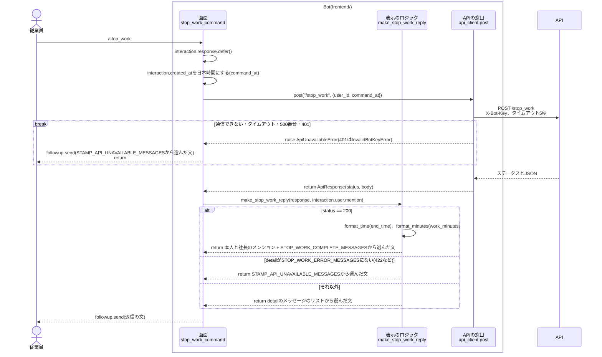
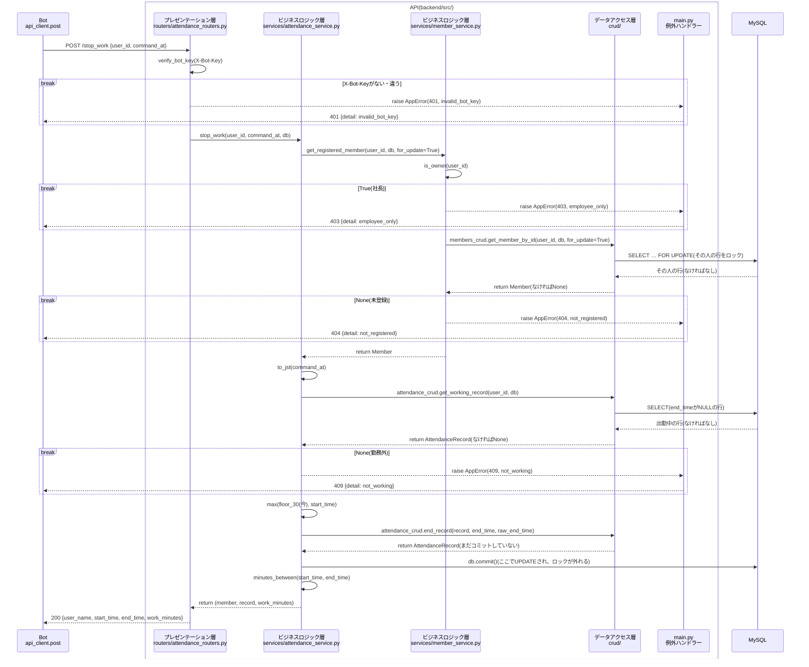
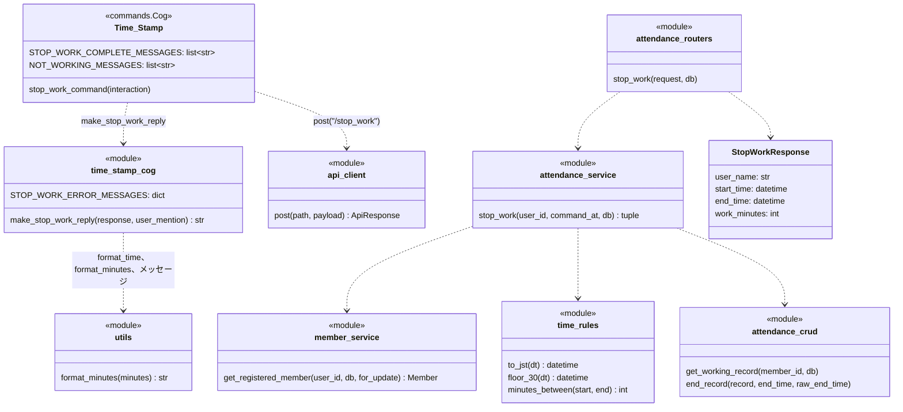

# `/stop_work`コマンドの単体詳細設計

- 基本設計: [退勤(`/stop_work`)](../basic_design.md#退勤stop_work)、[打刻時刻の30分単位への丸め](../basic_design.md#打刻時刻の30分単位への丸め)
- 詳細設計(全体): [共通の決まり](../detailed_design.md#共通の決まり)、[出勤状態の判定](../detailed_design.md#出勤状態の判定)、[`/stop_work`](../detailed_design.md#stop_work)、[Botの処理](../detailed_design.md#botの処理)、[attendance_records](../detailed_design.md#attendance_records出退勤記録)
- 土台(`attendance_records`のテーブル、`time_rules.py`、`get_registered_member`の`for_update`、`get_working_record`、`format_time`、`STAMP_API_UNAVAILABLE_MESSAGES`、`OWNER_DISCORD_ID`)は[`/start_work`](./start_work_detailed_design.md)の単体詳細設計で作ったものを使う。

## 目次
- [概要](#概要)
- [対象ファイル](#対象ファイル)
- [準備](#準備)
- [処理の流れ](#処理の流れ)
  - [Botの中](#botの中)
  - [APIの中](#apiの中)
- [コマンドの定義](#コマンドの定義)
- [Bot](#bot)
  - [時間の表示(`utils.py`)](#時間の表示utilspy)
  - [Cog(`cogs/time_stamp_cog.py`)](#cogcogstime_stamp_cogpy)
  - [返信の文](#返信の文)
- [API](#api)
  - [リクエストとレスポンス](#リクエストとレスポンス)
  - [確認する順番](#確認する順番)
  - [各層の処理](#各層の処理)
- [クラス](#クラス)
- [エラーの扱い](#エラーの扱い)
- [単体テスト](#単体テスト)
- [Discordでの確認](#discordでの確認)
- [決めたこと](#決めたこと)

---
## 概要
- コマンドした時刻を退勤時刻として、その人の出勤中の行(`end_time`がNULLの行)に書き込み、本人と社長にメンションして、登録名・丸めた退勤時刻・今回の勤務時間を入れた退勤の挨拶を返す。
- 退勤時刻は30分単位で切り捨てる(18:10 → 18:00)。打刻した本当の時刻も`raw_end_time`に残す。
- 丸めた退勤時刻が出勤時刻より前になる時は、退勤時刻を出勤時刻と同じにする(勤務時間0分)。
- 日付ではなく「`end_time`がNULLの行」を探すので、日をまたいだ勤務(夜勤など)でも退勤できる。
- 出勤していない(`end_time`がNULLの行がない)なら記録しない。
- 返信はサーバーの全員に見せる(`defer()`)。エラーのメッセージも全員に見える。
- `/start_work`で作った土台に、次のものを足す。
  - API: 退勤の行の更新(`attendance_crud.end_record`)
  - Bot: 勤務時間の表示(`utils.format_minutes`)。`/work_status`、`/all_work_status`でも使う

---
## 対象ファイル
### Bot(`frontend/`)
| ファイル | 変更 | 内容 |
| --- | --- | --- |
| `cogs/time_stamp_cog.py` | 追加 | `stop_work_command`、返信の文を作る`make_stop_work_reply`、`STOP_WORK_ERROR_MESSAGES`、メッセージのリスト(`STOP_WORK_COMPLETE_MESSAGES`、`NOT_WORKING_MESSAGES`)。ファイルのdocstringを`"""/start_work、/stop_workコマンド(出退勤の記録)のCog"""`に直す |
| `utils.py` | 追加 | `format_minutes`を足す |
| `tests/unit/test_utils.py` | 追加 | `format_minutes`のテスト |
| `tests/unit/test_time_stamp_cog.py` | 追加 | `make_stop_work_reply`のテスト |

### API(`backend/`)
| ファイル | 変更 | 内容 |
| --- | --- | --- |
| `src/schemas/attendance.py` | 追加 | `StopWorkRequest`、`StopWorkResponse` |
| `src/routers/attendance_routers.py` | 追加 | `POST /stop_work` |
| `src/services/attendance_service.py` | 追加 | `stop_work` |
| `src/crud/attendance_crud.py` | 追加 | `end_record` |
| `tests/integration/test_attendance_api.py` | 追加 | `/stop_work`の単体テスト。ファイルのdocstringを`"""/start_work、/stop_workの結合テスト"""`に直す |

### その他
| ファイル | 変更 | 内容 |
| --- | --- | --- |
| `README.md` | 変更 | APIの表の`/update_clock_out`を`/stop_work`に直し、説明を「退勤時刻を記録する。未登録の場合は404、出勤していない場合は409を返す」にする |

---
## 準備
- なし。`attendance_records`は`/start_work`のステップで、`end_time`と`raw_end_time`も含めて作ってある。

---
## 処理の流れ
全体は「Bot → API → MySQL」の3つに分かれ、BotとAPIの中も、それぞれ3つの層に分かれている。

| | 層 | ファイル・関数 |
| --- | --- | --- |
| Bot | 画面 | `cogs/time_stamp_cog.py`の`stop_work_command` |
| | 表示のロジック | `cogs/time_stamp_cog.py`の`make_stop_work_reply`、`utils.py`の`format_time`、`format_minutes` |
| | APIの窓口 | `services/api_client.py`の`post` |
| API | プレゼンテーション層 | `routers/attendance_routers.py`の`stop_work`(`X-Bot-Key`の確認は`dependencies.py`の`verify_bot_key`) |
| | ビジネスロジック層 | `services/attendance_service.py`の`stop_work`、`services/member_service.py`の`get_registered_member`、`services/time_rules.py` |
| | データアクセス層 | `crud/members_crud.py`の`get_member_by_id`、`crud/attendance_crud.py`の`get_working_record`、`end_record` |

`/start_work`と同じく、Botの中とAPIの中を別々の図にする。
図には、層をまたぐ関数の呼び出し、MySQLへのアクセス、例外と早期リターンを描く。関数の中の1行の処理は描かない。

### Botの中
APIは1つの箱として描く。APIの中は[APIの中](#apiの中)の図を参照。



- `break`の中に入ったら、そこで終わる。下には進まない。
- 401の時の`api_client`の動き(ログを残す)は[`/rename`の図](./rename_detailed_design.md#botの中)と同じなので、ここでは1つの`break`にまとめている。

### APIの中


- `break`の中に入ったら、そこで終わる。下には進まない。
- `AppError`は`routers`を通り抜けて`main.py`の例外ハンドラーに届く。図では、通り抜けるところを省いている。
- エラーで終わった時は、コミットせずに`get_db`がセッションを閉じる。閉じる時にロールバックされ、ロックも外れる。
- `members_crud`と`attendance_crud`は、図では1つの箱(`crud/`)にまとめている。

---
## コマンドの定義
| 項目 | 値 |
| --- | --- |
| コマンド名 | `stop_work{index}`(本番は`stop_work`、開発は`stop_work_test`) |
| 説明(候補に出る文) | `退勤します` |
| 引数 | なし |
| DMで使えるか | 使えない(`@app_commands.guild_only()`) |
| 返信が見える人 | 全員(`defer()`) |

---
## Bot
### 時間の表示(`utils.py`)
```python
def format_minutes(minutes: int) -> str:
    """分数を「時間:分」の文字列にする。24時間を超えてもそのまま時間で表す

    Args:
        minutes (int): 表示する分数。0以上

    Returns:
        str: 「8:30」「0:00」「30:00」のような文字列

    Examples:

        >>> format_minutes(510)
        '8:30'
    """
    return f"{minutes // 60}:{minutes % 60:02d}"
```
- `format_time`の下に置く。
- [全体の詳細設計](../detailed_design.md#時刻と時間の表示utilspy)の`format_start_time`は、`/stop_work`では使わないので、`/work_status`のステップで作る。

### Cog(`cogs/time_stamp_cog.py`)
`/start_work`で作り直した`Time_Stamp`のCogに、`stop_work_command`を足す。

```python
    # 退勤する
    @app_commands.command(name=f"stop_work{index}", description="退勤します")
    @app_commands.guild_only()
    async def stop_work_command(self, interaction: discord.Interaction) -> None:
        """退勤を記録し、本人と社長にメンションした挨拶を、サーバーの全員に見える形で返信する

        Args:
            interaction (discord.Interaction): コマンドのinteraction。
                interaction.user.idで退勤する人を、interaction.created_atで退勤時刻を決める
        """
        await interaction.response.defer()
        command_at = interaction.created_at.astimezone(JST)
        payload = {"user_id": interaction.user.id, "command_at": command_at.isoformat()}
        try:
            response = await api_client.post("/stop_work", payload)
        except api_client.ApiUnavailableError:
            await interaction.followup.send(random_choice_format_list_message(STAMP_API_UNAVAILABLE_MESSAGES))
            return
        await interaction.followup.send(make_stop_work_reply(response, interaction.user.mention))
```
- 退勤時刻も`/start_work`と同じく`interaction.created_at`を使う。

返信の文は、`make_start_work_reply`と同じく、Discordを使わないモジュールの関数`make_stop_work_reply`で作る。`make_start_work_reply`の下に置く。

```python
def make_stop_work_reply(response: ApiResponse, user_mention: str) -> str:
    """/stop_workの結果から、返信の文を作る

    Discordを使わないので、単体テストできる。

    Args:
        response (ApiResponse): /stop_workの結果
        user_mention (str): コマンドした人のメンション。interaction.user.mention

    Returns:
        str: ランダムに選んだ返信の文。200の時は、先頭に本人と社長のメンションを付ける。
            表にないdetailの時は、打刻のコマンドで通信できなかった時の文
    """
    if response.status == 200:
        end_time = datetime.fromisoformat(response.body["end_time"])
        message = random_choice_format_list_message(
            Time_Stamp.STOP_WORK_COMPLETE_MESSAGES,
            name=response.body["user_name"], end=format_time(end_time),
            work=format_minutes(response.body["work_minutes"]))
        return f"{user_mention} <@{OWNER_DISCORD_ID}> {message}"

    detail = response.body.get("detail")
    # 422の時はdetailがリストで返ってくるので、文字列の時だけ探す
    messages = STOP_WORK_ERROR_MESSAGES.get(detail) if isinstance(detail, str) else None
    if messages is None:
        return random_choice_format_list_message(STAMP_API_UNAVAILABLE_MESSAGES)
    return random_choice_format_list_message(messages)
```

- `STOP_WORK_ERROR_MESSAGES`は`detail`とメッセージのリストの辞書。`START_WORK_ERROR_MESSAGES`の下に置く。

  | detail | メッセージのリスト | 置いておく所 |
  | --- | --- | --- |
  | `employee_only` | `EMPLOYEE_ONLY_MESSAGES` | `utils.py` |
  | `not_registered` | `NOT_REGISTERED_MESSAGES` | `utils.py` |
  | `not_working` | `NOT_WORKING_MESSAGES`(追加) | `Time_Stamp` |

- メンションは成功した時だけ付ける(`/start_work`と同じ)。
- 挨拶の退勤時刻は`format_time`だけを使い、日付は付けない([全体の詳細設計](../detailed_design.md#時刻と時間の表示utilspy)のとおり)。日をまたいで退勤しても「退勤 6:00」になる。
- レスポンスの`start_time`は挨拶に使わない。

### 返信の文
- 各メッセージを数パターン用意し、`random_choice_format_list_message`でランダムに選ぶ。下は各リストの1つ目。
- 「!」は全角(`！`)で書く。メッセージの中のコマンド名に`_test`は付けない。

| 場面 | メッセージの例 | リスト |
| --- | --- | --- |
| 退勤完了 | {本人} {社長} {name}なのだ！退勤したのだ！お疲れさまなのだ！(退勤 {end} / 勤務時間 {work}) | `STOP_WORK_COMPLETE_MESSAGES`(追加) |
| `employee_only` | このコマンドは従業員しか使えないのだ！ | `EMPLOYEE_ONLY_MESSAGES` |
| `not_registered` | まだ名前が登録されていないのだ！先に/registerで登録するのだ！ | `NOT_REGISTERED_MESSAGES` |
| `not_working` | まだ出勤していないのだ！出勤し忘れていたら、社長に伝えるのだ！ | `NOT_WORKING_MESSAGES`(追加) |
| 通信できない | サーバーとつながらなかったのだ…打刻はできていないのだ！少し待ってからもう一度試してほしいのだ！ | `STAMP_API_UNAVAILABLE_MESSAGES` |

- 足すリストの例(実装の時に、ほかの文も足してよい)。`ALREADY_WORKING_LONG_MESSAGES`の下に置く。

  ```python
  STOP_WORK_COMPLETE_MESSAGES: list[str] = [
      "{name}なのだ！退勤したのだ！お疲れさまなのだ！(退勤 {end} / 勤務時間 {work})",
      "{name}が退勤したのだ！今日もよく頑張ったのだ！(退勤 {end} / 勤務時間 {work})",
      "お疲れさまなのだ！{name}の退勤をしっかり記録したのだ！(退勤 {end} / 勤務時間 {work})",
  ]

  NOT_WORKING_MESSAGES: list[str] = [
      "まだ出勤していないのだ！出勤し忘れていたら、社長に伝えるのだ！",
      "出勤の記録がないのだ！出勤し忘れていたら、社長に伝えるのだ！",
      "ん？今は勤務外なのだ…出勤し忘れていたら、社長に伝えてほしいのだ！",
  ]
  ```

- メンションは`make_stop_work_reply`で付けるので、`STOP_WORK_COMPLETE_MESSAGES`の文には書かない。
- `{name}`はAPIが返した登録名を使う(Discordの表示名ではない)。

---
## API
### リクエストとレスポンス
| 項目 | 値 |
| --- | --- |
| メソッド・パス | `POST /stop_work` |
| ヘッダー | `X-Bot-Key: {BOT_API_KEY}` |
| リクエスト | `{"user_id": int, "command_at": "2026-10-08T18:10:45.123000+09:00"}` |
| レスポンス(200) | `{"user_name": "Jun", "start_time": "2026-10-08T09:30:00", "end_time": "2026-10-08T18:00:00", "work_minutes": 510}`(時刻は丸めた後、日本時間) |
| エラー | `{"detail": "<エラーコード>"}` |

- `command_at`はタイムゾーン付きにする。タイムゾーンがない時は、FastAPIが422を返す(Pydanticの`AwareDatetime`)。
- `start_time`、`end_time`は、DBと同じくタイムゾーンなしの日本時間で返す。

### 確認する順番
上から順に確認し、最初に当てはまったものを返す。

| 順 | 確認すること | ステータス | detail |
| --- | --- | --- | --- |
| 0 | `X-Bot-Key`がない、または`BOT_API_KEY`と違う | 401 | `invalid_bot_key` |
| 1 | `user_id`が`OWNER_DISCORD_ID`と同じ | 403 | `employee_only` |
| 2 | その`user_id`が登録されていない | 404 | `not_registered` |
| 3 | 勤務外(その人の`end_time`がNULLの行がない) | 409 | `not_working` |

- 1と2は`get_registered_member`で確かめる。2の時に、`Member_table`のその人の行をロックする。
- 出勤してからの時間の長さは確かめない。何時間経っていても退勤できる(退勤し忘れの直しは社長がWebで行う)。

保存する値(出勤中の行を更新する):

| カラム | 値 | 例(9:30に出勤、18:10:45に打刻) |
| --- | --- | --- |
| `end_time` | `max(floor_30(command_at), start_time)` | `2026-10-08 18:00:00` |
| `raw_end_time` | `command_at`(日本時間、秒まで) | `2026-10-08 18:10:45` |

- `member_id`、`date`、`start_time`、`raw_start_time`は変えない。日をまたいで退勤しても、`date`は出勤日のまま。
- `work_minutes = minutes_between(start_time, end_time)`。DBには保存しない。

| 出勤(丸めた後) | 退勤の打刻 | `end_time` | `work_minutes` |
| --- | --- | --- | --- |
| 10/8 9:30 | 10/8 18:10 | 10/8 18:00 | 510(8:30) |
| 10/8 9:30 | 10/8 9:20 | 10/8 9:30(9:00より出勤が後なので出勤と同じ) | 0(0:00) |
| 10/9 0:00(10/8 23:45に出勤) | 10/8 23:50 | 10/9 0:00(23:30より出勤が後なので出勤と同じ) | 0(0:00) |
| 10/8 21:30 | 10/9 6:10 | 10/9 6:00 | 510(8:30) |

### 各層の処理
#### `schemas/attendance.py`
```python
class StopWorkRequest(BaseModel):
    """/stop_workのリクエスト

    Attributes:
        user_id (int): 退勤する人のDiscordのユーザーID
        command_at (AwareDatetime): コマンドした時刻。タイムゾーン付き(ないと422)
    """
    user_id: int
    command_at: AwareDatetime


class StopWorkResponse(BaseModel):
    """/stop_workのレスポンス

    Attributes:
        user_name (str): 退勤した人の登録名。挨拶に使う
        start_time (datetime): 出勤時刻(丸めた後、タイムゾーンなしの日本時間)
        end_time (datetime): 退勤時刻(丸めた後、タイムゾーンなしの日本時間)
        work_minutes (int): 今回の勤務時間(分)。丸めた後の出勤時刻から退勤時刻まで
    """
    user_name: str
    start_time: datetime
    end_time: datetime
    work_minutes: int
```

#### `routers/attendance_routers.py`
```python
@router.post("/stop_work", response_model=StopWorkResponse)
def stop_work(request: StopWorkRequest, db: Session = Depends(get_db)) -> StopWorkResponse:
    """POST /stop_work: 退勤を記録する

    Args:
        request (StopWorkRequest): 退勤する人のuser_idと、コマンドした時刻
        db (Session): DBのセッション

    Returns:
        StopWorkResponse: 登録名と、丸めた出勤時刻・退勤時刻と、勤務時間(分)

    Raises:
        AppError: 退勤できない時(attendance_service.stop_workと同じ)

    Note:
        AppErrorは、main.pyの例外ハンドラーがエラーのレスポンスにする
    """
    member, record, work_minutes = attendance_service.stop_work(request.user_id, request.command_at, db)
    return StopWorkResponse(
        user_name=member.user_name, start_time=record.start_time, end_time=record.end_time,
        work_minutes=work_minutes)
```

#### `services/attendance_service.py`
```python
def stop_work(user_id: int, command_at: datetime, db: Session) -> tuple[Member, AttendanceRecord, int]:
    """退勤を記録する

    「確認する順番」の表のとおりに確かめてから、出勤中の行に退勤時刻を書き込み、コミットする。
    同時に2回退勤されても後の方が退勤時刻を上書きしないよう、最初にMember_tableのその人の行をロックする。

    Args:
        user_id (int): 退勤する人のDiscordのユーザーID
        command_at (datetime): コマンドした時刻。タイムゾーン付き
        db (Session): DBのセッション

    Returns:
        tuple[Member, AttendanceRecord, int]: 退勤した人と、退勤時刻を書き込んだ行と、勤務時間(分)

    Raises:
        AppError: 退勤できない時。detailは次のどれか
            - employee_only(403): 社長
            - not_registered(404): 登録していない
            - not_working(409): 勤務外
    """
    # ロックは、このトランザクションで最初のSELECTにする(待った後に、相手がコミットした行を読めるようにするため)
    member = get_registered_member(user_id, db, for_update=True)
    now = to_jst(command_at)

    working_record = attendance_crud.get_working_record(user_id, db)
    if working_record is None:
        raise AppError(409, "not_working")

    # 丸めた退勤時刻が出勤時刻より前なら、出勤時刻と同じにする(勤務時間0分)
    end_time = max(floor_30(now), working_record.start_time)
    record = attendance_crud.end_record(working_record, end_time, now)
    db.commit()
    db.refresh(record)
    return member, record, minutes_between(record.start_time, record.end_time)
```
- `start_work`の下に置く。
- `db.commit()`でUPDATEが保存され、`Member_table`の行のロックが外れる。

#### `crud/attendance_crud.py`
| 関数 | 内容 |
| --- | --- |
| `end_record(record, end_time, raw_end_time) -> AttendanceRecord` | 追加。出勤中の行に退勤時刻を入れる。コミットしない |

```python
def end_record(record: AttendanceRecord, end_time: datetime, raw_end_time: datetime) -> AttendanceRecord:
    """出勤中の行に退勤時刻を入れる。値を変えるだけで、コミットしない

    Args:
        record (AttendanceRecord): get_working_recordで見つけた出勤中の行
        end_time (datetime): 丸めた後の退勤時刻
        raw_end_time (datetime): 打刻した本当の退勤時刻

    Returns:
        AttendanceRecord: 退勤時刻を入れた行(引数のrecordと同じもの)
    """
    record.end_time = end_time
    record.raw_end_time = raw_end_time
    return record
```
- `record`はセッションから読んだ行なので、`db.add`しなくても、コミットの時にUPDATEされる。そのため`db`を引数に取らない。

---
## クラス
今回足すもの・変えるものだけを書く。前のステップで作ったものは[`/start_work`のクラス](./start_work_detailed_design.md#クラス)を参照。



---
## エラーの扱い
| 起きること | API | Bot |
| --- | --- | --- |
| 社長、未登録、勤務外 | `AppError`を投げ、例外ハンドラーが403/404/409にする | `detail`に合わせたメッセージ。メンションは付けない |
| `X-Bot-Key`が違う | 401 `invalid_bot_key` | `api_client`がエラーのログを残して`InvalidBotKeyError`を投げる。従業員には打刻のコマンドで通信できなかった時のメッセージ |
| リクエストの形が違う(`command_at`にタイムゾーンがないなど) | FastAPIが422を返す | 打刻のコマンドで通信できなかった時のメッセージ |
| 同じ人が同時に2回`/stop_work`した | 後の方は、先の方がコミットするまで`SELECT … FOR UPDATE`で待つ。待った後は出勤中の行がなく、409 `not_working` | `not_working`のメッセージ |
| 同じ人が`/start_work`と`/stop_work`を同時にした | 先にロックを取った方から順に処理する。出勤中なら退勤だけが成功し、勤務外なら出勤だけが成功する | それぞれの結果のメッセージ |
| DBにつながらない | 500 | 打刻のコマンドで通信できなかった時のメッセージ |
| APIにつながらない・5秒以内に返ってこない | | 打刻のコマンドで通信できなかった時のメッセージ |

- 5秒のタイムアウトの後にAPIが記録を保存し終わることがある。その時は「打刻はできていないのだ！」と返したのに退勤が記録される。もう一度`/stop_work`すると`not_working`が返るので、退勤できていたことが分かる。

---
## 単体テスト
### API(`backend/tests/`)
- 実行: `docker compose exec api python -m pytest tests`
- 番号は、`/start_work`のテストの続き(T-23〜)にする。関数の単体テストは`/start_work`のBotのテスト(U-09)の続き(U-10〜)にする。

#### APIのテスト(`tests/integration/test_attendance_api.py`)
`/stop_work`を`TestClient`で呼び、返ってきた結果と、テスト用DBの`attendance_records`の中身を確かめる。

- 退勤する人は、先に`register`で登録し、`start_work`で出勤しておく。
- `/stop_work`を呼ぶ`stop_work(client, headers, user_id, command_at)`を、`start_work`と同じ形で足す。
- `command_at`はテストの中で決めた時刻を送る(今の時刻を使わない)。

| No | 確かめること | 起こしたエラー(やったこと) | 期待する結果 |
| --- | --- | --- | --- |
| T-23 | 丸めた時刻で退勤でき、勤務時間が分かる | なし(`Jun`で登録し`10/8 9:05`に出勤(9:30)した人が、次の時刻で退勤する)<br>・`10/8 18:10:45`<br>・`10/8 18:30:00` | 順に、200 `{"user_name": "Jun", "start_time": "2026-10-08T09:30:00", "end_time": …, "work_minutes": …}`の`end_time`が`10/8 18:00`、`10/8 18:30`、`work_minutes`が`510`、`540`。DBの行は1つのままで、`end_time`は丸めた時刻、`raw_end_time`は送った時刻(秒まで)。`start_time`、`raw_start_time`、`date`は変わらない |
| T-24 | UTCの時刻で送っても日本時間で記録される | なし(`10/8 9:05`に出勤した人が、`2026-10-08T09:10:45+00:00`で退勤する) | 200。`end_time`は`10/8 18:00`、`raw_end_time`は`10/8 18:10:45` |
| T-25 | 丸めた退勤時刻が出勤時刻より前なら、勤務時間0分になる | 次の時刻で出勤・退勤する<br>・出勤`10/8 9:05`(9:30)、退勤`10/8 9:20`<br>・出勤`10/8 23:45`(10/9 0:00)、退勤`10/8 23:50` | 順に、200 `end_time`が`10/8 9:30`、`10/9 0:00`(出勤時刻と同じ)、`work_minutes`はどちらも`0`。`raw_end_time`は送った時刻 |
| T-26 | 日をまたいで退勤できる | `10/8 21:05`に出勤(21:30)した人が、`10/9 6:10`に退勤する | 200 `end_time`は`10/9 6:00`、`work_minutes`は`510`。DBの`date`は`10/8`のまま |
| T-27 | 社長は退勤できない | 社長のIDで退勤する | 403 `employee_only` |
| T-28 | 登録していない人は退勤できない | 未登録の人が退勤する | 404 `not_registered` |
| T-29 | 出勤していない時は退勤できない | 次の状態で退勤する<br>・登録してから一度も出勤していない<br>・`10/8 9:05`に出勤、`10/8 18:10`に退勤した後、`10/8 18:20`にもう一度退勤する | どちらも409 `not_working`。2つ目は、DBの行の`end_time`(`18:00`)と`raw_end_time`(`18:10:00`)が変わらない |
| T-30 | 他の人の出勤中の行は退勤しない | `Jun`と`Ken`が`10/8 9:05`に出勤している所で、`Jun`が`10/8 18:10`に退勤する | 200。DBの`Jun`の行だけ`end_time`が`10/8 18:00`になり、`Ken`の行の`end_time`はNULLのまま |
| T-31 | 1日に2回出勤・退勤できる | `10/8 9:05`出勤、`12:10`退勤、`13:05`出勤、`18:10`退勤 | 2回目の退勤は200 `start_time`が`10/8 13:30`、`end_time`が`10/8 18:00`、`work_minutes`は`270`。DBの行は2つで、1つ目の行の`end_time`は`10/8 12:00`のまま |
| T-32 | BotとAPIの合言葉(`X-Bot-Key`)が違うと使えない | `10/8 9:05`に出勤した人が、`X-Bot-Key`を違う値にして退勤する | 401 `invalid_bot_key`。DBの行の`end_time`はNULLのまま |
| T-33 | タイムゾーンのない時刻は受け付けない | `10/8 9:05`に出勤した人が、`command_at`を`2026-10-08T18:10:45`にして退勤する | 422。DBの行の`end_time`はNULLのまま |

- T-23、T-25、T-29は、`pytest.mark.parametrize`でまとめる。
- T-25の2つ目は、出勤日をまたいで切り上がった出勤時刻(翌0:00)の時も、退勤時刻が前に戻らないことを確かめる。
- T-30は、`get_working_record`が`member_id`で絞れていて、`end_record`がほかの人の行を変えないことを確かめる。
- T-31は、退勤済みの行があっても、`end_time`がNULLの行だけを退勤することを確かめる。
- 同時に2回退勤した時(ロック)のテストは書かない(`/start_work`と同じ理由)。
- `/start_work`のT-19(退勤した後の行をDBに直接入れるテスト)は、そのまま残す。

### Bot(`frontend/tests/unit/`)
- 実行: `docker compose exec bot python -m pytest tests`
- `make_stop_work_reply`のテストでも、`/start_work`のテストの`owner_id`のfixtureで、`time_stamp_cog.OWNER_DISCORD_ID`をテスト用の値(`"999"`)にする。
- 返信の文はランダムに選ばれるので、「リストのどれかの文と同じか」で確かめる。

| No | ファイル | 確かめること | 入力 | 期待する結果 |
| --- | --- | --- | --- | --- |
| U-10 | `test_utils.py` | `format_minutes`で「時間:分」になる | `510`、`0`、`30`、`900`、`1800` | 順に`"8:30"`、`"0:00"`、`"0:30"`、`"15:00"`、`"30:00"`(24時間を超えてもそのまま) |
| U-11 | `test_time_stamp_cog.py` | 退勤できた時は、本人と社長のメンションを付けた挨拶になる | `ApiResponse(200, {"user_name": "Jun", "start_time": "2026-10-08T09:30:00", "end_time": "2026-10-08T18:00:00", "work_minutes": 510})`、`"<@1>"` | `"<@1> <@999> "`で始まり、続きが`STOP_WORK_COMPLETE_MESSAGES`のどれかに`name="Jun"`、`end="18:00"`、`work="8:30"`を入れた文 |
| U-12 | `test_time_stamp_cog.py` | エラーの時は`detail`に合わせた文になり、メンションは付かない | 409 `not_working`、404 `not_registered`、403 `employee_only` | それぞれ`STOP_WORK_ERROR_MESSAGES`のリストのどれか |
| U-13 | `test_time_stamp_cog.py` | 表にない`detail`の時は、打刻のコマンドで通信できなかった時の文になる | `ApiResponse(422, {"detail": [{…}]})` | `STAMP_API_UNAVAILABLE_MESSAGES`のどれか |

- U-10、U-12は、`pytest.mark.parametrize`でまとめる。

---
## Discordでの確認
単体テストでは確かめられない、Botとつないだ時の動きを開発環境(`/stop_work_test`)で確かめる。

| No | 操作 | 期待する結果 |
| --- | --- | --- |
| D-01 | 出勤中の人が`/stop_work_test` | 全員に見える、本人と社長にメンションした退勤の挨拶。退勤時刻は30分単位に切り捨てられ、勤務時間が出ている。社長に通知が届く。phpMyAdminで`attendance_records`の行の`end_time`と`raw_end_time`(打刻した時刻、日本時間)が入っている |
| D-02 | 同じ人がもう一度`/stop_work_test` | まだ出勤していないメッセージ。メンションは付かない |
| D-03 | `/start_work_test`の後、同じ30分の間に`/stop_work_test` | 勤務時間`0:00`の退勤の挨拶。退勤時刻は出勤時刻と同じ |
| D-04 | phpMyAdminで、出勤中の行の`start_time`を前日の夜にしてから`/stop_work_test` | 退勤の挨拶。勤務時間が日をまたいで計算されている。`date`は変わらない |
| D-05 | D-01の後に`/start_work_test`、もう一度`/stop_work_test` | 出勤・退勤とも挨拶が返り、`attendance_records`に退勤済みの行が2つある |
| D-06 | 未登録の人が`/stop_work_test` | まだ名前が登録されていないメッセージ |
| D-07 | 社長が`/stop_work_test` | 従業員しか使えないメッセージ |
| D-08 | APIのコンテナを止めて`/stop_work_test` | 5秒ほどで、サーバーとつながらなかった + 打刻はできていないメッセージ |
| D-09 | BotへのDMで`/stop_work_test`を打つ | 候補に出ない |

---
## 決めたこと
- **退勤時刻は`max(floor_30(今), start_time)`にする。** [全体の詳細設計](../detailed_design.md#stop_work)のとおり。出勤は切り上げ、退勤は切り捨てなので、同じ30分の間に出勤・退勤すると退勤が出勤より前になる。その時は勤務時間0分の記録として残す。
- **退勤できるまでの時間の長さは確かめない。** 長く出勤中のままでも、退勤を断ると記録が直せなくなるため。退勤し忘れていた時の時刻の直しは、社長がWebで行う。
- **`/stop_work`でも、最初に`Member_table`のその人の行をロックする。** 同時に2回退勤した時に後の方が退勤時刻を上書きしないように、また`/start_work`と同時に来た時に順番に処理するため。ロックを最初のSELECTにする理由は[`/start_work`の決めたこと](./start_work_detailed_design.md#決めたこと)と同じ。
- **`work_minutes`はDBに保存せず、レスポンスを作る時に計算する。** `start_time`と`end_time`から必ず計算でき、社長がWebで時刻を直した時にずれないようにするため。
- **退勤の行の更新は`attendance_crud.end_record`で行い、`services`で`record.end_time`を直接書き換えない。** DBの読み書きは`crud`で行う決まり([層の分け方と例外](../detailed_design.md#層の分け方と例外))に合わせるため。
- **`end_record`は`db`を引数に取らない。** セッションから読んだ行の値を変えるだけで、`db.add`も`db.query`も要らないため。
- **`StopWorkRequest`は`StartWorkRequest`と同じ形だが、別のクラスにする。** `/rename_member`など、ほかのAPIもリクエストごとにクラスを作っているため。
- **レスポンスの`start_time`は挨拶に使わないが、返す。** [全体の詳細設計](../detailed_design.md#stop_work)のレスポンスのとおり。
- **`make_stop_work_reply`のエラーの部分は、`make_start_work_reply`と共通の関数にしない。** `register_cog.py`の`make_register_reply`、`make_rename_reply`も、コマンドごとに同じ形で書いているため。
- **`format_minutes`は、`/stop_work`で使うのでここで作る。** `format_start_time`は`/work_status`のステップで作る。
- **`/start_work`のT-19は、`/stop_work`を使う形に直さない。** `/start_work`のテストが`/stop_work`の動きに左右されないようにするため。
- **退勤した後も、出勤日(`date`)は変えない。** [基本設計](../basic_design.md#打刻時刻の30分単位への丸め)のとおり、出勤日は丸めた後の出勤時刻の日付のため。
