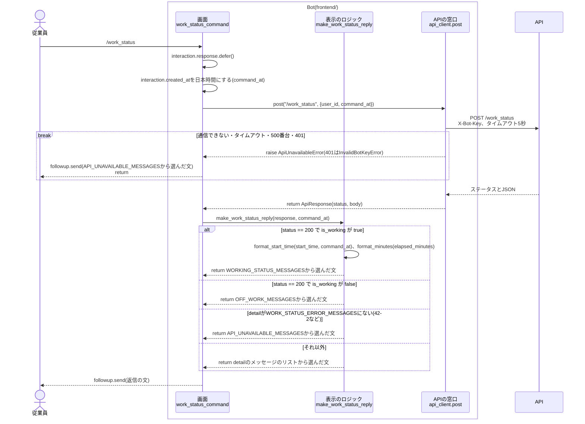
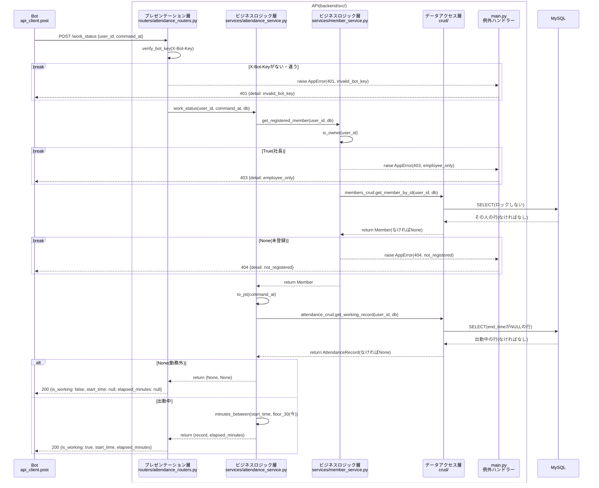
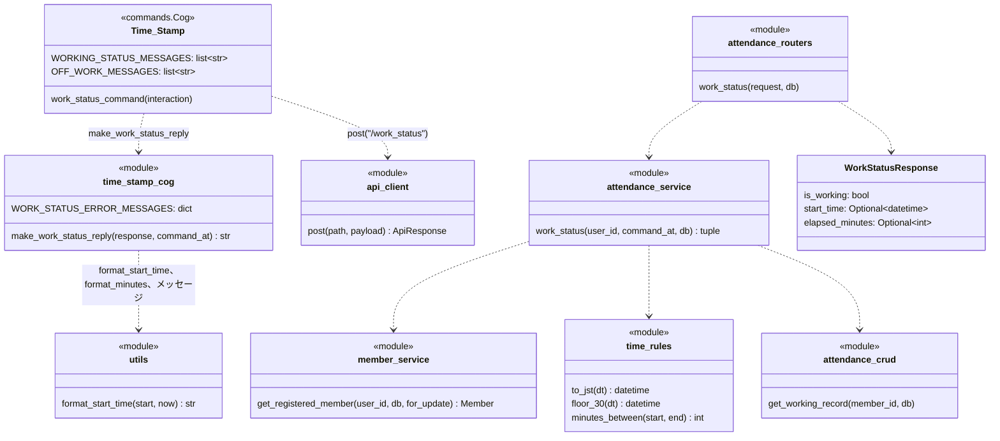

# `/work_status`コマンドの単体詳細設計

- 基本設計: [自分の出勤状況の確認(`/work_status`)](../basic_design.md#自分の出勤状況の確認work_status)、[打刻時刻の30分単位への丸め](../basic_design.md#打刻時刻の30分単位への丸め)
- 詳細設計(全体): [共通の決まり](../detailed_design.md#共通の決まり)、[出勤状態の判定](../detailed_design.md#出勤状態の判定)、[`/work_status`](../detailed_design.md#work_status)、[Botの処理](../detailed_design.md#botの処理)、[時刻と時間の表示](../detailed_design.md#時刻と時間の表示utilspy)
- 土台(`time_rules.py`、`get_registered_member`、`get_working_record`、`format_time`、`format_minutes`、`API_UNAVAILABLE_MESSAGES`)は[`/start_work`](./start_work_detailed_design.md)、[`/stop_work`](./stop_work_detailed_design.md)の単体詳細設計で作ったものを使う。

## 目次
- [概要](#概要)
- [対象ファイル](#対象ファイル)
- [準備](#準備)
- [処理の流れ](#処理の流れ)
  - [Botの中](#botの中)
  - [APIの中](#apiの中)
- [コマンドの定義](#コマンドの定義)
- [Bot](#bot)
  - [時刻の表示(`utils.py`)](#時刻の表示utilspy)
  - [Cog(`cogs/time_stamp_cog.py`)](#cogcogstime_stamp_cogpy)
  - [返信の文](#返信の文)
- [API](#api)
  - [リクエストとレスポンス](#リクエストとレスポンス)
  - [確認する順番](#確認する順番)
  - [各層の処理](#各層の処理)
- [クラス](#クラス)
- [エラーの扱い](#エラーの扱い)
- [単体テスト](#単体テスト)
- [Discordでの確認](#discordでの確認)
- [決めたこと](#決めたこと)

---
## 概要
- コマンドした人が出勤中なら、丸めた後の出勤時刻と、今回の出勤で働いている時間を返す。勤務外なら「今は勤務外なのだ！」と返す。
- 働いている時間は、コマンドした時刻を30分単位で切り捨て(退勤と同じ)、丸めた後の出勤時刻から計算する。マイナスになる時は0分にする。
- 日をまたいで出勤中の時は、出勤時刻に日付を付ける(「前日21:30」「10/1 21:30」)。
- 返信はサーバーの全員に見せる(`defer()`)。エラーのメッセージも全員に見える。メンションは付けない。
- DBは読むだけで、書き換えない。ロックもしない。
- 今までの土台に、次のものを足す。
  - API: `POST /work_status`(`crud`は今ある`get_working_record`を使い、足さない)
  - Bot: 日付付きの出勤時刻の表示(`utils.format_start_time`)。`/all_work_status`でも使う

---

  ## コマンドの定義
| 項目 | 値 |
| --- | --- |
| コマンド名 | `work_status{index}`(本番は`work_status`、開発は`work_status_test`) |
| 説明(候補に出る文) | `自分の出勤状況を確認します` |
| 引数 | なし |
| DMで使えるか | 使えない(`@app_commands.guild_only()`) |
| 返信が見える人 | 全員 |

---
## 対象ファイル
### Bot(`frontend/`)
| ファイル | 変更 | 内容 |
| --- | --- | --- |
| `cogs/time_stamp_cog.py` | 追加 | `work_status_command`、返信の文を作る`make_work_status_reply`、`WORK_STATUS_ERROR_MESSAGES`、メッセージのリスト(`WORKING_STATUS_MESSAGES`、`OFF_WORK_MESSAGES`)。ファイルのdocstringを`"""/start_work、/stop_work、/work_statusコマンド(出退勤の記録と出勤状況の確認)のCog"""`に直す |
| `utils.py` | 追加 | `format_start_time`を足す |
| `tests/unit/test_utils.py` | 追加 | `format_start_time`のテスト |
| `tests/unit/test_time_stamp_cog.py` | 追加 | `make_work_status_reply`のテスト。ファイルのdocstringを`"""/start_work、/stop_work、/work_statusの返信の文(make_start_work_reply、make_stop_work_reply、make_work_status_reply)の単体テスト"""`に直す |

### API(`backend/`)
| ファイル | 変更 | 内容 |
| --- | --- | --- |
| `src/schemas/attendance.py` | 追加 | `WorkStatusRequest`、`WorkStatusResponse` |
| `src/routers/attendance_routers.py` | 追加 | `POST /work_status` |
| `src/services/attendance_service.py` | 追加 | `work_status` |
| `tests/integration/test_attendance_api.py` | 追加 | `/work_status`の単体テスト。ファイルのdocstringを`"""/start_work、/stop_work、/work_statusの結合テスト"""`に直す |

- `crud/`、`models.py`、テーブルは変えない。

### その他
| ファイル | 変更 | 内容 |
| --- | --- | --- |
| `README.md` | 変更 | `work_stamp`のコマンドの表に「`/work_status` \| 自分の出勤状況を確認する」を足す(あわせて`/stop_work`の行の全角スペースを消す)。APIの表に「POST \| `/work_status` \| 本人の出勤状況を返す。社長の場合は403、未登録の場合は404を返す」を足す |

---
## 処理の流れ
全体は「Bot → API → MySQL」の3つに分かれ、BotとAPIの中も、それぞれ3つの層に分かれている。

### Botの中
APIは1つの箱として描く。APIの中は[APIの中](#apiの中)の図を参照。

### APIの中

---

## Bot
### 時刻の表示(`utils.py`)
| 関数 | 内容 |
| --- | --- |
| `format_start_time(start: datetime, now: datetime) -> str` | 追加。出勤時刻に、`now`の日付から見た日付を付けて「時:分」の文字列にする。時刻の部分は`format_time`を使う |

`start`の日付と`now`の日付を比べて、次のように表示する。

| `start`の日付 | 表示 | 例(`now`が10/8) |
| --- | --- | --- |
| `now`と同じ日 | `{時:分}` | `9:30` |
| `now`の前日 | `前日{時:分}` | `前日21:30` |
| `now`の2日以上前 | `{月}/{日} {時:分}`(月と日は0埋めしない) | `10/1 21:30`、`9/30 21:30` |
| `now`の翌日 | `翌{時:分}` | `翌0:00`(10/8 23:45に出勤して、10/9 0:00に切り上がった時) |

- `format_minutes`の下に置く。
- 比べるのは`date()`だけにする。`start`はAPIから返ったタイムゾーンなしの日本時間、`now`はBotの`command_at`(タイムゾーン付きの日本時間)で、どちらも日本時間の日付になっている。
- 「前日」「翌日」は`timedelta(days=1)`で比べるので、月や年をまたいでも正しく判定される(10/1から見た9/30、1/1から見た12/31は「前日」)。
- 2日以上前の時は年を付けない。年をまたいで出勤中のままになることはない前提にする([決めたこと](#決めたこと)を参照)。
- 翌日より後になることはない(`ceil_30`で進むのは最大30分のため)。来た時は2日以上前と同じ`{月}/{日} {時:分}`にする。

### Cog(`cogs/time_stamp_cog.py`)
`/start_work`で作り直した`Time_Stamp`のCogに足す。

| 名前 | 置く所 | 内容 |
| --- | --- | --- |
| `work_status_command(self, interaction) -> None` | `Time_Stamp`(`stop_work_command`の下) | 追加。出勤状況を、全員に見える形で返す |
| `make_work_status_reply(response: ApiResponse, command_at: datetime) -> str` | モジュール(`make_stop_work_reply`の下) | 追加。`/work_status`の結果から返信の文を作る。Discordを使わないので単体テストできる |
| `WORK_STATUS_ERROR_MESSAGES: dict[str, list[str]]` | モジュール(`STOP_WORK_ERROR_MESSAGES`の下) | 追加。`detail`とメッセージのリストの辞書 |

`work_status_command`の処理:
1. `interaction.response.defer()`する。
2. `interaction.created_at`を日本時間にして`command_at`にする。
3. `api_client.post("/work_status", {user_id, command_at})`を呼ぶ。`command_at`はタイムゾーン付きのISO 8601の文字列で送る。
4. `ApiUnavailableError`なら、`API_UNAVAILABLE_MESSAGES`から選んだ文を送って終わる。
5. それ以外は、`make_work_status_reply(response, command_at)`の文を送る。

`make_work_status_reply`の処理:
1. ステータスが200で`is_working`が`true`なら、`WORKING_STATUS_MESSAGES`から1つ選び、`start`(`format_start_time(start_time, command_at)`)、`elapsed`(`format_minutes(elapsed_minutes)`)を入れて返す。
2. ステータスが200で`is_working`が`false`なら、`OFF_WORK_MESSAGES`から選んだ文を返す。
3. それ以外は、`detail`で`WORK_STATUS_ERROR_MESSAGES`を引き、見つかったリストから選んだ文を返す。
4. 見つからない時(422で`detail`がリストの時も含む)は、`API_UNAVAILABLE_MESSAGES`から選んだ文を返す。

`WORK_STATUS_ERROR_MESSAGES`の中身:

| detail | メッセージのリスト | 置いておく所 |
| --- | --- | --- |
| `employee_only` | `EMPLOYEE_ONLY_MESSAGES` | `utils.py` |
| `not_registered` | `NOT_REGISTERED_MESSAGES` | `utils.py` |

- `command_at`は、APIに送った時刻と同じものを`format_start_time`の`now`に使う。APIの`elapsed_minutes`と、表示の「前日」などが同じ時刻を元にするため。
- 打刻しないので、通信できなかった時は「打刻はできていないのだ！」の付かない`API_UNAVAILABLE_MESSAGES`を使う([基本設計](../basic_design.md#共通)のとおり)。
- `utils.py`からの`import`に、`format_start_time`と`API_UNAVAILABLE_MESSAGES`を足す。

---
## API
### リクエストとレスポンス
| 項目 | 値 |
| --- | --- |
| メソッド・パス | `POST /work_status` |
| ヘッダー | `X-Bot-Key: {BOT_API_KEY}` |
| リクエスト | `{"user_id": int, "command_at": "2026-10-08T12:40:30.123000+09:00"}` |
| レスポンス(200、出勤中) | `{"is_working": true, "start_time": "2026-10-08T09:30:00", "elapsed_minutes": 180}`(`start_time`は丸めた後、日本時間) |
| レスポンス(200、勤務外) | `{"is_working": false, "start_time": null, "elapsed_minutes": null}` |
| エラー | `{"detail": "<エラーコード>"}` |

- `command_at`はタイムゾーン付きにする。タイムゾーンがない時は、FastAPIが422を返す(Pydanticの`AwareDatetime`)。
- `start_time`は、DBと同じくタイムゾーンなしの日本時間で返す。
- 勤務外の時も、`start_time`と`elapsed_minutes`の項目は省かず`null`で返す(Botが`is_working`だけで分けられるようにするため)。

### 確認する順番
上から順に確認し、最初に当てはまったものを返す。

| 順 | 確認すること | ステータス | detail |
| --- | --- | --- | --- |
| 0 | `X-Bot-Key`がない、または`BOT_API_KEY`と違う | 401 | `invalid_bot_key` |
| 1 | `user_id`が`OWNER_DISCORD_ID`と同じ | 403 | `employee_only` |
| 2 | その`user_id`が登録されていない | 404 | `not_registered` |

- 1と2は`get_registered_member`で確かめる。`for_update`は付けない(ロックしない)。
- 勤務外はエラーにせず、200の`is_working: false`で返す。

働いている時間の計算:
- `elapsed_minutes = minutes_between(start_time, floor_30(command_at))`。DBには保存しない。
- `floor_30(command_at)`が丸めた出勤時刻より前なら、`minutes_between`が0にする。

| 出勤(丸めた後) | 確認した時刻 | `elapsed_minutes` |
| --- | --- | --- |
| 10/8 9:30 | 10/8 12:40:30 | 180(3:00) |
| 10/8 9:30 | 10/8 9:40 | 0(0:00) |
| 10/9 0:00(10/8 23:45に出勤) | 10/8 23:50 | 0(0:00。切り捨てた23:30より出勤が後) |
| 10/7 21:30 | 10/8 12:40 | 900(15:00) |

### 各層の処理
| ファイル | 名前 | 内容 |
| --- | --- | --- |
| `schemas/attendance.py` | `WorkStatusRequest` | 追加。`user_id: int`、`command_at: AwareDatetime`(タイムゾーンがないと422) |
| | `WorkStatusResponse` | 追加。`is_working: bool`、`start_time: datetime \| None`、`elapsed_minutes: int \| None` |
| `routers/attendance_routers.py` | `work_status(request: WorkStatusRequest, db: Session) -> WorkStatusResponse` | 追加。`POST /work_status`。`attendance_service.work_status`を呼び、行が`None`なら`is_working=False`、それ以外は`is_working=True`と`start_time`、`elapsed_minutes`を入れた`WorkStatusResponse`を返す |
| `services/attendance_service.py` | `work_status(user_id: int, command_at: datetime, db: Session) -> tuple[AttendanceRecord \| None, int \| None]` | 追加(`stop_work`の下)。出勤中の行と働いている時間(分)を返す。勤務外なら`(None, None)`。使えない時は`AppError`(`employee_only`、`not_registered`)を投げる |

`attendance_service.work_status`の処理:
1. `get_registered_member(user_id, db)`で、社長と未登録を確かめる。
2. `to_jst(command_at)`で日本時間にする(`now`)。
3. `attendance_crud.get_working_record(user_id, db)`で出勤中の行を探す。なければ`(None, None)`を返す。
4. `minutes_between(行のstart_time, floor_30(now))`で働いている時間を計算し、`(行, 働いている時間)`を返す。

- コミットもロールバックもしない(DBを書き換えないため)。
- docstringは[docstringの書き方](../detailed_design.md#docstringの書き方)に従い、実装の時に書く。

---
## クラス
今回足すもの・変えるものだけを書く。前のステップで作ったものは[`/start_work`のクラス](./start_work_detailed_design.md#クラス)、[`/stop_work`のクラス](./stop_work_detailed_design.md#クラス)を参照。

---
## エラーの扱い
| 起きること | API | Bot |
| --- | --- | --- |
| 社長、未登録 | `AppError`を投げ、例外ハンドラーが403/404にする | `detail`に合わせたメッセージ(全員に見える) |
| `X-Bot-Key`が違う | 401 `invalid_bot_key` | `api_client`がエラーのログを残して`InvalidBotKeyError`を投げる。従業員には通信できなかった時のメッセージ |
| リクエストの形が違う(`command_at`にタイムゾーンがないなど) | FastAPIが422を返す | 通信できなかった時のメッセージ |
| `/start_work`、`/stop_work`と同時に`/work_status`した | ロックしないので待たない。打刻がコミットされる前か後かで、勤務外・出勤中のどちらかが返る | 返ってきた状態のメッセージ。もう一度確認すれば、打刻の後の状態が分かる |
| DBにつながらない | 500 | 通信できなかった時のメッセージ |
| APIにつながらない・5秒以内に返ってこない | | 通信できなかった時のメッセージ |

---
## 単体テスト
### API(`backend/tests/`)
- 実行: `docker compose exec api python -m pytest tests`
- 番号は、`/myname`のテストの続き(T-39〜、U-17〜)にする。

#### APIのテスト(`tests/integration/test_attendance_api.py`)
`/work_status`を`TestClient`で呼び、返ってきた結果を確かめる。

- 確認する人は、先に`register`で登録しておく。出勤中の状態は`start_work`で作る。
- `/work_status`を呼ぶ`work_status(client, headers, user_id, command_at)`を、`start_work`、`stop_work`と同じ形で足す。
- `command_at`はテストの中で決めた時刻を送る(今の時刻を使わない)。

| No | 確かめること | 起こしたエラー(やったこと) | 期待する結果 |
| --- | --- | --- | --- |
| T-39 | 出勤中なら、丸めた出勤時刻と働いている時間が分かる | なし(`Jun`で登録し`10/8 9:05`に出勤(9:30)した人が、次の時刻で確認する) ・`10/8 12:40:30` ・`10/8 9:30:00` ・`10/8 9:59:59` | 順に、200 `{"is_working": true, "start_time": "2026-10-08T09:30:00", "elapsed_minutes": …}`の`elapsed_minutes`が`180`、`0`、`0`。DBの行は1つのままで、`end_time`はNULLのまま |
| T-40 | 勤務外なら、`is_working`が`false`になる | 次の状態で確認する ・登録してから一度も出勤していない ・`10/8 9:05`に出勤、`10/8 18:10`に退勤した後、`10/8 18:20`に確認する | どちらも200 `{"is_working": false, "start_time": null, "elapsed_minutes": null}` |
| T-41 | 丸めた出勤時刻が確認した時刻より後なら、0分になる | `10/8 23:45`に出勤(10/9 0:00)した人が、`10/8 23:50`に確認する | 200 `start_time`が`2026-10-09T00:00:00`、`elapsed_minutes`が`0` |
| T-42 | 日をまたいで出勤中でも、働いている時間が分かる | `10/7 21:05`に出勤(21:30)した人が、`10/8 12:40`に確認する | 200 `start_time`が`2026-10-07T21:30:00`、`elapsed_minutes`が`900` |
| T-43 | UTCの時刻で送っても日本時間で計算される | `10/8 9:05`に出勤した人が、`2026-10-08T03:40:30+00:00`で確認する | 200 `elapsed_minutes`が`180` |
| T-44 | 他の人の出勤中の行は見ない | `Ken`だけが`10/8 9:05`に出勤している所で、`Jun`が`10/8 12:40`に確認する | 200 `is_working`が`false` |
| T-45 | 社長は確認できない | 社長のIDで確認する | 403 `employee_only` |
| T-46 | 登録していない人は確認できない | 未登録の人が確認する | 404 `not_registered` |
| T-47 | BotとAPIの合言葉(`X-Bot-Key`)が違うと使えない | `Jun`で登録した人が、`X-Bot-Key`を違う値にして確認する | 401 `invalid_bot_key` |
| T-48 | タイムゾーンのない時刻は受け付けない | `Jun`で登録した人が、`command_at`を`2026-10-08T12:40:30`にして確認する | 422 |

- T-39、T-40は、`pytest.mark.parametrize`でまとめる。
- T-39の2つ目、3つ目は、`floor_30`で切り捨ててから計算していること(9:59:59でも30分にならないこと)を確かめる。
- T-39は、`/work_status`がDBを書き換えないことも確かめる。
- T-40の2つ目は、退勤済みの行があっても、`end_time`がNULLの行だけを見ていることを確かめる。
- T-41は、`minutes_between`でマイナスにならないことを、APIを通して確かめる。

### Bot(`frontend/tests/unit/`)
- 実行: `docker compose exec bot python -m pytest tests`
- 返信の文はランダムに選ばれるので、「リストのどれかの文と同じか」で確かめる。
- `command_at`は、日本時間のタイムゾーン付きの`datetime`(`settings_env.JST`)で渡す。

| No | ファイル | 確かめること | 入力 | 期待する結果 |
| --- | --- | --- | --- | --- |
| U-17 | `test_utils.py` | `format_start_time`で、日付に合わせた表示になる | (`start`, `now`)が ・(`10/8 9:30`, `10/8 12:40`) ・(`10/7 21:30`, `10/8 12:40`) ・(`10/1 21:30`, `10/8 12:40`) ・(`10/9 0:00`, `10/8 23:50`) ・(`9/30 21:30`, `10/1 9:00`) ・(`2025/12/31 21:30`, `2026/1/1 9:00`) | 順に`"9:30"`、`"前日21:30"`、`"10/1 21:30"`、`"翌0:00"`、`"前日21:30"`、`"前日21:30"` |
| U-18 | `test_time_stamp_cog.py` | 出勤中の時は、日付付きの出勤時刻と働いている時間を入れた文になる | `ApiResponse(200, {"is_working": True, "start_time": "2026-10-07T21:30:00", "elapsed_minutes": 900})`、`command_at`が`2026-10-08 12:40:30+09:00` | `WORKING_STATUS_MESSAGES`のどれかに`start="前日21:30"`、`elapsed="15:00"`を入れた文。メンションは付かない |
| U-19 | `test_time_stamp_cog.py` | 勤務外の時は、勤務外の文になる | `ApiResponse(200, {"is_working": False, "start_time": None, "elapsed_minutes": None})` | `OFF_WORK_MESSAGES`のどれか |
| U-20 | `test_time_stamp_cog.py` | エラーの時は`detail`に合わせた文になる | 404 `not_registered`、403 `employee_only` | それぞれ`WORK_STATUS_ERROR_MESSAGES`のリストのどれか |
| U-21 | `test_time_stamp_cog.py` | 表にない`detail`の時は、通信できなかった時の文になる | `ApiResponse(422, {"detail": [{…}]})` | `API_UNAVAILABLE_MESSAGES`のどれか(`STAMP_API_UNAVAILABLE_MESSAGES`ではない) |

- U-17、U-20は、`pytest.mark.parametrize`でまとめる。
- U-17の5つ目と6つ目は、月と年をまたいでも「前日」になることを確かめる。
- `test_time_stamp_cog.py`の`owner_id`のfixture(`autouse=True`)は、`/work_status`のテストにもかかるが、そのままでよい(メンションを使わないので結果は変わらない)。

---
## Discordでの確認
単体テストでは確かめられない、Botとつないだ時の動きを開発環境(`/work_status_test`)で確かめる。

| No | 操作 | 期待する結果 |
| --- | --- | --- |
| D-01 | 出勤中の人が`/work_status_test` | 全員に見える(「これはあなただけに表示されています」が付かない)、出勤中のメッセージ。出勤時刻は30分単位に切り上げた時刻で、働いている時間が出ている。メンションは付かない |
| D-02 | D-01を、別のアカウントのDiscordで見る | D-01の返信が見え、上に「(コマンドした人)が/work_status_testを使用しました」と出ている |
| D-03 | 勤務外の人(`/stop_work_test`の後)が`/work_status_test` | 全員に見える、勤務外のメッセージ |
| D-04 | `/start_work_test`の直後に`/work_status_test` | 出勤中のメッセージで、働いている時間は`0:00` |
| D-05 | phpMyAdminで、出勤中の行の`start_time`を前日の夜にしてから`/work_status_test` | 出勤時刻が「前日21:30」のように表示され、働いている時間が日をまたいで計算されている |
| D-06 | phpMyAdminで、出勤中の行の`start_time`を3日前にしてから`/work_status_test` | 出勤時刻が「10/5 21:30」のように日付付きで表示される |
| D-07 | 未登録の人が`/work_status_test` | 全員に見える、まだ名前が登録されていないメッセージ |
| D-08 | 社長が`/work_status_test` | 全員に見える、従業員しか使えないメッセージ |
| D-09 | APIのコンテナを止めて`/work_status_test` | 5秒ほどで、全員に見える、サーバーとつながらなかったメッセージ(「打刻はできていない」は付かない) |
| D-10 | BotへのDMで`/work_status_test`を打つ | 候補に出ない |

- D-05、D-06の後は、phpMyAdminで`start_time`を元に戻すか、`/stop_work_test`で退勤しておく。

---
## 決めたこと
- **この設計書にはコードを書かない。** 関数のシグネチャ、処理の手順、決めたことだけを書く。コードと設計書の両方に同じものを書くと、直した時にずれてしまうため。コードの中身は実装とPRで確かめる。
- **`/work_status`ではロックしない(`for_update`を付けない)。** DBを書き換えないので、同時に打刻されても記録が壊れることはない。打刻と同時に確認した時は、どちらの状態が返っても、もう一度確認すれば正しい状態が分かる。ロックすると、打刻の処理を待たせることになる。
- **勤務外はエラー(409など)にせず、200で`is_working: false`を返す。** [全体の詳細設計](../detailed_design.md#work_status)のとおり。勤務外は「確認できた結果」の1つで、失敗ではないため。
- **レスポンスに`user_name`を入れない。** [全体の詳細設計](../detailed_design.md#work_status)のレスポンスのとおり。返信は全員に見えるが、Discordが返信の上に「(コマンドした人)が/work_statusを使用しました」と出すので、名前を出さなくても誰の状況か分かる。
- **働いている時間はAPIで計算し、Botは表示を整えるだけにする。** [時刻の扱い](../detailed_design.md#時刻の扱い)の「丸めと時間の計算はAPIで行う」に合わせるため。
- **出勤時刻の日付(「前日」など)はBotで付ける。** [時刻と時間の表示](../detailed_design.md#時刻と時間の表示utilspy)のとおり、`format_start_time(start, now)`は`utils.py`の表示の関数にする。`now`には、APIに送ったのと同じ`command_at`を使う。
- **`format_start_time`は日付だけを比べ、2日以上前の時も年は付けない。** 出勤中のまま年をまたぐほど退勤し忘れることは考えにくく、その前に社長が`/all_work_status`やWebで気づくため。
- **`work_status`の`services`の戻り値は`tuple[AttendanceRecord | None, int | None]`にする。** `start_work`、`stop_work`がタプルで返しているのに合わせる。勤務外の時の`WorkStatusResponse`の作り方(`null`で返す)はrouterで決める。
- **`services`の関数名は、`start_work`、`stop_work`に合わせて`work_status`にする。** routerの関数名、APIのパスとそろえる。
- **長く出勤中でも、`/start_work`の`already_working_long`のような注意の文は付けない。** [基本設計](../basic_design.md#自分の出勤状況の確認work_status)にないため。日付付きの出勤時刻と働いている時間を見れば、退勤し忘れに気づける。
- **返信にメンションは付けない。** 全員に見えるが、確認のための返信で、社長に知らせる必要がないため([メンション](../detailed_design.md#メンション)も`/start_work`と`/stop_work`だけ)。
- **返信は全員に見せる(`defer()`にする)。** [基本設計](../basic_design.md#コマンド設計)のとおり、出勤状況をみんなで共有できるようにするため。`followup.send`にも`ephemeral`は付けない。
- **通信できなかった時は`API_UNAVAILABLE_MESSAGES`を使う。** 打刻しないコマンドなので、「打刻はできていないのだ！」は付けない([基本設計](../basic_design.md#共通)のとおり)。
- **`make_work_status_reply`のエラーの部分は、`make_start_work_reply`、`make_stop_work_reply`と共通の関数にしない。** [`/myname`の決めたこと](./myname_detailed_design.md#決めたこと)のとおり、まとめるかは全部のコマンドを作り直した後に決める。
- **`format_start_time`は、`/work_status`で使うのでここで作る。** `/all_work_status`でも同じものを使う。
