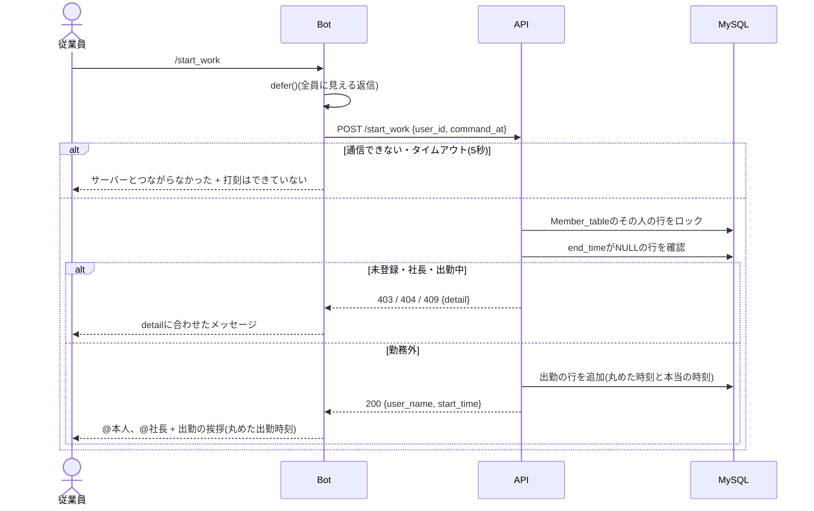
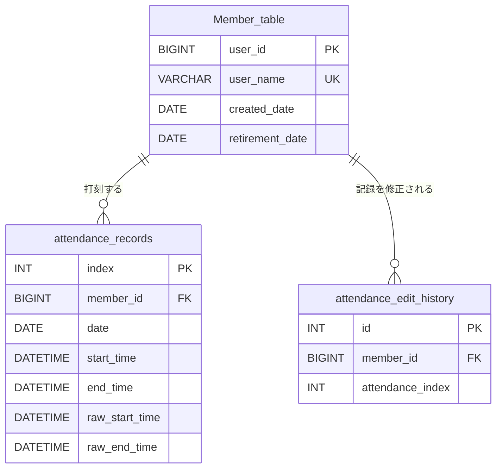

# 出退勤の詳細設計

基本設計は[basic_design.md](./basic_design.md)を参照。
Webでの勤怠確認と修正は[Webの詳細設計](../web_attendance_requirements_and_design/detailed_design.md)を参照。

## 目次
- [ファイル構成](#ファイル構成)
  - [Bot](#botfrontend)
  - [API](#apibackendsrc)
  - [テスト](#テストbackendtests)
- [共通の決まり](#共通の決まり)
  - [時刻の扱い](#時刻の扱い)
  - [30分単位の丸め](#30分単位の丸めservicestime_rulespy)
  - [社長かどうかの判定](#社長かどうかの判定)
  - [BotからAPIへのリクエスト](#botからapiへのリクエスト)
  - [層の分け方と例外](#層の分け方と例外)
  - [エラーの返し方](#エラーの返し方)
  - [コマンドの登録](#コマンドの登録)
  - [docstringの書き方](#docstringの書き方)
- [出勤状態の判定](#出勤状態の判定)
- [API詳細](#api詳細)
  - [/register_member](#register_member)
  - [/get_name](#get_name)
  - [/rename_member](#rename_member)
  - [/start_work](#start_work)
  - [/stop_work](#stop_work)
  - [/work_status](#work_status)
  - [/all_work_status](#all_work_status)
- [Botの処理](#botの処理)
  - [処理の流れ](#処理の流れstart_workの例)
  - [返信の見え方](#返信の見え方)
  - [メンション](#メンション)
  - [時刻と時間の表示](#時刻と時間の表示utilspy)
  - [エラーコードとメッセージ](#エラーコードとメッセージ)
  - [成功した時のメッセージの例](#成功した時のメッセージの例)
  - [/all_work_statusの表示](#all_work_statusの表示)
  - [/helpの表示](#helpの表示)
- [テーブル定義](#テーブル定義)
  - [Member_table](#member_tableメンバー)
  - [attendance_records](#attendance_records出退勤記録)
  - [attendance_edit_history](#attendance_edit_history修正履歴)
- [環境変数](#環境変数envに追加)
- [未決事項](#未決事項)
- [現在のコードとの差分](#現在のコードとの差分設計に合わせて直すところ)

## ファイル構成
```
DiscordWorkLogger/
├ backend/
│ ├ src/
│ │ ├ crud/                     データアクセス層
│ │ │ ├ __init__.py
│ │ │ ├ attendance_crud.py      ### 出退勤の読み書き
│ │ │ └ members_crud.py         ### メンバーの読み書き
│ │ ├ routers/                  プレゼンテーション層
│ │ │ ├ __init__.py
│ │ │ ├ attendance_routers.py   ## 出退勤のAPI
│ │ │ └ members_routers.py      ## 名前のAPI
│ │ ├ schemas/                  API送受信の型
│ │ │ ├ __init__.py
│ │ │ ├ attendance.py           ## 出退勤の型
│ │ │ └ members.py              ## 名前の型
│ │ ├ services/                 ビジネスロジック層
│ │ │ ├ __init__.py
│ │ │ ├ attendance_service.py   ## 出退勤の判定
│ │ │ ├ member_service.py       ## 名前と社長の判定
│ │ │ └ time_rules.py           ## 30分単位の丸め
│ │ ├ __init__.py
│ │ ├ config.py                 ## .envの読み込み
│ │ ├ database.py               ## DBの接続
│ │ ├ dependencies.py           ## 共通の部品
│ │ ├ exceptions.py             ## アプリの例外
│ │ ├ main.py                   ## APIの起動
│ │ └ models.py                 ## テーブル定義
│ └ tests/                      ## APIのテスト
│   ├ integration/              ## API通しのテスト
│   │ ├ __init__.py             ## パッケージ化
│   │ ├ test_attendance_api.py  ## 出退勤APIのテスト
│   │ └ test_members_api.py     ## 名前APIのテスト
│   ├ unit/                     ## 関数単位のテスト
│   │ ├ __init__.py             ## パッケージ化
│   │ ├ test_member_service.py  ## 名前判定のテスト
│   │ └ test_time_rules.py      ## 丸めのテスト
│   ├ __init__.py               ## パッケージ化
│   ├ conftest.py               ## テストの共通準備
│   └ dependencies.py           ## テスト用DBに差替
├ frontend/                     ## Bot本体
│ ├ cogs/                       画面(コマンドの受付と返信)
│ │ ├ __init__.py               ## パッケージ化
│ │ ├ help_cog.py               ## /helpコマンド
│ │ ├ register_cog.py           ## 名前のコマンド
│ │ ├ time_stamp_cog.py         ## 出退勤のコマンド
│ │ └ timer_cog.py              ## タイマーのコマンド
│ ├ services/                   APIの窓口
│ │ ├ __init__.py               ## パッケージ化
│ │ └ api_client.py             ## API呼び出し
│ ├ tests/                      ## Botのテスト
│ │ └ unit/                     ## 関数単位のテスト
│ │   ├ test_help_cog.py        ## /helpのテスト
│ │   └ test_utils.py           ## 表示形式のテスト
│ ├ main.py                     ## Botの起動
│ ├ settings_env.py             ## .envの読み込み
│ └ utils.py                    ## 表示と文言の部品
├ (.env)                        ## 秘密の設定値
├ .gitignore                    ## Git管理外の指定
└ docker-compose.yml            ## コンテナ構成
# ()内表記は.gitignore対象.
# /で終わるものはディレクトリを表す.
```

### Bot(`frontend/`)
Botも、バックエンドと同じく役割ごとに分ける。判定やルールはAPIで行うので、Botにビジネスロジック層はない。

| 層 | ディレクトリ・ファイル | やること |
| --- | --- | --- |
| 画面 | `cogs/` | コマンドを受け取り、`defer`して、返信を送る |
| 表示のロジック | `utils.py`、各Cogの返信の文を作る関数(`make_register_reply`など) | APIの結果を、見せる文に変える。Discordを使わないので単体テストできる |
| APIの窓口 | `services/` | APIを呼ぶ。URL、`X-Bot-Key`、タイムアウト、通信エラーの扱いを1か所にまとめる |

- `cogs/`は`services/`と`utils.py`を使ってよい。`services/`は`cogs/`を使わない。
- `services/`は、バックエンドの`services/`(ビジネスロジック層)とは役割が違う。フロントエンドでよく使う「APIの窓口」の意味で使う。

| ファイル | 内容 |
| --- | --- |
| `main.py` | Botの起動。`cogs/`のCogを読み込む |
| `settings_env.py` | `.env`の読み込み(`API_BASE_URL`、`BOT_API_KEY`、`OWNER_DISCORD_ID`など) |
| `services/api_client.py` | 追加。APIを呼ぶ処理をまとめる(タイムアウト、通信エラーの扱い) |
| `cogs/register_cog.py` | `/register`、`/myname`、`/rename` |
| `cogs/time_stamp_cog.py` | `/start_work`、`/stop_work`、`/work_status`、`/all_work_status` |
| `cogs/help_cog.py` | `/help` |
| `cogs/timer_cog.py` | タイマーのコマンド(今の`timer.py`の名前を変えて移す) |
| `utils.py` | メッセージのランダム選択、どのコマンドでも使うメッセージ、時刻と時間の表示形式 |
| `tests/unit/test_utils.py` | 追加。`utils.py`の表示形式(`format_time`、`format_minutes`、`format_start_time`)のテスト |

- Botは`frontend/`で`python3 main.py`として動かすので、`cogs/`の中からも`from settings_env import ...`、`from services import api_client`のように`frontend/`から見た名前で読み込む。

### API(`backend/src/`)
| ファイル | 内容 |
| --- | --- |
| `main.py` | FastAPIの起動。routerを読み込む(今の`from_discord.py`の代わり) |
| `config.py` | `.env`の読み込み(DBの接続情報、`OWNER_DISCORD_ID`、`BOT_API_KEY`など) |
| `database.py` | DBの接続 |
| `dependencies.py` | FastAPIの`Depends`で使う共通の部品。DBのセッション(`get_db`)と、`X-Bot-Key`の確認(`verify_bot_key`) |
| `exceptions.py` | アプリの例外`AppError`。詳しくは[層の分け方と例外](#層の分け方と例外) |
| `models.py` | テーブル定義 |
| `schemas/members.py` | 名前のAPIのリクエスト・レスポンスの型 |
| `schemas/attendance.py` | 出退勤のAPIのリクエスト・レスポンスの型 |
| `routers/members_routers.py` | `/register_member`、`/get_name`、`/rename_member` |
| `routers/attendance_routers.py` | `/start_work`、`/stop_work`、`/work_status`、`/all_work_status` |
| `services/time_rules.py` | 30分単位の丸めと、時間の計算 |
| `services/member_service.py` | 名前のチェック、社長かどうかの判定、登録しているメンバーの取得(`get_registered_member`) |
| `services/attendance_service.py` | 出勤・退勤・出勤状況の処理(ロック、出勤中かどうかの確認、5時間以上かどうか、退勤時刻を出勤時刻にそろえる処理) |
| `crud/members_crud.py`、`crud/attendance_crud.py` | DBの読み書き |

- 最初から入れておくデータはないので、データを入れる仕組み(seeding)は作らない。

### テスト(`backend/tests/`)
- テストは`pytest`で書く。

| ファイル | 内容 |
| --- | --- |
| `conftest.py` | テストで共通に使うもの(APIを呼ぶ`TestClient`、テストごとにテーブルを空にする処理) |
| `dependencies.py` | `get_db`をテスト用のデータベースにつなぐものに差し替える |
| `unit/test_time_rules.py` | `floor_30`、`ceil_30`、`minutes_between`。[基本設計の丸めの表](./basic_design.md#打刻時刻の30分単位への丸め)の例と、日付が変わる時(23:45)を確かめる |
| `unit/test_member_service.py` | 名前のチェック(空、英字以外、11文字以上)と、社長かどうかの判定 |
| `integration/test_members_api.py` | `/register_member`、`/get_name`、`/rename_member`。[API詳細](#api詳細)のエラーの表を、上から順に確かめる |
| `integration/test_attendance_api.py` | `/start_work`、`/stop_work`、`/work_status`、`/all_work_status`。エラーの表のほか、日をまたいだ退勤、退勤が出勤より前になる時(勤務時間0分)、5時間以上の出勤中を確かめる |

- integrationのテストは、本番と同じMySQLの中に作ったテスト用のデータベース(`.env`の`MYSQL_TEST_DATABASE`)を使う。`SELECT ... FOR UPDATE`など、MySQLでしか確かめられないことがあるため。

- Webで使うファイルは[Webの詳細設計](../web_attendance_requirements_and_design/detailed_design.md#ファイル構成)を参照。

---
## 共通の決まり
### 時刻の扱い
- Botは、コマンドを受け取った時刻として`interaction.created_at`(UTC)を使い、日本時間に変換してAPIに送る。
  - 送る形: ISO 8601のタイムゾーン付き(例: `2026-10-04T09:05:12+09:00`)。項目名は`command_at`。
- APIは受け取った時刻を日本時間に変換し、タイムゾーンなしの`DATETIME`としてDBに保存する(DBの時刻はすべて日本時間)。
- 丸めと時間の計算はAPIで行い、Botは返ってきた時刻と分数を表示用に整えるだけにする。

### 30分単位の丸め(`services/time_rules.py`)
```python
def floor_30(dt: datetime) -> datetime:
    """秒を切り捨ててから、30分単位で切り捨てる(退勤、働いている時間の計算に使う)"""
    dt = dt.replace(second=0, microsecond=0)
    return dt.replace(minute=dt.minute // 30 * 30)

def ceil_30(dt: datetime) -> datetime:
    """秒を切り捨ててから、30分単位で切り上げる(出勤に使う)。0分と30分はそのまま"""
    dt = dt.replace(second=0, microsecond=0)
    if dt.minute % 30 == 0:
        return dt
    return dt + timedelta(minutes=30 - dt.minute % 30)

def minutes_between(start: datetime, end: datetime) -> int:
    """startからendまでの分数。マイナスになる場合は0"""
    return max(0, int((end - start).total_seconds() // 60))
```
- 23:45に出勤すると`ceil_30`で翌0:00になり、日付も変わる。出勤日(`date`)はこの丸めた後の日付にする。

### 社長かどうかの判定
- APIは、リクエストの`user_id`が`.env`の`OWNER_DISCORD_ID`と一致したら社長として扱う。
- 判定はAPIだけで行う。Botは社長のメンションを作るためだけに`OWNER_DISCORD_ID`を読む。
- 従業員専用のAPIは、最初に社長かどうかを確認し、社長なら`403 employee_only`を返す。
- `/all_work_status`は、最初に社長かどうかを確認し、社長でなければ`403 owner_only`を返す。

### BotからAPIへのリクエスト
- Bot用のAPIはリクエストの`user_id`をそのまま信じるため、Botからのリクエストだと分かるようにする。
  - Botはヘッダーに`X-Bot-Key: {BOT_API_KEY}`を付ける。APIは`.env`の`BOT_API_KEY`と一致しなければ`401`を返す。
  - 確認は`dependencies.py`の`verify_bot_key`で行い、Bot用のrouterすべてに付ける。
- 通信は`aiohttp`(discord.pyと一緒に入っている)を使い、タイムアウトは5秒にする。
  - 今の`requests`は待っている間Bot全体が止まるため使わない。
- Discordはコマンドを受け取ってから3秒以内に応答しないとエラーになるため、APIを呼ぶコマンドは最初に`interaction.response.defer()`し、結果は`interaction.followup.send()`で送る。
  - 返信が見える人は`defer`の時に決まるので、自分だけに見せるコマンドは`defer(ephemeral=True)`にする。
- `api_client.py`は、通信できない・タイムアウト・500番台のどれかなら`ApiUnavailableError`を投げる。各コマンドはこれを受けて、通信できなかった時のメッセージを返す。
  - 401の時は、エラーのログを残して`InvalidBotKeyError`(`ApiUnavailableError`の子クラス)を投げる。`.env`の`BOT_API_KEY`の設定の間違いなので、従業員には通信できなかった時と同じメッセージを見せる。

### 層の分け方と例外
| 層 | やること | 例外 |
| --- | --- | --- |
| `routers/` | リクエストを受け取り、`services`を呼んで、結果を返す | 自分では投げない |
| `services/` | 判定とルール。「未登録」「すでに出勤中」などを確かめる | `AppError`を投げる |
| `crud/` | DBの読み書きだけ。見つからなければ`None`を返す | 投げない |
| `main.py` | `AppError`を、HTTPのエラーのレスポンスに変える | |

- `exceptions.py`には、例外`AppError`を1つだけ作る。エラーの種類ごとにクラスは作らない。
  ```python
  class AppError(Exception):
      def __init__(self, status_code: int, detail: str):
          self.status_code = status_code
          self.detail = detail
  ```
  - 使い方: `raise AppError(404, "not_registered")`、`raise AppError(409, "already_working")`
- `main.py`で`@app.exception_handler(AppError)`を1つ登録し、`status_code`と`{"detail": detail}`のレスポンスを返す。
- 社長の確認と未登録の確認は、`member_service.py`の`get_registered_member(db, user_id)`にまとめる。従業員専用のAPIは、どれも最初にこの関数を呼ぶ。
  1. `user_id`が社長なら`AppError(403, "employee_only")`
  2. `crud`でメンバーを探し、`None`なら`AppError(404, "not_registered")`
  3. 見つかったメンバーを返す
- コミットとロールバックは`services`で行う。`crud`は`db.add`や`db.query`だけを行い、コミットしない(1つの処理の中で複数のテーブルを変える時に、まとめて保存するため)。

### エラーの返し方
- エラーは`{"detail": "<エラーコード>"}`で返し、Botはエラーコードごとにメッセージを出し分ける。
- 今の日本語の`detail`(「このIDはすでに使われています」など)は、英字のエラーコードに置き換える(文言を変えても判定が壊れないようにするため)。

| ステータス | 使う場面 |
| --- | --- |
| 400 | 入力がルールに合わない(名前のルールなど) |
| 401 | `X-Bot-Key`が正しくない |
| 403 | 使えない人のコマンド(社長・従業員) |
| 404 | 名前が未登録 |
| 409 | 今の状態ではできない(登録済み、すでに出勤中など) |

### コマンドの登録
- 出退勤のコマンドには`@app_commands.guild_only()`を付け、DMで使えないようにし、DMのコマンドの候補にも出さないようにする。
- コマンド名は今と同じく、開発環境では末尾に`_test`を付ける。

### docstringの書き方
- 詳細設計(各コマンドの単体詳細設計も含む)のコードに付けるdocstringは、Google形式で書く。実装も設計書のコードと同じ形にする。
- 文は日本語で書く。

```python
def func(arg1, arg2):
    """概要

    詳細説明

    Args:
        引数(arg1)の名前 (引数(arg1)の型): 引数(arg1)の説明
        引数(arg2)の名前 (:obj:`引数(arg2)の型`, optional): 引数(arg2)の説明

    Returns:
        戻り値の型: 戻り値の説明

    Raises:
        例外の名前: 例外の説明

    Yields:
        戻り値の型: 戻り値についての説明

    Examples:

        関数の使い方

        >>> func(5, 6)
        11

    Note:
        注意事項や注釈など

    """
    value = arg1 + arg2
    return value
```

- 当てはまらない項目は書かない(例: 例外を投げない関数には`Raises`を書かない。`Yields`はジェネレーターの時だけ書く)。
- 概要は1行で書く。詳細説明、`Examples`、`Note`は、必要な時だけ書く。
- クラス(`dataclass`も含む)は、クラスのdocstringの`Attributes:`に、各属性を`名前 (型): 説明`の形で書く。
- 今あるコードの`@param`/`@return`の形のdocstringは、そのコードを直すステップでGoogle形式に直す。
- ファイル(モジュール)の説明は、ファイルのいちばん上(importより前)に1行のdocstringで書く(例: `"""APIの設定値(.envから読んだ値と日本時間)をまとめる"""`)。中身が空の`__init__.py`には書かない。

---
## 出勤状態の判定
- `attendance_records`に、その人の`end_time`がNULLの行があれば「出勤中」、なければ「勤務外」とする。
- 「未登録」は、`Member_table`にその人の`user_id`がないこと。
- 出勤中の行は1人1行までにする。同時に2回`/start_work`された時に2行できないように、打刻の処理では最初に`Member_table`のその人の行を`SELECT ... FOR UPDATE`でロックしてから確認する(Webの修正も同じロックを使う)。

---
## API詳細
すべて`POST`。リクエストには`X-Bot-Key`ヘッダーを付ける。エラーは上から順に確認し、最初に当てはまったものを返す。

### `/register_member`
- リクエスト: `{user_id: int, user_name: str}`
- レスポンス(200): `{user_name: str}`
- 登録日(`created_date`)は、APIが日本時間の今日の日付を入れる。

| 確認する順 | ステータス | detail |
| --- | --- | --- |
| 1. 社長 | 403 | `employee_only` |
| 2. 名前が空(前後の空白を除いて0文字) | 400 | `name_empty` |
| 3. 英字以外が入っている(`^[A-Za-z]+$`に合わない) | 400 | `name_not_alpha` |
| 4. 11文字以上 | 400 | `name_too_long` |
| 5. すでに登録している | 409 | `already_registered` |
| 6. 他の人が同じ名前(大文字・小文字を区別しない) | 409 | `name_taken` |

### `/get_name`
- リクエスト: `{user_id: int}`
- レスポンス(200): `{user_name: str}`

| 確認する順 | ステータス | detail |
| --- | --- | --- |
| 1. 社長 | 403 | `employee_only` |
| 2. 未登録 | 404 | `not_registered` |

### `/rename_member`
- リクエスト: `{user_id: int, user_name: str}`
- レスポンス(200): `{old_name: str, new_name: str}`

| 確認する順 | ステータス | detail |
| --- | --- | --- |
| 1. 社長 | 403 | `employee_only` |
| 2. 未登録 | 404 | `not_registered` |
| 3〜5. 名前のルール | 400 | `/register_member`と同じ |
| 6. 今と完全に同じ名前 | 409 | `same_name` |
| 7. 他の人が同じ名前(大文字・小文字を区別しない) | 409 | `name_taken` |

- 6は大文字・小文字も区別して比べる。「jun」から「Jun」への変更はできる(7の確認では自分を除くため)。

### `/start_work`
- リクエスト: `{user_id: int, command_at: datetime}`
- レスポンス(200): `{user_name: str, start_time: datetime}`(`start_time`は丸めた後)

| 確認する順 | ステータス | detail |
| --- | --- | --- |
| 1. 社長 | 403 | `employee_only` |
| 2. 未登録 | 404 | `not_registered` |
| 3. 出勤中で、`floor_30(command_at)`が丸めた後の出勤時刻から5時間(300分)以上後 | 409 | `already_working_long` |
| 4. 出勤中(3以外) | 409 | `already_working` |

- 保存する値: `date = ceil_30(command_at).date()`、`start_time = ceil_30(command_at)`、`raw_start_time = command_at`。

### `/stop_work`
- リクエスト: `{user_id: int, command_at: datetime}`
- レスポンス(200): `{user_name: str, start_time: datetime, end_time: datetime, work_minutes: int}`(時刻は丸めた後)

| 確認する順 | ステータス | detail |
| --- | --- | --- |
| 1. 社長 | 403 | `employee_only` |
| 2. 未登録 | 404 | `not_registered` |
| 3. 勤務外 | 409 | `not_working` |

- 日付ではなく「`end_time`がNULLの行」を探して更新する。日をまたいだ勤務でも正しく退勤できる。
- 保存する値: `end_time = max(floor_30(command_at), start_time)`、`raw_end_time = command_at`。
  - 丸めた後の退勤時刻が出勤時刻より前なら、出勤時刻と同じにする(勤務時間0分)。
- `work_minutes = minutes_between(start_time, end_time)`

### `/work_status`
- リクエスト: `{user_id: int, command_at: datetime}`
- レスポンス(200):
  - 出勤中: `{is_working: true, start_time: datetime, elapsed_minutes: int}`
  - 勤務外: `{is_working: false, start_time: null, elapsed_minutes: null}`
- `elapsed_minutes = minutes_between(start_time, floor_30(command_at))`

| 確認する順 | ステータス | detail |
| --- | --- | --- |
| 1. 社長 | 403 | `employee_only` |
| 2. 未登録 | 404 | `not_registered` |

### `/all_work_status`
- リクエスト: `{user_id: int, command_at: datetime}`
- レスポンス(200):
  ```json
  {
    "working": [{"user_name": "Jun", "start_time": "2026-10-04T09:30:00", "elapsed_minutes": 180}],
    "off": [{"user_name": "Ken"}]
  }
  ```
- `working`は出勤時刻の古い順、`off`は名前のアルファベット順(大文字・小文字を区別しない)に並べる。

| 確認する順 | ステータス | detail |
| --- | --- | --- |
| 1. 社長ではない | 403 | `owner_only` |

---
## Botの処理
### 処理の流れ(`/start_work`の例)
他のコマンドも、APIのパスとメッセージが違うだけで同じ流れにする。



### 返信の見え方
| コマンド | `defer` | 理由 |
| --- | --- | --- |
| `/register`、`/myname`、`/rename`、`/start_work`、`/stop_work`、`/work_status` | `defer()` | 全員に見せる |
| `/all_work_status` | `defer(ephemeral=True)` | 自分だけに見せる |
| `/help` | なし(APIを使わないので、すぐ`send_message(ephemeral=True)`) | 自分だけに見せる |

- エラーのメッセージも、そのコマンドの返信と同じ見え方になる(例: `/start_work`の「もう出勤しているのだ!」は全員に見える)。

### メンション
- `/start_work`と`/stop_work`の挨拶は、`interaction.user.mention`と`<@{OWNER_DISCORD_ID}>`を先頭に付ける。

### 時刻と時間の表示(`utils.py`)
| 関数 | 内容 | 例 |
| --- | --- | --- |
| `format_time(dt)` | 時刻を「時:分」にする。時は0埋めしない | `9:30`、`18:00` |
| `format_minutes(minutes)` | 分数を「時間:分」にする。24時間を超えてもそのまま | `510` → `8:30`、`900` → `15:00` |
| `format_start_time(start, now)` | 出勤時刻に、`now`(`command_at`)の日付から見た日付を付ける | 下の表 |

| 出勤時刻の日付 | 表示 |
| --- | --- |
| 今日 | `9:30` |
| 前日 | `前日21:30` |
| 2日以上前 | `10/1 21:30` |
| 翌日(23:45に出勤して翌0:00に切り上がった時) | `翌0:00` |

- `/start_work`と`/stop_work`の挨拶の時刻は`format_time`だけを使う(日付は付けない)。

### エラーコードとメッセージ
各メッセージは今の`/register`と同じく数パターン用意し、`random_choice_format_list_message`でランダムに選ぶ。下の表は1つの例。

| detail | メッセージの例 |
| --- | --- |
| `employee_only` | このコマンドは従業員しか使えないのだ! |
| `owner_only` | このコマンドは社長しか使えないのだ! |
| `not_registered` | まだ名前が登録されていないのだ!先に`/register`で登録するのだ! |
| `name_empty` | 名前を書くのだ! |
| `name_not_alpha` | 英字以外は書けないのだ! |
| `name_too_long` | 名前は10文字までなのだ! |
| `already_registered` | もう登録されているのだ!名前を変えたい時は`/rename`を使うのだ! |
| `name_taken` | 『{name}』は他の人が使っているのだ…別の名前にしてほしいのだ! |
| `same_name` | 今と同じ名前なのだ! |
| `already_working` | もう出勤しているのだ! |
| `already_working_long` | もう出勤しているのだ!退勤し忘れていたら、社長に伝えるのだ! |
| `not_working` | まだ出勤していないのだ!出勤し忘れていたら、社長に伝えるのだ! |
| (通信できない) | サーバーとつながらなかったのだ…少し待ってからもう一度試してほしいのだ! |
| (通信できない、`/start_work`・`/stop_work`) | サーバーとつながらなかったのだ…打刻はできていないのだ!少し待ってからもう一度試してほしいのだ! |

- 上の表にないステータス(422など)が返ってきた時は、通信できなかった時と同じメッセージを返す。

### 成功した時のメッセージの例
| コマンド | メッセージの例 |
| --- | --- |
| `/register` | {name}の登録が完了したのだ!これからよろしくなのだ! |
| `/myname` | お前の名前は「{name}」なのだ! |
| `/rename` | 名前を{old_name}から{new_name}に変えたのだ! |
| `/start_work` | {本人} {社長} {name}なのだ!出勤したのだ!今日もよろしくなのだ!(出勤 {start}) |
| `/stop_work` | {本人} {社長} {name}なのだ!退勤したのだ!お疲れさまなのだ!(退勤 {end} / 勤務時間 {work}) |
| `/work_status`(出勤中) | 出勤中なのだ!{start}に出勤して、今{elapsed}働いているのだ! |
| `/work_status`(勤務外) | 今は勤務外なのだ! |

### `/all_work_status`の表示
```
みんなの出勤状況なのだ!
【出勤中】
・Junさん 9:30〜(3:00)
・Kenさん 前日21:30〜(15:00)
【勤務外】
・Aoiさん
```
- 出勤中・勤務外のどちらかが0人の時は、その見出しの下に「・いないのだ」と表示する。
- 登録している人が1人もいない時は、「まだ誰も登録していないのだ!」とだけ返す。

### `/help`の表示
- [基本設計の例](./basic_design.md#コマンドの説明help)のとおりに表示する。
- コマンド名には、今の環境のコマンド名の末尾(`_test`)も付ける(開発環境で、そのままコピーして使えるようにするため)。

---
## テーブル定義
- 文字コードは`utf8mb4`、照合順序は`utf8mb4_0900_ai_ci`(MySQL 8.0の初期値)にする。大文字・小文字を区別しないので、`user_name`のUNIQUE制約で「Jun」と「jun」の重複も防げる。
- `monthly_summary`は使わない(集計は表示のたびに`attendance_records`から計算するため)。

### Member_table(メンバー)
| カラム | 型 | NULL | 説明 |
| --- | --- | --- | --- |
| user_id | BIGINT | × | 主キー。DiscordのユーザーID |
| user_name | VARCHAR(10) | × | 登録名。UNIQUE。入力した大文字・小文字のまま保存する |
| created_date | DATE | × | 登録日 |
| retirement_date | DATE | ○ | 退職日。今回は使わない(後回し) |

### attendance_records(出退勤記録)
| カラム | 型 | NULL | 説明 |
| --- | --- | --- | --- |
| index | INT | × | 主キー。自動採番 |
| member_id | BIGINT | × | 外部キー(`Member_table.user_id`) |
| date | DATE | × | 出勤日。丸めた後の出勤時刻の日付 |
| start_time | DATETIME | × | 出勤時刻(丸めた後) |
| end_time | DATETIME | ○ | 退勤時刻(丸めた後)。出勤中はNULL |
| raw_start_time | DATETIME | ○ | 打刻した本当の出勤時刻。社長がWebで追加した記録はNULL |
| raw_end_time | DATETIME | ○ | 打刻した本当の退勤時刻。出勤中と、社長がWebで退勤時間を入れた記録はNULL |

- インデックス: `(member_id, start_time)`(出勤中の行の検索、月の一覧、重なりの確認に使う)、`(date)`(月の一覧に使う)。
- `index`はMySQLの予約語なので、SQLを直接書く時は`` `index` ``のように囲む(SQLAlchemyは自動で囲む)。
- `raw_start_time`と`raw_end_time`は、Discordの返信やWebには出さない。トラブルの時にphpMyAdminで確認する。

### attendance_edit_history(修正履歴)
[Webの詳細設計](../web_attendance_requirements_and_design/detailed_design.md#テーブル定義)を参照。



---
## 環境変数(`.env`に追加)
| 名前 | 使う所 | 内容 |
| --- | --- | --- |
| `OWNER_DISCORD_ID` | Bot、API | 社長のDiscordユーザーID |
| `BOT_API_KEY` | Bot、API | BotからのリクエストだとAPIが確かめるための文字列 |
| `MYSQL_TEST_DATABASE` | APIのテスト | integrationのテストで使うデータベースの名前 |

---
## 未決事項
- なし

## 現在のコードとの差分(設計に合わせて直すところ)
- Botは`/start_work`に送っているが、APIは`/create_clock_in`、`/update_clock_out`になっている。`/start_work`、`/stop_work`に揃える。
- 出退勤のAPIが`schemas.AttendanceRecord`(`index`必須)を受け取っている。リクエストを`{user_id, command_at}`にする。
- 出勤時に「未登録」「すでに出勤中」の確認がない。
- 退勤時に日付で記録を探しているので、日をまたぐ勤務や1日複数回の出勤に対応できない。`end_time`がNULLの行で探す。
- 30分単位の丸めがない。打刻した本当の時刻のカラム(`raw_start_time`、`raw_end_time`)がない。
- `attendance_records.member_id`に外部キー制約とNOT NULLが付いていない。
- `monthly_summary`(モデルとスキーマ)を消す。
- `/get_name`の未登録が`409`になっている。`404 not_registered`にする。
- エラーの`detail`が日本語の文言になっている。エラーコードにする。
- 名前のルール(英字のみ、10文字まで)の確認がない。
- 社長かどうかの判定、`X-Bot-Key`の確認がない。
- Botが`requests`でAPIを呼んでいて、タイムアウトもない。`aiohttp`にし、`defer`してから返信する。
- `time_stamp_cog.py`の`/start_work`が、存在しない`REGISTER_COMPLETE_MESSAGES`と`name`を使っている。
- `/rename`、`/stop_work`、`/work_status`、`/all_work_status`、`/help`がない。
- 出退勤のコマンドに`guild_only`が付いていない。
- テストがない。`backend/requirements.txt`に`pytest`を足す。
- APIのファイルが`backend/`直下にある。`backend/src/`の構成に移し(`schemas.py`は`schemas/`に分ける)、`docker-compose.yml`の起動コマンドを`uvicorn src.main:app`にする。
