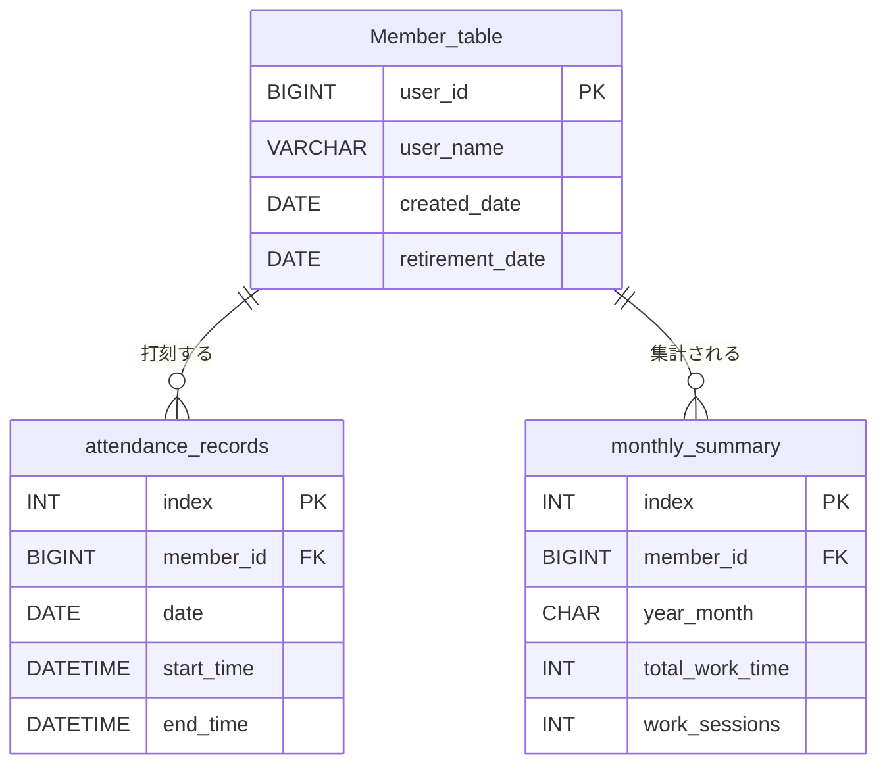

# 出退勤の詳細設計

基本設計は[basic_design.md](./basic_design.md)を参照。

## 出勤状態の判定
- 出勤中かどうかは、`attendance_records`に`end_time`がNULLの行があるかで判定する。

## 処理の流れ
### 出勤(/start_work)
1. Botがuser_id、日付、現在時刻を取得してAPIに送る。
2. APIはユーザーが登録済みか確認する。未登録ならエラーを返す。
3. `end_time`がNULLの出勤記録があるか確認する。あれば重複エラーを返す。
4. 新しい出勤記録を作成する。
5. Botは登録名を使って出勤完了メッセージを返す。

詳細は[start_workのシーケンス図](../start_work_sequence_diagram.md)を参照。

### 退勤(/stop_work)
1. Botがuser_idと現在時刻を取得してAPIに送る。
2. APIはユーザーが登録済みか確認する。未登録ならエラーを返す。
3. `end_time`がNULLの出勤記録を探す。なければ未出勤エラーを返す。
4. 見つけた記録の`end_time`に退勤時刻を保存する。
5. Botは今回の勤務時間(`end_time - start_time`)を含めた退勤完了メッセージを返す。

- 日付ではなく「`end_time`がNULLの記録」で探すことで、日をまたいだ勤務(夜勤など)でも正しく退勤できるようにする。

## API詳細
| メソッド | パス | 成功 | エラー |
| --- | --- | --- | --- |
| POST | `/register_member` | 200 | 409: IDか名前が重複 |
| POST | `/get_name` | 200 | 409: 未登録 |
| POST | `/start_work` | 200 | 404: 未登録 / 409: すでに出勤中 |
| POST | `/stop_work` | 200 | 404: 未登録 / 409: 出勤していない |
| POST | `/work_status` | 200 | 404: 未登録 |
| POST | `/monthly_report` | 200 | 404: 未登録 |

- エラーの種類は`detail`で区別し、Bot側で`detail`ごとにメッセージを出し分ける(`/register`と同じ方式)。
- APIと通信できなかった場合(タイムアウトなど)は、Bot側で「APIサーバーと通信できなかった」と返信する。

### リクエスト・レスポンス
- `/start_work`
  - リクエスト: `{user_id: int, date: date, start_time: datetime}`
  - レスポンス: `{user_name: str, start_time: datetime}`
- `/stop_work`
  - リクエスト: `{user_id: int, end_time: datetime}`
  - レスポンス: `{user_name: str, start_time: datetime, end_time: datetime, work_minutes: int}`

## テーブル定義
### Member_table(メンバー)
| カラム | 型 | 説明 |
| --- | --- | --- |
| user_id | BIGINT | 主キー。discordのユーザーID |
| user_name | VARCHAR(10) | 登録名。重複不可 |
| created_date | DATE | 登録日 |
| retirement_date | DATE / NULL | 退職日。在籍中はNULL |

### attendance_records(出退勤記録)
| カラム | 型 | 説明 |
| --- | --- | --- |
| index | INT | 主キー。自動採番 |
| member_id | BIGINT | Member_table.user_idを参照する外部キー |
| date | DATE | 出勤した日付 |
| start_time | DATETIME | 出勤時刻 |
| end_time | DATETIME / NULL | 退勤時刻。出勤中はNULL |

### monthly_summary(月次集計)
- `attendance_records`から計算できるので、毎回計算するならこのテーブルは不要になる(未決事項を参照)。

| カラム | 型 | 説明 |
| --- | --- | --- |
| index | INT | 主キー。自動採番 |
| member_id | BIGINT | Member_table.user_idを参照する外部キー |
| year_month | CHAR(7) | 年月。例: 2026-06 |
| total_work_time | INT / NULL | 総労働時間。単位は分。NULLの場合は未集計 |
| work_sessions | INT / NULL | 出勤回数。NULLの場合は未集計 |

---

## 未決事項
- `monthly_summary`をテーブルに保存するか、`/monthly_report`の度に`attendance_records`から計算するか。
  人数が少ないうちは毎回計算でも十分そう。

## 現在のコードとの差分(設計に合わせて直すところ)
- Botは`/start_work`に送っているが、APIのパスは`/create_clock_in`になっている。パス名をどちらかに揃える。
- APIの出退勤エンドポイントが`schemas.AttendanceRecord`(index必須)を受け取っているので、出勤は`AttendanceCreate`を使うようにする。
- 出勤時に「未登録」「すでに出勤中」のチェックがない。
- 退勤時に日付で記録を探しているので、日をまたぐ勤務や1日複数回の出勤に対応できない。`end_time`がNULLの記録で探すようにする。
- `monthly_summary.year_month`が`String(6)`だが、`2026-06`は7文字なので入らない。
- `monthly_summary.total_work_time`が`DateTime`になっているが、時間の長さなので分単位の整数にする。
- `member_id`に外部キー制約が付いていない。
