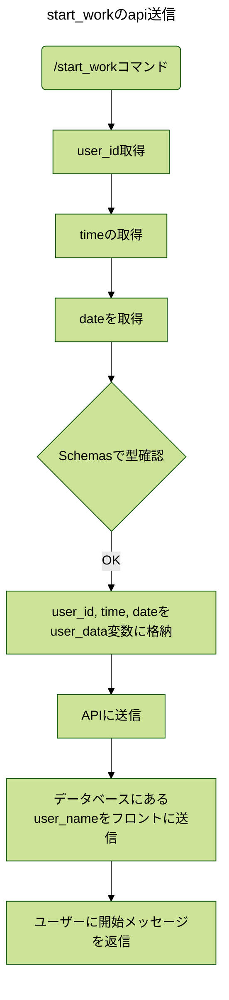

```mermaid
---
title: start_workのapi送信
config:
  theme: forest
---
flowchart TD
    A(/start_workコマンド) --> B[user_id取得]
    B --> C[timeの取得]
    C --> D[dateを取得]
    D --> E{Schemasで型確認}
    E -->|OK| F[user_id, time, dateをuser_data変数に格納]
    F --> H[APIに送信]
    H --> J[データベースにあるuser_nameをフロントに送信]
    J --> I[ユーザーに開始メッセージを返信]


```