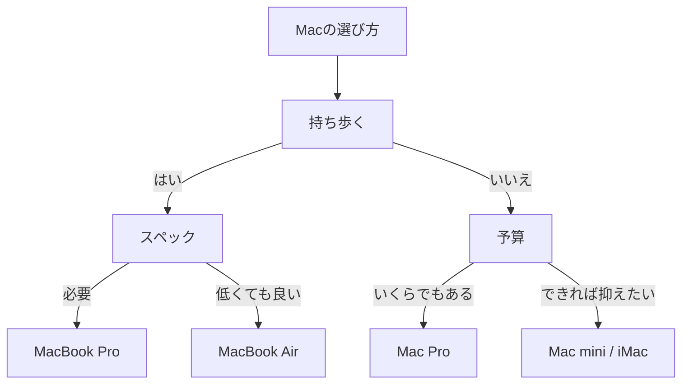

```mermaid
graph TB
  A[Macの選び方] --> B[持ち歩く]
  B -->|はい| C[スペック]
  B -->|いいえ| D[予算]
  C -->|必要| R1[MacBook Pro]
  C -->|低くても良い| R2[MacBook Air]
  D -->|いくらでもある| R3[Mac Pro]
  D -->|できれば抑えたい| R4[Mac mini / iMac]
```