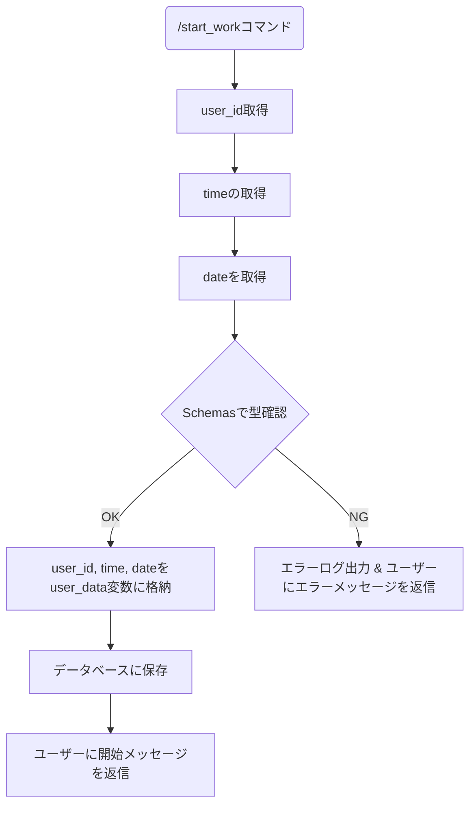

```mermaid
flowchart TD
    A(/start_workコマンド) --> B[user_id取得]
    B --> C[timeの取得]
    C --> D[dateを取得]
    D --> E{Schemasで型確認}
    E -->|OK| F[user_id, time, dateをuser_data変数に格納]
    E -->|NG| G[エラーログ出力 & ユーザーにエラーメッセージを返信]
    F --> H[データベースに保存]
    H --> I[ユーザーに開始メッセージを返信]


```