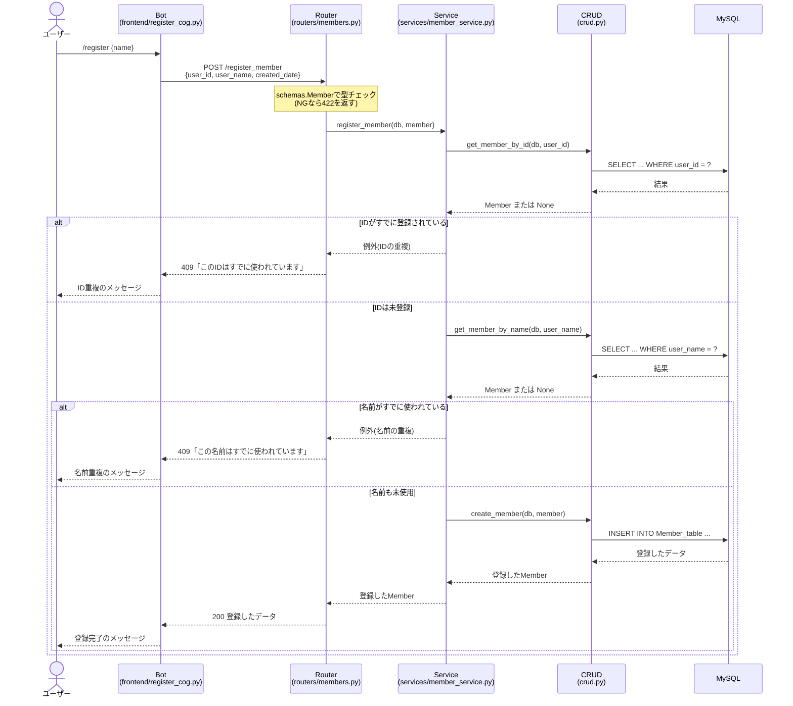

# register_member シーケンス図

APIの中をRouter・Service・CRUDの3つの層に分けたときの、メンバー登録(`/register_member`)の流れ。

## 各層の役割

| 層 | やること | やらないこと |
| --- | --- | --- |
| Router | リクエストを受け取る。例外をHTTPのステータスコード(409など)に変えて返す | 重複チェックなどのルールの判断、DBの操作 |
| Service | 「IDが重複していたらダメ」「名前が重複していたらダメ」というルールを判断する | HTTPのこと(ステータスコード)、SQLを書くこと |
| CRUD | 「IDで探す」「名前で探す」「保存する」だけをする | ルールの判断 |

ServiceはHTTPのステータスコードを知らない。Serviceは例外で「重複している」とだけ伝え、それを409にするかどうかはHTTPの窓口であるRouterが決める。
