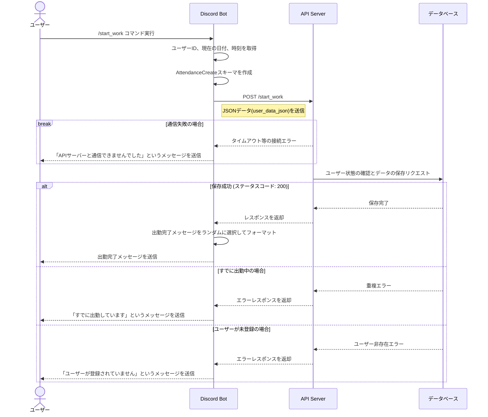

# start_work シーケンス図

```mermaid
sequenceDiagram
    actor User as ユーザー
    participant Bot as Discord Bot
    participant API as API Server
    participant DB as データベース

    User->>Bot: /start_work コマンド実行
    Bot->>Bot: ユーザーID、現在の日付、時刻を取得
    Bot->>Bot: AttendanceCreateスキーマを作成
    Bot->>API: POST /start_work
    Note right of Bot: JSONデータ(user_data_json)を送信

    break 通信失敗の場合
        API-->>Bot: タイムアウト等の接続エラー
        Bot-->>User: 「APIサーバーと通信できませんでした」というメッセージを送信
    end

    API->>DB: ユーザー状態の確認とデータの保存リクエスト

    alt 保存成功 (ステータスコード: 200)
        DB-->>API: 保存完了
        API-->>Bot: レスポンスを返却
        Bot->>Bot: 出勤完了メッセージをランダムに選択してフォーマット
        Bot-->>User: 出勤完了メッセージを送信
    else すでに出勤中の場合
        DB-->>API: 重複エラー
        API-->>Bot: エラーレスポンスを返却
        Bot-->>User: 「すでに出勤しています」というメッセージを送信
    else ユーザーが未登録の場合
        DB-->>API: ユーザー非存在エラー
        API-->>Bot: エラーレスポンスを返却
        Bot-->>User: 「ユーザーが登録されていません」というメッセージを送信
    end
```
