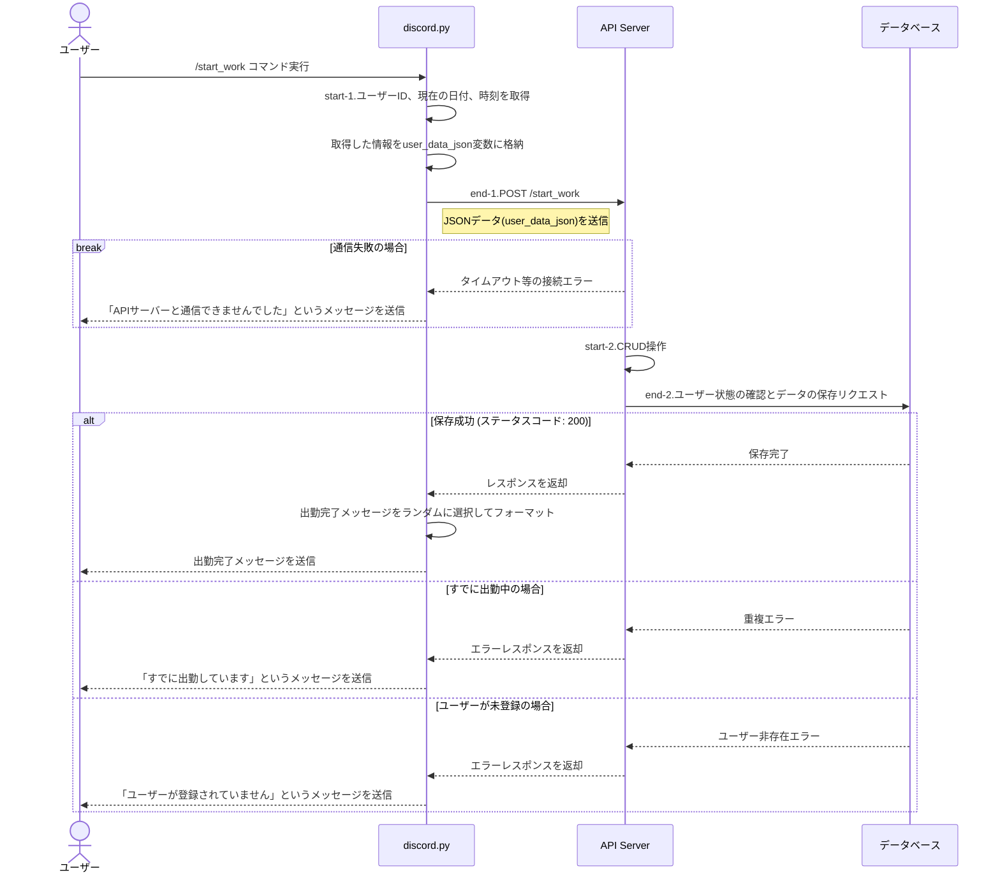
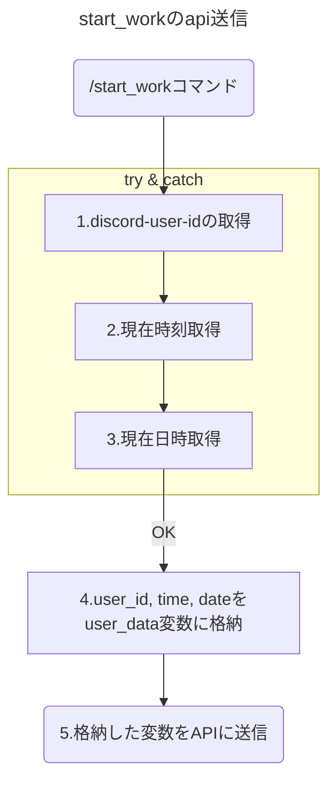

# start_work シーケンス図

```mermaid
sequenceDiagram
    actor User as ユーザー
    participant Bot as discord.py
    participant API as API Server
    participant DB as データベース

    User->>Bot: /start_work コマンド実行
    Bot->>Bot: start-1.ユーザーID、現在の日付、時刻を取得
    Bot->>Bot: 取得した情報をuser_data_json変数に格納
    Bot->>API: end-1.POST /start_work
    Note right of Bot: JSONデータ(user_data_json)を送信

    break 通信失敗の場合
        API-->>Bot: タイムアウト等の接続エラー
        Bot-->>User: 「APIサーバーと通信できませんでした」というメッセージを送信
    end
    API ->>API:start-2.CRUD操作
    API->>DB: end-2.ユーザー状態の確認とデータの保存リクエスト

    alt 保存成功 (ステータスコード: 200)
        DB-->>API: 保存完了
        API-->>Bot: レスポンスを返却
        Bot->>Bot: 出勤完了メッセージをランダムに選択してフォーマット
        Bot-->>User: 出勤完了メッセージを送信
    else すでに出勤中の場合
        DB-->>API: 重複エラー
        API-->>Bot: エラーレスポンスを返却
        Bot-->>User: 「すでに出勤しています」というメッセージを送信
    else ユーザーが未登録の場合
        DB-->>API: ユーザー非存在エラー
        API-->>Bot: エラーレスポンスを返却
        Bot-->>User: 「ユーザーが登録されていません」というメッセージを送信
    end
```

## 1.フロントからAPIにリクエストを送る。
クライアントがフロントでstart_workコマンドをしたら、必要なデータを格納し、APIにリクエスト送信する。
### 考えられる例外処理
- 各データがnull、もしくは違う方にならないかが心配
->**try&errorで解決か？**

```mermaid
---
title: start_workのapi送信
config:
---
flowchart TD
    A(/start_workコマンド) --> B[1.discord-user-idの取得]
    subgraph try & catch
    B --> C[2.現在時刻取得]
    C --> D[3.現在日時取得]
    end
    D -->|OK| F[4.user_id, time, dateをuser_data変数に格納]
    F --> H(5.格納した変数をAPIに送信)

```

