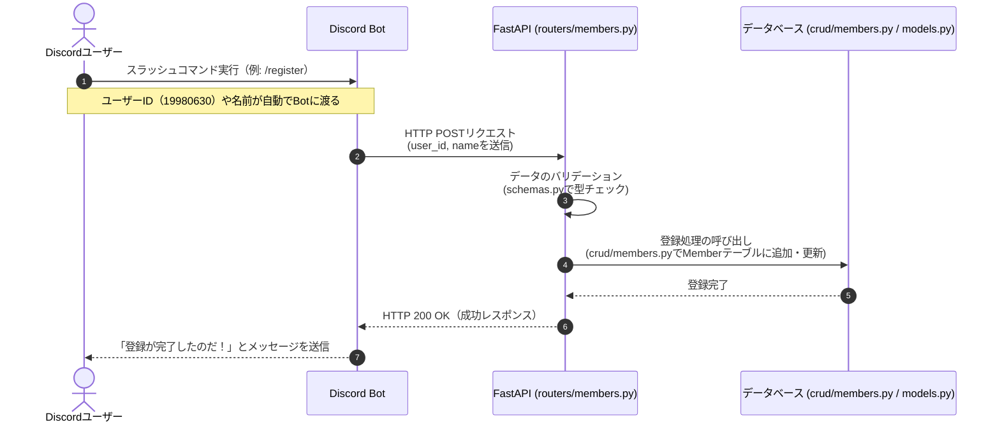

# ユーザー登録のシーケンス設計

ユーザーがDiscord上で自分の名前とIDを登録する際の流れ（シーケンス図）なのだ。

## シーケンス図

## 各コンポーネントの役割

- **Discordユーザー**: コマンドを実行するだけなのだ。IDは裏側で自動的にBotに送られるのだ。
- **Discord Bot**: 送られてきたIDと名前を取り出して、FastAPIのサーバーに通信（POSTリクエスト）する役割なのだ。
- **FastAPI**: Botから送られてきたデータを受け取り、型が正しいかチェック（schemas.py）してから、データベース操作の処理を呼び出すのだ。
- **データベース**: 受け取ったユーザーIDと名前をテーブル（models.pyで定義したMemberテーブル）に保存する役割なのだ。
