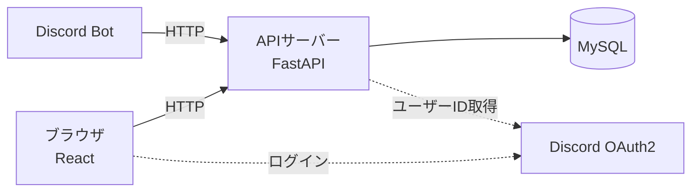
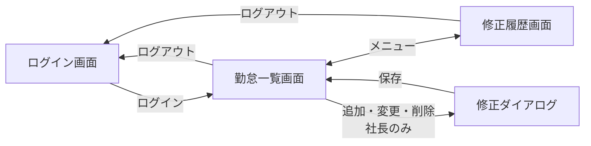
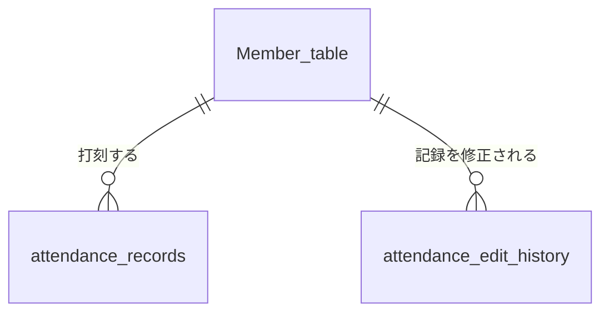

# Webでの勤怠確認と修正の基本設計

要件定義は[requirements_definition.md](./requirements_definition.md)を参照。
Discordでの打刻は[出退勤の基本設計](../attendance_requirements_and_design/basic_design.md)を参照。

## 全体構成
- 画面はReactで作り、データの取得と修正はDiscordのBotと同じAPI(FastAPI)を使う。
- Webは打刻をしないので、Botは変更しない。
- ログインはDiscordのアカウントで行う(Discord OAuth2)。`Member_table`の`user_id`をそのまま使えるため、パスワードを管理しなくて良い。
- 権限のチェック(社長かどうか、自分の記録かどうか)はAPI側で行う。画面でボタンを隠すだけにはしない。
- 今回は会社の中から見られれば良いので、会社のPCでDockerを動かし、同じネットワークからアクセスする。
- 開発スピードを優先し、パソコンのブラウザで見ることだけを考えて画面を作る。スマホの画面には合わせない。

## ログインと権限
### ログイン
- 「Discordでログイン」ボタンからDiscordの認可画面に移り、許可するとAPIがDiscordのユーザーIDを受け取る。
- `Member_table`に登録されている人だけログインできる。未登録の人には「名前が登録されていません。Discordで`/register`を使って登録してください。」と表示する。
- ログイン画面に「ログインしたままにする」のチェックボックスを置く。
  - チェックした場合: ブラウザを閉じてもログインしたままにする。最後に使った日から30日間使わなかった時だけログインが切れる(使っている間はずっとログインしたまま)。
  - チェックしない場合: ブラウザを閉じたらログインが切れる。
- ログアウトしたら、チェックしていてもログインが切れる。

### 社長かどうかの判定
- 社長のDiscordユーザーIDを`.env`に書いておき、一致したら社長として扱う。
- 社長は打刻しないこともあるため、`Member_table`に登録していなくてもログインできるようにする。

### 権限
| できること | 従業員 | 社長 |
| --- | --- | --- |
| 勤怠の一覧と月の集計を見る | 自分のみ | 全員 |
| 人を選んで絞り込む | - | ○ |
| 記録を追加・変更・削除する | - | ○ |
| 修正履歴を見る | 自分の記録のみ | 全員 |

## 画面設計
### 画面一覧
| 画面 | 内容 |
| --- | --- |
| ログイン画面 | 「Discordでログイン」ボタンと「ログインしたままにする」のチェックボックスを置く |
| 勤怠一覧画面 | 月ごとの勤怠の一覧と集計を表示する。社長はここから記録を修正する |
| 修正履歴画面 | 記録の修正履歴を新しい順に表示する |

- 記録の追加・変更はダイアログで行い、削除は確認ダイアログを出してから行う。別の画面には移らない。
- 画面のメッセージは、普通の丁寧語にする(Discordのずんだもん口調にはしない)。

### 勤怠一覧画面
- 上部で月を選ぶ。最初は今月を表示する。
- 社長は人を選ぶ。最初は「全員」を表示する。

| 表示するもの | 内容 |
| --- | --- |
| 月の集計 | 総労働時間と出勤回数。社長が「全員」を選んでいる時は、1人ずつの集計を並べる |
| 勤怠の一覧 | 出勤日、出勤時間、退勤時間、勤務時間。社長が「全員」を選んでいる時は名前の列を足す |
| 修正ボタン | 社長のみ。各行に「変更」「削除」、一覧の上に「出勤を追加」 |

- 1回の出勤を1行にし、出勤した日だけを並べる(出勤していない日の行は作らない)。
- 出勤時間の古い順に並べる。
- 日をまたいだ勤務は、退勤時間を「翌0:30」のように表示する。
- 月をまたいだ勤務は、出勤日の月に表示する。
- 退勤していない行は、退勤時間を「出勤中」、勤務時間を「-」と表示し、行の色を変えて目立たせる。
- 退勤していない行は、総労働時間には含めず、出勤回数には含める。
- 勤務時間と総労働時間は「8:30」(8時間30分)のように、時:分の形で表示する。Discordの返信と同じ形にする。

### 修正履歴画面
- 修正した日時の新しい順に並べる。
- 社長は人を選んで絞り込める。従業員は自分の記録の履歴だけが表示される。

| 列 | 内容 |
| --- | --- |
| 修正日時 | 社長が修正した日時 |
| 名前 | 修正された記録の人 |
| 操作 | 追加・変更・削除 |
| 修正前 | 出勤時間〜退勤時間。追加の時は「-」 |
| 修正後 | 出勤時間〜退勤時間。削除の時は「-」 |

- 修正履歴には変更・削除のボタンを置かない。

## 処理の概要
### 勤怠の確認
- 指定した月に出勤した記録と、その月の集計をまとめて返す。
- 集計(総労働時間と出勤回数)は、表示するたびに`attendance_records`から計算する。
- 従業員が他の人の記録を指定した場合は、APIがエラーを返す。

### 記録の修正(社長のみ)
| 操作 | 内容 |
| --- | --- |
| 変更 | 出勤時間・退勤時間を変える。退勤し忘れた記録に退勤時間を入れるのもこの操作 |
| 追加 | 打刻し忘れた出勤を、出勤時間と退勤時間を入力して追加する |
| 削除 | 間違えた出勤を消す |

- 出勤時間と退勤時間は、どちらも「日付+時刻」で入力する。退勤の日付には、最初から出勤と同じ日付を入れておく(日をまたいだ時だけ社長が翌日に変える)。
- 次の場合は保存せず、理由を表示する。
  - 退勤時間が出勤時間より前
  - 未来の時刻
  - 同じ人の他の記録と時間が重なる
- 出勤時間と退勤時間は、30分単位(0分か30分)でしか入力できないようにする。給料は30分単位で計算し、Discordで打刻した時刻も30分単位に丸めているのに合わせるため(詳しくは[出退勤の基本設計](../attendance_requirements_and_design/basic_design.md#打刻時刻の30分単位への丸め)を参照)。
- 社長が修正するのは丸めた後の時刻だけで、打刻した本当の時刻は変えない。社長が追加した記録には、打刻した本当の時刻はない。
- 退勤時間を空にできるのは、今「出勤中」の記録を変更する時だけにする(働いている人の出勤時間だけを直せるようにするため)。
- 追加と、退勤済みの記録の変更では、退勤時間を空にできない(1人に「出勤中」の記録が2つできるのを防ぐため)。
- 出勤時間を変えた時は、出勤日も出勤時間の日付に合わせる。
- 記録を修正したら、必ず修正履歴が残る。記録だけが直って履歴が残らない、ということが起きないようにする。

### 修正履歴
- 修正のたびに、修正前と修正後の出勤時間・退勤時間を残す。
- 削除した記録も、修正前の内容が修正履歴に残る。
- 修正履歴は、Webから変更・削除できないようにする。

## API一覧
Webで使うAPI。Discordで使うAPIは[出退勤の基本設計](../attendance_requirements_and_design/basic_design.md#api一覧)を参照。

| メソッド | パス | 内容 | 使える人 |
| --- | --- | --- | --- |
| GET | `/auth/login` | Discordの認可画面に移る | 全員 |
| GET | `/auth/callback` | Discordから戻ってきた時にログインする | 全員 |
| POST | `/auth/logout` | ログアウトする | ログインした人 |
| GET | `/me` | ログインしている人の名前と、社長かどうかを返す | ログインした人 |
| GET | `/members` | 人を選ぶためのメンバー一覧を返す | 社長 |
| GET | `/attendance` | 指定した月・人の記録と集計を返す | ログインした人 |
| POST | `/attendance` | 記録を追加する | 社長 |
| PUT | `/attendance/{index}` | 記録を変更する | 社長 |
| DELETE | `/attendance/{index}` | 記録を削除する | 社長 |
| GET | `/edit_history` | 修正履歴を返す | ログインした人 |

- Botが使うAPIはPOSTに統一しているが、Webは「取得はGET、変更はPUT、削除はDELETE」と分ける(Reactから呼ぶ時に分かりやすいため)。

## データモデル設計
- 既存の`Member_table`と`attendance_records`をそのまま使い、修正履歴のテーブルを1つ追加する。

| テーブル | 内容 |
| --- | --- |
| Member_table | 既存。ログインできる人の判定と、名前の表示に使う |
| attendance_records | 既存。一覧の表示と修正に使う |
| attendance_edit_history | 追加。いつ、誰の、どの記録を、修正前から修正後にどう直したか |

## 共通
- APIサーバーとつながらない時は、「サーバーとつながりませんでした。少し待ってから、もう一度読み込んでください。」と表示する。

## 環境構成
- `docker-compose.yml`にReactの画面用のコンテナを追加する。
- WebのURL(会社のPCのIPアドレスなど)は`.env`で設定する。実際のURLは、会社のPCで動かす時に決める。

---

## 後回しにしたこと
- 退職した人の扱い。退職したらDBから消す方向で考えている([出退勤の基本設計](../attendance_requirements_and_design/basic_design.md#後回しにしたこと)と同じ)。
- スマホの画面に合わせること。今回はパソコンのみとする。
