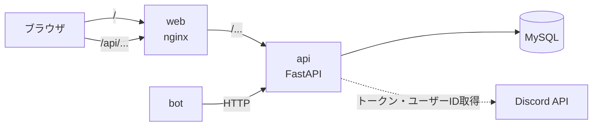
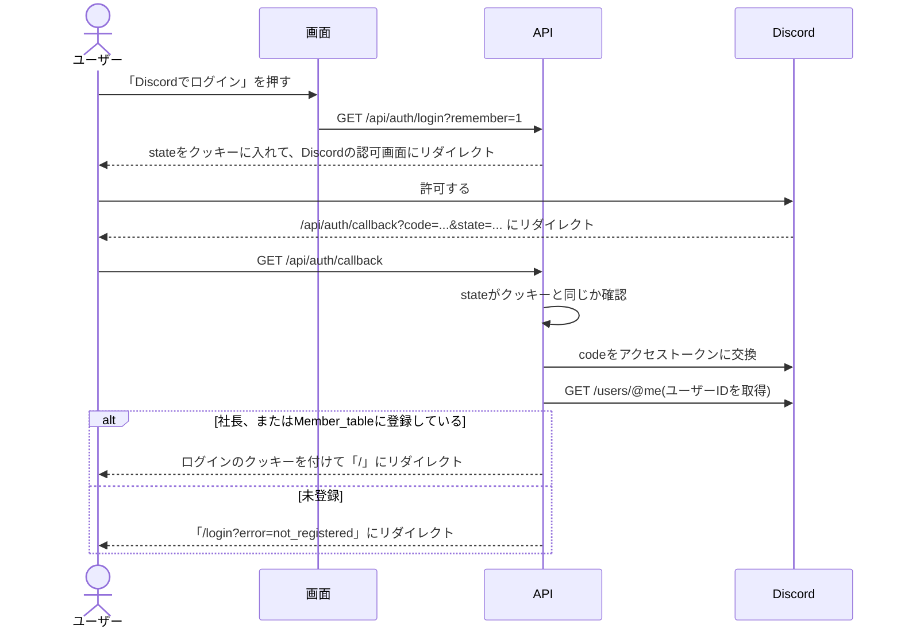
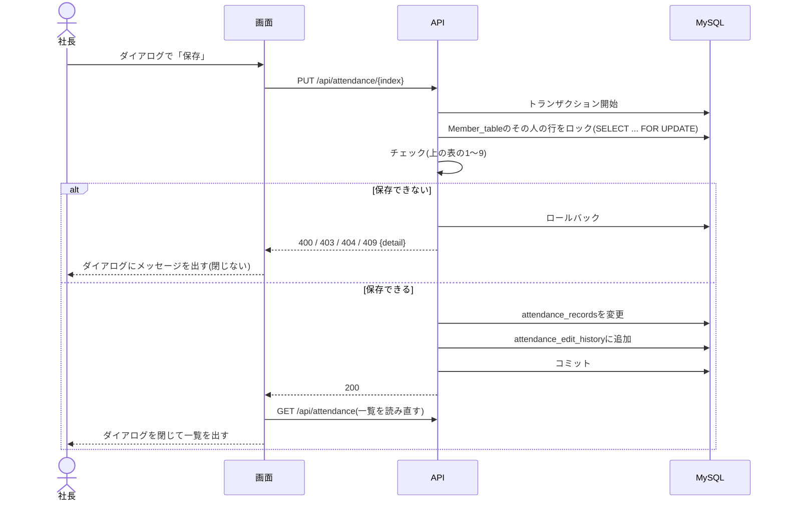
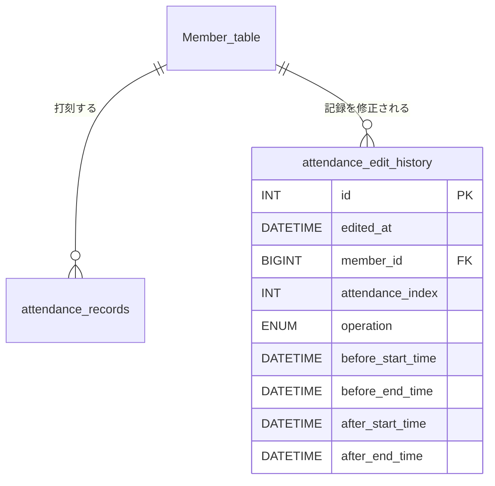

# Webでの勤怠確認と修正の詳細設計

基本設計は[basic_design.md](./basic_design.md)を参照。
Discordでの打刻は[出退勤の詳細設計](../attendance_requirements_and_design/detailed_design.md)を参照。時刻の扱い、30分単位の丸め、テーブルの多くはそちらに書いている。

## 全体構成
- Reactの画面は`web/`に作る(Vite + React、JavaScript、react-router-dom。Task_Assist_Systemの`react-practice`と同じ構成)。
- 本番(会社のPC)では、Reactをビルドしたファイルをnginxのコンテナで配る。nginxは`/api/`へのリクエストをAPIのコンテナに転送する。
  - 画面とAPIが同じURLになるので、CORSの設定やクッキーの扱いを考えなくて良い。
  - 開発中は`npm run dev`(Vite)の`server.proxy`で、`/api`を`http://localhost:8000`に転送する。
- APIのパスは基本設計のとおり(`/me`など)で、nginxとViteが`/api`を外してから転送する。画面からは`/api/me`のように呼ぶ。



## ファイル構成
### API(`backend/src/`に追加)
| ファイル | 内容 |
| --- | --- |
| `routers/auth_routers.py` | `/auth/login`、`/auth/callback`、`/auth/logout`、`/me` |
| `routers/web_attendance_routers.py` | `/members`、`/attendance`(GET・POST・PUT・DELETE) |
| `routers/edit_history_routers.py` | `/edit_history` |
| `services/session.py` | ログインのクッキーの作成と確認 |
| `services/discord_oauth.py` | Discordとのやり取り(コードとトークンの交換、ユーザーIDの取得) |
| `services/attendance_edit.py` | 記録の修正のチェックと、修正履歴の保存 |
| `crud/edit_history_crud.py` | 修正履歴の読み書き |

- 丸めや時間の計算は、出退勤と同じ`services/time_rules.py`を使う。

### 画面(`web/src/`)
| ファイル | 内容 |
| --- | --- |
| `main.jsx`、`App.jsx` | ルーティング。ログインしているか確認する |
| `api.js` | APIを呼ぶ処理をまとめる(エラーの扱い) |
| `format.js` | 時刻と時間の表示形式 |
| `pages/LoginPage.jsx` | ログイン画面 |
| `pages/AttendancePage.jsx` | 勤怠一覧画面 |
| `pages/HistoryPage.jsx` | 修正履歴画面 |
| `components/Header.jsx` | 名前、メニュー(勤怠一覧・修正履歴)、ログアウト |
| `components/MonthSelect.jsx` | 月を選ぶ |
| `components/MemberSelect.jsx` | 人を選ぶ(社長のみ) |
| `components/SummaryTable.jsx` | 月の集計 |
| `components/RecordTable.jsx` | 勤怠の一覧 |
| `components/EditDialog.jsx` | 記録の追加・変更のダイアログ |
| `components/DeleteDialog.jsx` | 削除の確認ダイアログ |

### その他
| ファイル | 内容 |
| --- | --- |
| `web/Dockerfile` | Nodeでビルドし、できたファイルをnginxのイメージにコピーする |
| `web/nginx.conf` | `/api/`をAPIに転送する。それ以外で見つからないパスは`index.html`を返す(画面のルーティングのため) |
| `web/vite.config.js` | 開発中の`/api`の転送 |

---
## ログイン
### ログインの流れ
Discord OAuth2の認可コードフローを使う。スコープは`identify`だけ(ユーザーIDが分かれば良いため)。



- `state`は毎回ランダムに作り(`secrets.token_urlsafe(32)`)、「ログインしたままにする」かどうかと一緒に、10分で切れるクッキー`oauth_state`に入れる。
- Discordで「キャンセル」した時、`state`が合わない時、Discordとの通信に失敗した時は、「/login?error=login_failed」にリダイレクトする。
- Discordのアクセストークンは、ユーザーIDを取ったら捨てる(保存しない)。
- DiscordのDeveloper Portalに、リダイレクト先として`{WEB_URL}/api/auth/callback`を登録する。

### ログインのクッキー
- ログインしている人は、署名付きのクッキー`session`で見分ける(`itsdangerous`の`URLSafeTimedSerializer`、鍵は`.env`の`SESSION_SECRET`)。
  - 中身: `{user_id: str, remember: bool}`。署名があるので、書き換えるとログインできなくなる。
  - DBにはログインの情報を保存しない(テーブルを増やさないため)。
- クッキーの設定: `HttpOnly`、`SameSite=Lax`、`Path=/`。

| | 「ログインしたままにする」をチェック | チェックしない |
| --- | --- | --- |
| クッキーの期限 | `Max-Age`を30日にする | `Max-Age`を付けない(ブラウザを閉じると消える) |
| 期限の延長 | APIを使うたびにクッキーを作り直し、30日を数え直す | なし |
| 署名の有効期限 | 30日(最後にクッキーを作り直してから) | 30日 |

- `POST /auth/logout`はクッキー`session`を消す。

### ログインしている人の確認
- ログインが必要なAPIは、FastAPIの`Depends`で次の順に確認する。
  1. クッキーがない、署名が正しくない、期限切れ → `401 not_logged_in`
  2. `user_id`が`OWNER_DISCORD_ID`と同じ → 社長
  3. `Member_table`に登録している → 従業員
  4. どちらでもない(ログインした後に消された) → `401 not_logged_in`
- 社長しか使えないAPIは、従業員なら`403 forbidden`を返す。

---
## API詳細
- リクエストとレスポンスはJSON。
- DiscordのユーザーIDは、JSONでは**文字列**にする。JavaScriptの数値ではDiscordのIDの桁数を正確に扱えないため(Bot用のAPIは数値のまま)。
- 時刻は`YYYY-MM-DDTHH:MM`(タイムゾーンなし、日本時間)、日付は`YYYY-MM-DD`、月は`YYYY-MM`。
- エラーは出退勤と同じく`{"detail": "<エラーコード>"}`で返す。

### `GET /auth/login`
- クエリ: `remember`(`1`ならログインしたままにする)
- Discordの認可画面にリダイレクトする。

### `GET /auth/callback`
- クエリ: `code`、`state`(Discordが付ける)
- [ログインの流れ](#ログインの流れ)のとおりにリダイレクトする。

### `POST /auth/logout`
- レスポンス: `204`

### `GET /me`
- レスポンス: `{user_id: str, user_name: str | null, is_owner: bool}`(社長は`user_name`がnull)

### `GET /members`(社長のみ)
- レスポンス: `[{user_id: str, user_name: str}]`(名前のアルファベット順)

### `GET /attendance`
- クエリ: `month`(必須、`YYYY-MM`)、`member_id`(省略可)
- 人の決め方

| | `member_id`なし | `member_id`が自分 | `member_id`が他の人 |
| --- | --- | --- | --- |
| 社長 | 全員 | - | その人 |
| 従業員 | 自分 | 自分 | `403 forbidden` |

- レスポンス:
  ```json
  {
    "month": "2026-10",
    "summaries": [
      {"member_id": "123...", "user_name": "Jun", "total_minutes": 510, "work_count": 2}
    ],
    "records": [
      {
        "index": 12, "member_id": "123...", "user_name": "Jun", "date": "2026-10-03",
        "start_time": "2026-10-03T21:30", "end_time": "2026-10-04T00:30",
        "work_minutes": 180
      }
    ]
  }
  ```
- `records`: `date`がその月の記録(`date >= 月の1日 AND date < 次の月の1日`)を、`start_time`の古い順に並べる。
  - 出勤中の記録は`end_time`と`work_minutes`をnullにする。
- `summaries`: 1人1行。名前のアルファベット順。
  - 「全員」の時は、その月の末日までに登録した全員を出す。その月に出勤していない人は`total_minutes: 0, work_count: 0`。
  - `total_minutes`: 退勤している記録の`work_minutes`の合計(出勤中の記録は含めない)。
  - `work_count`: 出勤中と勤務時間0分の記録も含めた行数。
- エラー: `400 invalid_month`(`month`の形が正しくない)、`403 forbidden`、`404 member_not_found`(社長が存在しない人を指定)

### `POST /attendance`(社長のみ)
- リクエスト: `{member_id: str, start_time: str, end_time: str}`
- レスポンス(201): `records`の1行と同じ形
- 保存する値: `date = start_time.date()`、`raw_start_time`と`raw_end_time`はNULL。

### `PUT /attendance/{index}`(社長のみ)
- リクエスト: `{start_time: str, end_time: str | null}`
- レスポンス(200): `records`の1行と同じ形
- `date`は`start_time`の日付に合わせる。`raw_start_time`と`raw_end_time`は変えない。
- 今と同じ出勤時間・退勤時間が送られてきた時は、何も変えず、修正履歴も残さずに200を返す。

### `DELETE /attendance/{index}`(社長のみ)
- レスポンス: `204`

### `GET /edit_history`
- クエリ: `member_id`(省略可。人の決め方は`GET /attendance`と同じ)
- レスポンス: 修正した日時の新しい順。件数が少ないので、ページ分けはしない。
  ```json
  [
    {
      "id": 5, "edited_at": "2026-10-04T10:12", "member_id": "123...", "user_name": "Jun",
      "operation": "update",
      "before_start_time": "2026-10-03T09:30", "before_end_time": null,
      "after_start_time": "2026-10-03T09:30", "after_end_time": "2026-10-03T18:00"
    }
  ]
  ```
- `user_name`は、今の`Member_table`の名前を出す(名前を変えた人は、変えた後の名前になる)。

---
## 記録の修正
### チェックの順番
APIで、上から順に確認し、最初に当てはまったものを返す。画面は返ってきたエラーコードに合わせてダイアログにメッセージを出す(チェックはAPIだけで行い、画面と二重に書かない)。

| 順 | 保存できない場合 | ステータス | detail | 画面のメッセージ |
| --- | --- | --- | --- | --- |
| 1 | 社長ではない | 403 | `forbidden` | この操作はできません。 |
| 2 | 人がいない(追加) | 404 | `member_not_found` | この人は見つかりませんでした。画面を読み込み直してください。 |
| 3 | 記録がない(変更・削除) | 404 | `record_not_found` | この記録は見つかりませんでした。画面を読み込み直してください。 |
| 4 | 時刻が0分か30分ではない | 400 | `invalid_time` | 時刻は30分単位で入力してください。 |
| 5 | 退勤時間が空で、空にできない | 400 | `end_required` | 退勤時間を入力してください。 |
| 6 | 退勤時間が出勤時間より前 | 400 | `end_before_start` | 退勤時間が出勤時間より前になっています。 |
| 7 | 出勤か退勤が、`ceil_30(今)`より後 | 400 | `future_time` | 未来の時刻は入力できません。 |
| 8 | 退勤時間 − 出勤時間が24時間を超える | 400 | `over_24h` | 1回の勤務は24時間までです。退勤の日付を確認してください。 |
| 9 | 同じ人の他の記録と時間が重なる | 409 | `overlap` | ほかの出勤の記録と時間が重なっています。 |

- 4〜9は追加と変更の時だけ確認する。削除は1と3だけ。
- 5: 退勤時間を空にできるのは、`PUT`で、今の記録の`end_time`がNULLの時だけ。
- 6: 出勤時間と退勤時間が同じ(勤務時間0分)は保存できる。
- 8: ちょうど24時間は保存できる。
- 9: 同じ人の他の記録(変更の時は自分を除く)のどれかと、次の式が成り立てば重なりとする。退勤時間がNULL(出勤中)の記録は、退勤時間を無限に先として扱う。
  ```
  他の記録の出勤時間 < この記録の退勤時間  かつ  この記録の出勤時間 < 他の記録の退勤時間
  ```
  - 片方の退勤時間ともう片方の出勤時間が同じ(例: 9:00〜12:00と12:00〜15:00)は重ならないとする。

### 保存の流れ
記録と修正履歴が必ず一緒に保存されるよう、1つのトランザクションで行う。



- ロックは、Discordの`/start_work`・`/stop_work`と同じ行に掛ける。社長が修正している間に同じ人が打刻しても、順番に処理され、重なりのチェックが正しく働く。
- 途中でエラーが起きた時はロールバックし、記録も修正履歴も保存しない(`500`)。

---
## 画面
### 共通
- 最初に`GET /api/me`を呼び、`401`ならログイン画面に移る。結果(名前、社長かどうか)は`App.jsx`で持ち、各画面に渡す。
- 画面を使っている途中でAPIが`401`を返した時も、ログイン画面に移る。
- ヘッダーに、ログインしている人の名前(社長は「社長」)、「勤怠一覧」「修正履歴」のメニュー、「ログアウト」ボタンを置く。

| URL | 画面 |
| --- | --- |
| `/login` | ログイン画面 |
| `/` | 勤怠一覧画面 |
| `/history` | 修正履歴画面 |

### 表示の形(`format.js`)
| 表示するもの | 形 | 例 |
| --- | --- | --- |
| 出勤日 | `月/日(曜日)` | `10/3(金)` |
| 出勤時間 | `時:分`(時は0埋めしない) | `21:30` |
| 退勤時間(出勤と同じ日) | `時:分` | `23:00` |
| 退勤時間(出勤の次の日) | `翌時:分` | `翌0:30` |
| 退勤時間(出勤の2日以上後。Discordで退勤し忘れた時だけ起きる) | `月/日 時:分` | `10/5 9:00` |
| 退勤時間(出勤中) | `出勤中` | |
| 勤務時間・総労働時間 | `時間:分`(24時間を超えてもそのまま) | `8:30`、`120:00` |
| 勤務時間(出勤中) | `-` | |
| 出勤回数 | `○回` | `12回` |
| 修正日時 | `月/日 時:分` | `10/4 10:12` |
| 修正前・修正後 | `月/日 出勤時間〜退勤時間` | `10/3 21:30〜翌0:30`、`10/3 9:30〜出勤中` |

### ログイン画面
- 「Discordでログイン」ボタンは`/api/auth/login`へのリンクにする。「ログインしたままにする」をチェックしている時は`?remember=1`を付ける。
- URLの`error`に合わせてメッセージを出す。

| `error` | メッセージ |
| --- | --- |
| `not_registered` | 名前が登録されていません。Discordで`/register`を使って登録してください。 |
| `login_failed` | ログインできませんでした。もう一度試してください。 |

- すでにログインしている人が`/login`を開いた時は、勤怠一覧画面に移る。

### 勤怠一覧画面
- 月は`<input type="month">`で選ぶ。最初は今月。今月より後の月は選べない(`max`を今月にする)。
- 社長は人をドロップダウンで選ぶ。選択肢は「全員」と`GET /api/members`の人。最初は「全員」。
- 月か人を変えたら、`GET /api/attendance`を呼び直す。
- 月の集計は表にし、名前、総労働時間、出勤回数を並べる。従業員と、社長が1人を選んでいる時は1行になる。
- 勤怠の一覧の列: (全員の時だけ)名前、出勤日、出勤時間、退勤時間、勤務時間、(社長だけ)操作。
- 出勤中の行は背景を黄色にする。
- 記録が1件もない時は、一覧に「この月の記録はありません。」と表示する。

### 修正ダイアログ(社長のみ)
| 項目 | 入力 | 追加の時の最初の値 | 変更の時の最初の値 |
| --- | --- | --- | --- |
| 名前 | ドロップダウン | 一覧で選んでいる人(「全員」の時は未選択) | 変えられない(名前を表示するだけ) |
| 出勤日付 | `<input type="date">` | 今日 | 今の出勤時間の日付 |
| 出勤時刻 | ドロップダウン(`0:00`〜`23:30`) | 未選択 | 今の出勤時間 |
| 退勤日付 | `<input type="date">` | 出勤日付と同じ | 今の退勤時間の日付(出勤中なら出勤日付) |
| 退勤時刻 | ドロップダウン(`0:00`〜`23:30`) | 未選択 | 今の退勤時間(出勤中なら「出勤中のまま」) |

- 退勤時刻の選択肢の先頭に「出勤中のまま」を置くのは、出勤中の記録を変更する時だけ。選ぶと`end_time: null`で送る。
- 出勤日付を変えたら、退勤日付も同じ日付にする(日をまたぐ時だけ社長が翌日に変える)。
- 未来を選びにくくするため、日付の`max`を`ceil_30(今)`の日付にし、その日付を選んでいる時は、時刻の選択肢を`ceil_30(今)`の時刻までにする。最終的なチェックはAPIで行う。
- 名前か出勤時刻が未選択のまま「保存」を押した時は、APIを呼ばずに「名前を選んでください。」「出勤時間を入力してください。」と出す。退勤時刻の未選択はそのまま送り、APIの`end_required`を出す。
- 保存できたらダイアログを閉じ、一覧を読み直す。保存できなかったら、ダイアログを開いたままメッセージを出す。
- 保存中は「保存」ボタンを押せないようにする(二重に保存しないため)。

### 削除の確認ダイアログ(社長のみ)
- 「Jun さんの 10/3 21:30〜翌0:30 の記録を削除します。よろしいですか?」と出し、「削除する」「やめる」を置く。
- 削除できたら一覧を読み直す。

### 修正履歴画面
- 社長は人をドロップダウンで選べる(最初は「全員」)。従業員は選べず、自分の履歴だけが出る。
- 列: 修正日時、名前、操作(`add`→「追加」、`update`→「変更」、`delete`→「削除」)、修正前、修正後。
- 修正前・修正後の空の方(追加の修正前、削除の修正後)は「-」と表示する。
- 履歴が1件もない時は、「修正履歴はありません。」と表示する。

### エラーの表示
| 起きたこと | 表示 |
| --- | --- |
| APIとつながらない(`fetch`が失敗) | サーバーとつながりませんでした。少し待ってから、もう一度読み込んでください。 |
| `401` | ログイン画面に移る |
| `403` | この操作はできません。 |
| `500`など、上にないもの | エラーが起きました。少し待ってから、もう一度試してください。 |

- ダイアログの中のエラーはダイアログの中に、それ以外は画面の上部に出す。

---
## テーブル定義
`Member_table`と`attendance_records`は[出退勤の詳細設計](../attendance_requirements_and_design/detailed_design.md#テーブル定義)を参照。

### attendance_edit_history(修正履歴)
| カラム | 型 | NULL | 説明 |
| --- | --- | --- | --- |
| id | INT | × | 主キー。自動採番 |
| edited_at | DATETIME | × | 社長が修正した日時(日本時間、秒は切り捨て) |
| member_id | BIGINT | × | 外部キー(`Member_table.user_id`)。修正された記録の人 |
| attendance_index | INT | × | 修正された記録の`attendance_records.index`。削除した記録の番号も残すため、外部キーにはしない |
| operation | ENUM('add', 'update', 'delete') | × | 操作 |
| before_start_time | DATETIME | ○ | 修正前の出勤時間。追加の時はNULL |
| before_end_time | DATETIME | ○ | 修正前の退勤時間。追加の時と、修正前が出勤中の時はNULL |
| after_start_time | DATETIME | ○ | 修正後の出勤時間。削除の時はNULL |
| after_end_time | DATETIME | ○ | 修正後の退勤時間。削除の時と、修正後も出勤中の時はNULL |

- インデックス: `(member_id, edited_at)`
- 修正履歴は追加だけを行い、変更・削除のAPIは作らない。



---
## 環境構成
### `docker-compose.yml`に追加
```yaml
  web:
    build:
      context: ./web
    container_name: web
    restart: always
    ports:
      - "3000:80"
    depends_on:
      - api
```

### `.env`に追加
| 名前 | 内容 |
| --- | --- |
| `OWNER_DISCORD_ID` | 社長のDiscordユーザーID(出退勤と同じ) |
| `DISCORD_CLIENT_ID` | DiscordのアプリのクライアントID(Developer PortalのOAuth2) |
| `DISCORD_CLIENT_SECRET` | Discordのアプリのクライアントシークレット |
| `WEB_URL` | 画面のURL(例: `http://192.168.0.10:3000`)。リダイレクト先を作るのに使う |
| `SESSION_SECRET` | ログインのクッキーに署名する鍵。ランダムな長い文字列 |

### APIに追加するライブラリ
| ライブラリ | 使う所 |
| --- | --- |
| `httpx` | Discordとのやり取り |
| `itsdangerous` | ログインのクッキーの署名 |

---
## 未決事項
- なし
